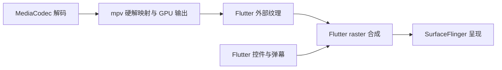

# 红果鉴 / 真果鉴

Flutter 多端独立短剧应用，原名“短剧库 APP”。站源请求、解析、下载和播放均在设备上完成，不依赖旧项目或自建服务。当前源码版本：**0.2.119+2125（开发快照）**。

0.2.119 更正一处错误结论，并按反馈收紧首页标签。**桌面图标延迟是平台行为，不是缺陷**：查 AOSP `PackageManagerService.setEnabledSettings` 后确认，`setComponentEnabledSetting` 在带 `DONT_KILL_APP` 时把组件写入 `mPendingBroadcasts` 待发队列，并用 `mHandler.sendMessageDelayed(SEND_PENDING_BROADCAST, broadcastDelay)` 延迟发出，`BROADCAST_DELAY` 是 1 秒、系统启动后 60 秒内为 `BROADCAST_DELAY_DURING_STARTUP` 即 10 秒；只有不带 `DONT_KILL_APP`（即允许杀掉本应用）才走同一调用内的 `sendNowBroadcasts` 立即广播。而且连续两次调用会因 `!mHandler.hasMessages(SEND_PENDING_BROADCAST)` 判定合并成一条广播，计时自首次调用起算。广播到达后 Launcher3 一侧是干净的（`model/PackageUpdatedTask` 的 `OP_UPDATE` 调 `icons/IconCache.updateIconsForPkg`，后者先 `removeIconsForPkg` 再按 `LauncherApps.getActivityList` 重建），vivo 自己的桌面另有图标缓存，这才是名称先到、彩色图标后到、需要手动划动才刷新的原因。该延迟无法在应用侧消除：立即广播与保留进程互斥，`mPendingBroadcasts` 也没有公开冲刷接口。

**移除 `PackageManager.SYNCHRONOUS`**：0.2.118 把它当成「让组件状态同步生效、避免桌面读到旧状态」的手段，这是错的。按 AOSP javadoc 与实现，它只把该用户的包限制状态序列化刷盘（对应 `flushPackageRestrictionsAsUserInternalLocked(userId)`），与广播时机无关；且是同步磁盘 I/O，官方要求放在后台线程，而原实现是在 MethodChannel 回调所在的主线程直接调用，现已去掉，`roundIcon` 部分保留。

**首页站源切换标签**：全站源版的「全部站源」改为「全部」，与其余两字站源名对齐。

0.2.118 修掉动态桌面入口的三处反馈。**对应关系写实**：真果鉴下「设置里出现分级限制按钮」这一状态就是 `fullMode=true`，桌面入口为真果鉴；关掉分级限制过滤只改 `greenMode`，不碰 `fullMode`，因此不会改变桌面入口。这条映射本就由 `setFullMode` 驱动，本轮把它在代码与文档里都写明，避免再被理解成「关掉分级限制才换名」。

**桌面图标不刷新**：名称会换、图标不换，原因是两个别名只声明了 `android:icon`，而国产桌面（vivo 的 OriginOS 一类）优先读 `roundIcon` 并按其缓存位图，别名切换后名称走了新组件、图标仍命中旧缓存。现给 `.LauncherGreen` 与 `.LauncherFull` 各补 `android:roundIcon`（指向各自的 `ic_launcher` / `ic_launcher_full`），两个图标槽位都成为「随别名变化」的资源；切换仍先启用目标别名再停用另一个，并补上 `PackageManager.SYNCHRONOUS`（API 34+）。

**「关于」名称跟随状态**：新增 `appEditionName(fullMode)`，真果鉴版下为`fullMode ? 真果鉴 : 绿果鉴`，绿果鉴版恒为绿果鉴。菜单项「关于绿果鉴／关于真果鉴」、弹窗标题、首页标题与任务切换器标题都改用它，因此激活前是「关于绿果鉴」、激活后是「关于真果鉴」，弹窗内标题同步。

0.2.117 删除皮果，并让真果鉴支持动态切换桌面入口。**皮果下线**：`ptt.red` 在 Cloudflare 之后还有一层自研 WAF，按出口 IP 判定。实测本机直连（国内 IP）拿到 Cloudflare 的 `Just a moment...` 挑战页，走代理出口才是正常页面；手机端 `adb shell curl` 直连同为挑战页，而应用内报出的 403 文案「站点要求浏览器验证，当前请求无法通过，请在 59 秒后重试」来自站点应用层，说明请求已过 Cloudflare、但出口被站点判为可疑。这个判据在站点侧、由用户的代理出口决定，应用内无法保证，因此按「修不好就移除」的结论删掉：站源常量、站源目录条目、别名与域名映射、静态分类、榜单三条、原生分发分支、皮果专用的选集与标题解析（`/{剧号}` 详情、`/{剧号}/{集号}/{线路}` 选集、带 `seq` 的连续集号裁剪、`<title>` 取剧名）一并移除，Dart 站源列表与榜单映射同步收口。皮果属于绿色短剧站，删除只影响可达性，不影响绿色/成人划分。

**动态桌面入口**：真果鉴安装后桌面显示的是**绿果鉴**名称与绿色图标；在「关于」里连点五次版本号激活分级限制开关后，桌面名称换成**真果鉴**、图标换成用户提供的彩虹播放图标，关闭开关再换回。实现走 `activity-alias`：`.MainActivity` 不再持有桌面 intent-filter，改由 `.LauncherGreen`（`ic_launcher`，默认 `enabled=true`）与 `.LauncherFull`（`ic_launcher_full`，默认 `enabled=false`）两个别名承载，切换通过 `duanju/device` 通道的 `setLauncherEdition` 调用 `PackageManager.setComponentEnabledSetting(..., DONT_KILL_APP)`，先启用目标别名再停用另一个，避免出现瞬时无入口；应用启动时按持久化的 `fullMode` 校正一次。标签与电视横幅都用 `manifestPlaceholders` 分开（`appLabel`／`appLabelFull`、`appBanner`／`appBannerFull`），`<application>` 的 `android:label` 固定为绿果鉴。**绿果鉴不提供切换**：`setFullMode` 在该版本直接返回，`LauncherFull` 始终停用，桌面入口只有绿果鉴一种。新图标由 `assets/branding/app_icon_full.png` 经 `scripts/generate_brand_assets.py` 生成各密度 `ic_launcher_full.png`。

0.2.116 修掉三处实测问题。**绿果鉴站源白名单下沉到原生层**：版次限制原本在原生核心里写死成「只有红果」，所以绿果鉴一旦切到其它站源就报「当前版本不包含此站源」，而 Dart 侧列表明明有这些站源。`nativeSourceAvailable` 现在用绿果鉴白名单（红果、芽果、毛果、番果、罐果、河果、星果、花果、牛果、皮果、伍果、米果、爽果）并按 `buildAllSources` 分流，不装全站源时只放行这些；改用白名单而不是「排除成人站源」，新接入的站源在人工确认前不会自动进入绿色版本。

**皮果 403 的真因与止血**：`ptt.red` 在 Cloudflare 之后还有一层自研 WAF，按出口 IP 判定。实测本机直连（国内 IP）拿到 Cloudflare 的 `Just a moment...` 挑战页，走代理出口则是正常页面；皮果的 403 文案「站点要求浏览器验证，当前请求无法通过，请在 59 秒后重试」来自站点应用层，说明请求已经通过 Cloudflare、但出口被站点判为可疑。对应改动：页面请求补齐 `Accept`、`Upgrade-Insecure-Requests`、`Sec-Fetch-*` 等浏览器头；错误提示原本写死「该站源需要本机网络直连，开启代理或加速器时会失败」，对皮果这种站源恰好说反，改为提示切换代理节点或换网络；浏览器验证类拦截不再触发「绑到物理网络重试」，那类拦截判的就是出口 IP，换到物理网络只会更差。

0.2.115 按反馈把绿果鉴做成纯绿色版本，并把红果搜索改成真正的分页。**绿果鉴不再有完整模式**：`LocalStore.fullMode` 在该版本下恒为 false，因此 `greenMode` 恒为 true，既不存在分级限制开关（设置项本就以 `fullMode` 为条件，随之消失），「关于」里的版本号也退化为纯文本、没有任何交互，点它不会开启任何东西；存量配置里即使带着 `fullMode: true` 也会被忽略。成人点播与成人直播在该版本下都没有入口。

**红果搜索分页（真分页）**：`searchHongguoDramasPaged` 第 1 页只跑少量季数探测，第 2 页起每页再跑一批，游标记录已试过的查询，补完即收口；实测「凡人修仙之一罐灵草到道祖」第 1 页 21 条、第 2 页 26 条、第 3 页提示已到全部，季号从原先只有 `1,2,3,9,15,17,18,19,20,39` 变成 **1–20 齐全**，全程 5 秒左右。关键修复是季数探测改为「建议接口 + 搜索页」两路合并：建议接口只回 `short_play_name`，拿「剧名第N季」去问常常整条落空，而搜索页对精确剧名会把该季排在第一位，之前只问建议接口才会漏掉大半季数。同时修掉两个让分页失效的问题：`hasMore` 为真时必须推进页码（否则带警示文案时「加载更多」会反复请求同一页），以及一整批探测都没带回新剧集时要收口，否则「加载更多」会永远挂在界面上。

顺带修掉直播页的实时切换缺陷：分级限制开关会整源改变可见集合，而直播页只在 `initState` 里算过一次可见源，开关变化后不会重算，结果关掉限制也仍停在空态，必须重启应用才恢复；现在 `didUpdateWidget` 会跟着重算。

0.2.114 按反馈把红果鉴改造成绿果鉴，并补齐搜索分页。默认版本更名为**绿果鉴**（slug `lvguojian`，Windows 可执行文件 `lvguojian.exe`，iOS `CFBundleName` 同步），站源不再只有红果：`SourceSite.values` 在绿色版下由 `adult` 标记自动收口，把非成人站源全部装进来，目前是红果、芽果、猫果、饭果、观果、河果、星果、花果、牛果、皮果、伍果、米果、爽果 13 条；真果鉴仍为全站源版。**黄豆实际是魔改短剧站，已改名为豆果并标为成人**，绿色版不再包含它。**红果搜索改为分页**：此前 `pagedSearch` 不含红果，客户端据此把 `hasMore` 强行置回 false，所以红果搜索只出第一页且没有「加载更多」，季数多的剧（例如二十多季的系列）永远补不全；现在红果进入分页集合，原生侧新增 `searchHongguoDramasPaged`：第 1 页给出名称检索与综合搜索的首批结果，第 2 页起每次只跑一轮受预算约束的季数补齐，并在客户端持有补齐游标，使「加载更多」从上次停下的查询继续，不再重复同一批请求，补完即显示「已经看到这里的全部剧集」。

**皮果已修复**：`ptt.red` 的详情页是 `/{剧号}`，选集链接是 `/{剧号}/{集号}/{线路}`，而原有实现按 `maccms` 的 `/movie/{id}`、`/p/66/d/{id}`、`/vodplay/` 形态处理，列表能出条目但详情取不到、分集也认不出来。现在详情候选补上 `/{剧号}`；分集只在带 `seq` 的选集网格里取，并按「集号必须是 1..N 连续段」丢掉网格末尾混入的画质入口（如写着 720 的链接）；详情标题改从 `<title>` 取（正文没有 h1，h2 全是「同分類熱門推薦」这类栏目标题），同时把繁体栏目名一并纳入跳过名单。实测「荒島求生AI真人版」标题正确、51 集连续、末集可解析出 m3u8。另需注意该站对直连返回 403 要求浏览器验证，走代理可正常访问。

0.2.113 逐个站源复核分级，修掉 7 条漏标的色情站源。此前 35 条站源里只标了 14 条成人，**绿色模式因此形同虚设**——按站源逐步抓取首页文本核对后，确认以下 7 条虽然名字像短剧、实际是色情站：超果（`www.shanekids.com`，站点标题即「超短剧 - AI色情短剧」，榜单内容为乱伦/凌辱类）、帝果（`www.dsd.com.se`，即「懂色帝.com」，主打「看懂AV / 中文字幕 / 无码破解」）、剧果（`huangju.net`，标题「红果黄剧 AI成人短剧在线观看」）、野果（`yeguodj.com`，标题「野果短剧 - AI色情短剧每日更新，高清AV短剧免费在线观看」）、以及同属「黄果短剧」一站三入口的黄果视频 / 黄果 AI / 黄果旧版（`huangguoai.com` 首页分类即「AI成人短剧 / AI成人漫剧 / AI换脸 / AI魔改」，并带 2257 声明）。这 7 条现已标为成人，名称说明同步改为真实定位。复核后**绿色 14 条**：红果、黄豆、芽果、猫果、饭果、观果、河果、星果、花果、牛果、皮果、伍果、米果、爽果；**成人 21 条**：上述 7 条加艳果、桃果、柚果、榴果、美果、城果、宵果、樱果、露果、荔果、橘果、枣果、柠果、芒果。绿色侧已逐条抓首页文本确认是短剧/影视内容：红果（红果短剧官网）、黄豆（黄豆短剧）、河果（河马剧场）、星果（星星短剧）、皮果（PTT視頻）、伍果（五五短剧）、花果（花生短剧）、米果（大米星球）、爽果（短剧网站），芽果/猫果/饭果/观果/牛果 按站源梳理表第三节的「绿色·短剧」结论保留。

0.2.112 按反馈把分级限制收进「完整模式」。**默认状态下应用就是纯绿色**：`LocalStore.greenMode` 现在读作 `!fullMode || 曾设定的值`，完整模式关闭时无论旧配置存了什么，绿色模式都强制开启，成人点播与成人直播都不会出现；`fullMode` 默认 `false`，随配置备份导出导入，旧备份缺键时回落为 `false`。**完整模式有一个不对外提示的隐藏入口**：「关于」弹窗改为自绘对话框并去掉了「查看许可」，版本号本身是可聚焦控件，电视遥控器可以聚焦并确认；该入口只按次数计数，不显示任何提示，界面文案里也不出现它的存在与用法。关闭完整模式时会把绿色模式写回开启，避免下次进入完整模式时误显示成人内容。**分级限制开关只在完整模式下出现**：设置页的条目此前只在电视布局里存在，现在手机布局也补上了同一个入口，两处都由 `fullMode` 控制显示，标题改为「分级限制」，与「绿色模式」这一内部叫法区分。

0.2.111 让绿色模式真正做到「只看纯绿色」。开关本身 0.2.93 就有了（默认开启），但**漏了两条路**。**其一，绿色模式只过滤站源列表，没有并进权限判定**：`LocalStore.allowsSource` 是站源可见性的唯一入口，榜单、搜索、推荐、资料库、下载、局域网同步都直接按站源 id 走它；而绿色过滤当时只写在 `sources` 这个列表 getter 里，于是**榜单页的成人站源榜、按 id 命中成人源的推荐与资料库记录全都漏了出来**。现在把绿色判定并进 `allowsSource` 本身，一处收口，所有按 id 取用的路径一并生效。**其二，直播侧的分类过滤用的是成人特征词黑名单**，而这类直播面板的分类名以「卡哇伊」「咪狐」「花蝴蝶」「蜜桃」「番茄社区」「LOVE」「小妲己」这类花名为主——实测该面板 137 个分类里**只有「卫视直播」属于公开电视直播**，其余全是秀场，黑名单永远列不全，用户开着绿色模式照样看到一片秀场分类。改成**白名单**：只有明确属于公开电视直播的分类名（卫视/央视/CCTV/新闻/体育/财经/少儿/纪录等）才放行，没被明确认定为绿色的一律隐藏，未知分类默认不展示。同时把「秀果」整源标记为成人（它的可播内容几乎全是秀场），因此**绿色模式下直播页不再显示任何直播源**，并给出明确空态「绿色模式已开启 · 当前内置直播源包含成人内容，已整体隐藏」而不是崩溃——原实现是 `LiveSource.visible(greenMode).first`，可见集合为空时会在 `.first` 上直接抛异常，现已改为可空并全程加守卫，开关在设置页切换后直播页会即时重算可见集合。

0.2.110 修掉用户反馈的「米果、爽果选集网格异常」。**现象**：选集网格里同一个集号连着排七八次（用户截图里是 30 集的剧排出 `1,1,1,1,1,1,1,1,2,2,…`，分组标签也成了 `1–7 / 7–13 / 13–19 / 19–25 / 26–30`）。**根因在 `fetchMaccmsDetail`**：这些站的详情页会把该剧的**每条播放线路**都完整列一遍，而 `maccmsEpisodesFromDocument` 收集全页锚点后用 `maccmsEpisodesOfSource` 只按剧号过滤，**没有按集号去重**，于是 N 条线路就把选集撑成 N 倍。用户那条 30 集的剧正好是 8 条线路 → 240 个分集，`episodePageSize = 50` 因此算出 5 个分组、每组 50 项，标签取首尾项集号就恰好是 `1–7 / 7–13 / 13–19 / 19–25 / 26–30`——与截图逐项吻合，可以确认就是这个缺陷。**修复**：在分集装配处按集号去重，保留首次出现的线路（通常是主线路），`EpisodeCount` 随去重后的结果。这是通用修复，对任何有多个播放线路的 maccms 站源都生效。**实测确认**（对真实站点只读页面）：米果「一瓯春」页面锚点 **240 → 30 集**、「母亲的反击」143 → 40、「继承者游戏」301 → 107、「外来媳妇本地郎5」2502 → **417**、「低头不见抬头见」3240 → **360**，全部 `重复集号=0`。

0.2.109 按反馈下线直播源「熊果」。原因是它的观感明显差于「秀果」：熊果走的是 Pandalive 的 Amazon IVS 直播流，1080p、`#EXT-X-TARGETDURATION:2`，每个切片只覆盖 2 秒内容却有 1.5～2.5 MB（折合约 6～10 Mbps），而这条跨境链路的可用带宽长期只有码率的一半左右——0.2.95 已实测过：直连 246 KB/s、经代理 446 KB/s，本机到公共 CDN 的基准是 3558 KB/s，瓶颈在跨境段而不在代码；源站又不提供多码率变体（`list.json` 只有单一 `quality: 0`），无法靠选低码率规避，播放器下载 3.5 秒才换来 2 秒内容，必然持续缓冲。0.2.106 的线路实测排序只能缓解「起播选错线路」，改不了带宽本身，所以直接下线。**改动**：从 `LiveSource.values` 移除 `xiongguo`（含它的列表地址、Referer、默认分组与 6 个代理前缀），直播源只剩「秀果」。`LiveProtocol.list` 分支、`proxies` / `group` 字段与 M3U 列表解析能力**全部保留**（后续接列表型源仍要用），只是当前没有内置源走这条路径。原先针对熊果的两处用例改写：`live_orientation_test.dart` 改为断言 `xiongguo` 已不在源表内、保留的源仍可用；`live_parser_test.dart` 的列表解析用例改用中性源名与中性域名夹具，继续覆盖「无分组信息按默认分组归类」与「`#EXTINF:-1 ,ID,名称` 三段式取名」这两条解析语义。**验证**：直播相关 47 项 Dart 用例全部通过，`dart analyze lib test` 92 条 `info`、0 error、0 warning。

0.2.108 定位并修复「米果、爽果无法使用」的真正原因。**证据来自用户手机实测**（vivo V2453A / Android 15，已装 0.2.107）：手机跑的是 `com.github.metacubex.clash.meta`，处于 **TUN + fake-ip 模式**——`baidu.com` 解析到 198.18.0.112、`qq.com` 198.18.0.113、`dmxq40.com` 198.18.0.109，全部落在 198.18.0.0/15 这个代理软件 fake-ip 专用段，说明**手机所有流量都经代理节点出去**，实测出口 IP `168.110.123.238`。在手机上用 `curl` 逐个复现：百度 **200**、樱果 **200**、柠果 **200**，但米果 **000**（`BoringSSL SSL_connect: SSL_ERROR_SYSCALL`，TLS 握手被重置）、爽果 **403**。**结论**：米果、爽果是这批站源里少数**必须从本机网络直连**的——站源对机房/代理出口在 TLS 层重置连接或直接上 WAF 拒绝；而樱果、露果、柠果、芒果恰好相反，它们的媒体 CDN 只有走代理才连得上。同一时刻在本机直连复测：米果目录/搜索/详情全通、取回首个分片 **174652 字节**，爽果 **219584 字节**。**根因是应用没有处理「站源出口亲和性不一致」**：用户开着代理时直连类站源必然失败，而关掉代理代理类站源又会黑屏，用户只能手动来回切，且报错只显示原始 `EOF` 或 403，看不出是出口问题。

修复不做站源表（出口属性会随网络和时间变化），改成**失败驱动的换出口重试**：新增 `lib/network_exit.dart`，`lib/core_bridge.dart` 的 `_call` 把原生的调用抽成 `_invokeNative`，先用当前出口请求；失败且错误特征指向出口被拒（EOF / connection reset / handshake / SSL / 403 / 429 / 503 / 超时）**且系统确实开着 VPN** 时，通过新的 Android 通道方法 `bindPhysicalNetwork` 用 `ConnectivityManager.bindProcessToNetwork` 把进程临时绑到物理网络（Wi‑Fi/蜂窝/以太网）重试一次，随后立刻 `release()` 恢复。这条路径不需要 root，也不依赖代理解析规则：需要代理的站源第一次就成功、不会触发换出口，需要直连的站源第一次失败即自动改走本机网络。同时 `NetworkExit.describe` 把原始网络错误翻成「站源重置了连接／站源要求浏览器验证，当前网络出口被拒绝；该站源需要本机网络直连，开启代理或加速器时会失败」，不再把 `Get "https://...": EOF` 这种原文抛给用户。

**验证**：`dart analyze lib` 92 条 `info`、0 error、0 warning；APK 已装包验证到 build 通过（`versionCode=4114`、`versionName=0.2.108`）。**设备端复验未完成**：安装 0.2.108 时手机已从 USB 断开（`adb devices` 为空），「挂 Clash 打开米果/爽果能否自动绕过代理成功」这一步**没有实测**，属于开发快照，不作为通过验收的版本。

**验证强度修正（针对「米果、爽果无法使用」的反馈）**：用户反馈这两个站源不可用，据此复查发现此前的「实测」**证据强度不够**——`TestLiveMiguoCatalogSearchAndDetail` 与 `TestLiveShuangguoCatalogSearchAndDetail` 只断言 `chapter.VideoURL` 非空，`TestLiveYingguoAndLuguoPlayback` 只断言解析出合法 HTTP 地址，**都没有真的取回过一个分片**。源站返回死链、空壳清单或占位地址时，这些断言照样通过。现已补上取流断言：解析出地址后再拉清单、取回首个分片，分片小于 1KB 即判定失败。**加强检查后暴露出的三个问题全部在测试脚手架里，不是站源缺陷**：（a）相对地址用「当前目录 + 路径」拼接，而主清单普遍写的是 `/path/x.m3u8` 这类根相对地址，拼出的地址重复了目录、一律 404——必须按 URL 规则解析；（b）分片按扩展名白名单过滤，实测有站源把分片写成 `seg_00000.jpg`，会把可用站源误判成死链——改为按 HLS 语义区分主清单（带 `EXT-X-STREAM-INF`）与媒体清单（其余每行都是分片）；（c）主清单的第一个变体常已下线，取第一个就返回会把可用站源判死——改为逐个变体试到出片，并加两次重试避免把网络抖动写成不可用。**修正后的实测结果**（`CHECK_LIVE_PROVIDERS=true`）：**直连**下米果取回首个分片 174652 字节、爽果 219584 字节，两者目录、搜索、详情、取流全链路通过，同一批里橘果 335956、枣果 1153568 也通过；樱果、露果、柠果、芒果的媒体 CDN 在本机直连被阻断，挂 `LIVE_PROXY` 后 7 个源全部取回分片（1153568 / 1153568 / 1153568 / 1153568 / 335956 / 511184 / 642960 字节）。**结论**：米果与爽果在本机直连环境下可正常播放，属于**能直连就通**的那一组；设备端若仍不可用，需要用户提供具体表现（打不开、转圈、报错文案）才能定位，本机无法复现。Go 全量失败数仍为 5（红果 cursor/catalog 既有失败），无新增。

0.2.107 补齐 0.2.106 漏掉的两处，并明确验收边界。**漏掉的第一处**：直播页内嵌播放器（直播页顶部那块）此前**只能靠点视频区域进全屏**，没有任何可见按钮，而点播详情页的顶部播放器一直有显式全屏按钮——用户反馈的「直播没有旋转功能」包含这一层。现在在「正在播放」信息条上补了常驻的「全屏与旋转」按钮，与收藏按钮同一行，点开即进入带旋转控制的直播全屏页。**验证边界要说清楚**：0.2.106/0.2.107 的两个修复，能在本机验证的部分已经验证完了——线路实测排序有 4 条用例（失败线路沉底但保留兜底、按延迟排可用线路、预检全失败时保持原顺序、实测顺序对每条频道一致），方向锁定契约有 3 条用例（横屏 16:9 锁 landscapeLeft/Right、竖屏 9:16 锁 portraitUp/Down、电视模式恒锁横屏），Dart 全量 `+254 ~1 -24`（基线 `+249 ~1 -24`，新增 5 条全过、失败数不变），`dart analyze lib test` 92 条 `info`、0 error、0 warning。**但设备端的真实表现没有验证过**：按用户 2026-10-05 的要求不做本地模拟器测试，所以「熊果起播是否变快」「旋转按钮点下去是否真的转屏」只能由用户安装后人工确认——方向锁定依赖 `SystemChrome.setPreferredOrientations` 与系统自动旋转开关，若手机系统「自动旋转」处于关闭状态，锁横屏仍然生效但竖屏回切会受系统策略影响。

0.2.106 修掉用户实测反馈的两个直播缺陷。**其一，熊果转圈很久、只有最后一条线路可用。**熊果是列表型源，线路顺序是「6 条代理 + 1 条直连」共 7 条，而这里叠了三层问题：（a）起播固定用 `channel.urls.first`，也就是第一条代理；（b）重连虽然会换线路，但 `maxRetries` 写死 3，加上首次播放，**最多只推进到第 4 条，结构上永远够不到第 7 条直连**，用户只能一路手动切过去；（c）`_route` 只在**报错**时前进，而代理线路的典型故障是返回正常清单却一直卡在缓冲、不触发 error 回调，于是表现为无限转圈且永不换线。更根本的是顺序本身写死了：实测本机环境下 6 条代理全部可取回清单（其中最慢一条要 11.35 秒），而直连返回 403；用户网络恰好相反。**哪条线路可用完全取决于用户所处网络，固定的顺序对一部分用户必然是最差顺序。**现在改为**实测排序**：加载分类时对「每条代理前缀 + 直连」并发预检一次（复用首条频道的地址，7 条线路一次预检、结果按站源缓存），按「能取到清单 + 响应快」排序，取不到清单的线路沉底但**保留兜底**；预检全部失败时保持原顺序、不阻断加载。同时把重连上限改为「走完整批线路」，并补一个 15 秒无画面的停滞看门狗，把「卡在缓冲」也计入线路失败、触发换线。**其二，直播完全没有旋转与全屏切换。**`LivePlayerScreen` 全文只调了 `SystemChrome.setEnabledSystemUIMode`，**从未调用 `setPreferredOrientations`、也从未接入 `AppOrientationController`**，对比点播页会按宽高比 `setPlayback(...)` 锁方向、退出时 `releasePlayback`；而这个页面把 `fullscreen: true` 写死，导致 `PlayerControls` 里的旋转按钮（只在 `compact` 即非全屏时出现）**永远不显示**，用户没有任何旋转入口。现在直播页进页面即按横屏锁定（直播流均为 16:9），新增常驻旋转入口在横竖屏之间切换；为此给 `PlayerControls` 增加了可选参数 `onRotate`：传入时旋转按钮始终显示（直播页整屏都是播放器，没有「退出全屏」这个中间状态可用来暴露它），不传时保持原行为。**验证**：`test/live_playback_test.dart` 新增 2 条用例并改写原有用例——断言失败线路沉底且保留兜底、按延迟排序可用线路、预检全失败时保持原顺序、实测顺序对整个分类的每条频道一致；Dart 全量从基线 `+249 ~1 -24` 变为 `+251 ~1 -24`，新增 2 条通过、失败数不变；`dart analyze lib test` 仍为 92 条 `info`、0 error、0 warning。

0.2.105 接上代理这条线，把《站源梳理表.md》成人区里评分最高的几个站源接进来了，站源总数从 22 涨到 **27**：新增「荔果」（ririlu.cc，日日撸，评分 86，与 missav 并列成人区最高）、「橘果」（bulunhufait.buzz，海角乱伦，评分 66）、「枣果」（yhsp5.yachts，银河视频，评分 47）、「柠果」（toptv15.cyou，愛豆AV，评分 53）、「芒果」（zsrenqi.xyz，真实人妻，评分 64）。上一轮查清「直连被阻断、代理可用」之后，这一轮重新评估了梳理表里全部 130 个标记可用的域名，分两轮筛选：先看首页是否带 `vodplay` 卡片，再对剩下 119 个逐个试常见分类路由。筛选过程中确认了此前几处「不可用」结论同样是**路径形式判断错误**——日日撸被拒的理由是 `/index.php/vod/...` 返回 404，而该站与露果是同一套模板族，真实路径是 `/vodtype/{id}/`；这类误判上一轮已经犯过一次，这一轮换了更稳的方式：**先枚举站内链接形态计数，再据此选路由**，不再凭单次状态码下结论。**逐源实测结果**（`TestLiveYingguoAndLuguoPlayback` 扩到 7 个源）：荔果目录 97 条、橘果 6 条、枣果 30 条、柠果 20 条、芒果 20 条，全部解析出有效播放地址；FFI 层端到端取回分片——荔果 291492 字节、橘果 9616 字节、枣果 381640 字节、柠果 71711 字节、芒果 54233 字节。**这一轮修掉的真实缺陷是本次接入的核心收获**：`provider_huangguo.go` 的网页抓取成功后会记录`scheme://host` 作为站源首选主机（`providerHosts`），这个机制**只保留主机名、丢掉注册的路径前缀**。枣果注册的基址是 `https://www.yhsp5.yachts/cn/home/web`，站内还会 301 到 `yhsp9.homes`；前缀被抹掉后，详情请求落到站点默认首页，返回的是「360导航」错误页，取不到任何播放地址。`duanjuBaseURL` 已改为**同源时只替换主机、保留注册路径**，任何带目录前缀的站源都不会再被打散。另外补上 `yhsp9.homes` 的主机反查，避免跳转后认不出所属站源。**验证方法上纠正一处我自己的疏漏**：`test/native_ffi_boundary_test.dart` 的实测用例开头有 `CHECK_LIVE_PROVIDERS != 'true'` 门控，我在 Dart 侧漏设了这个变量（Go 侧一直有设），导致前几次 FFI 运行其实是**提前返回的空跑**，却都报了「All tests passed」；补上 `CHECK_LIVE_PROVIDERS=true` 后才是真实验证。归因做了对照排除，避免把假阳性推给工具：先在测试体首行插入必定抛错的探针，确认 `--plain-name` 与全量运行都会正常执行、正常失败，说明**过滤参数本身没有问题**；再把探针放到门控之后、以写文件方式回读环境变量，确认测试体确实执行到门控才返回，且读到的 `FFI_SOURCES` 值正确。因此此前几次「通过」的唯一原因就是漏设门控变量，与测试框架无关。**无回归**：其余 8 个既有 maccms 实测源全部通过；Go 全量失败数仍为 5，即红果 cursor/catalog 那组既有失败，与基线一一对应，本轮没有新增失败；`dart analyze lib test` 仍为 92 条 `info`、0 error、0 warning。**安装验证按用户要求交由人工执行**：本机 `adb devices` 全程为空，无真机可装；按用户 2026-10-05 的指示不再做本地模拟器测试，改为打包 APK 由用户自行安装人工验证。0.2.105 的 APK 已产出（`dist/android/zhenguojian-0.2.105+2111-arm64-v8a.apk`，31,990,272 字节，versionCode 4111），在模拟器上曾确认可正常安装并启动（`primaryCpuAbi=arm64-v8a`、进程存活、无 FATAL），但**设备端功能与播放仍需用户人工验收**；橘果与芒果的部分分类需要会员权限（芒果的 58/76 分类返回「升级会员」跳转页），已改用可访问分类绕过。

0.2.104 接入第 21、22 个站源「樱果」（missav02.xyz）与「露果」（luyitian.com），并把**一个卡了很久的方法论错误**纠正过来。先说方法论：这两个站（以及梳理表成人区里评分最高的 missav、撸一天、黑料不打烊、XX01、AVTOP10 等一大批）此前都被我判为「不可用」，理由是直连 `http=0`。这一轮查出真实原因：**本机直连被阻断，而系统代理 `127.0.0.1:7897` 是通的**——`luyitian.com`、`xx01.com`、`ririlu.cc` 等都解析到 Cloudflare 真实 IP 只是连接被拦，`heiliao.com`、`missav02.xyz` 则解析到 Facebook 段的假 IP（DNS 污染）。挂上代理后这些站全部 `http=200`，我此前的「不可用」结论是**环境误判，不是站点问题**。**这也解释了 App 侧的行为**：`SystemProxyMonitor`（`lib/resource_settings.dart`）只在 Android/iOS 生效，每 30 秒读一次系统代理交给 Go 层，所以用户设备上只要配了代理，这些站源就能直接走通；桌面端没有原生系统代理探测（`proxy_system_other.go` 返回空），实测时才需要 `LIVE_PROXY` 显式传入。**樱果与露果的适配**：两站共用同一套 maccms 后端与模板族，分类路径 `/vodtype/{id}/`、播放页 `/vodplay/{id}-1-1/`，且**列表页直接指向播放页**（没有独立详情模板），因此声明 `Single: true`；两站模板里根本没有分页控件，所以 `Paged: false`，并同时登记进「无翻页入口」的豁免清单（与米果同一处）。**顺带修掉两个被这次接入逼出来的真实缺陷**：其一，`maccmsCardLink` 取卡片里第一个 `<a>` 的 `href` 却不校验它是不是详情链接，而露果把分类标签放进了**与视频卡片完全相同的容器类名** `col-6 col-sm-4 col-lg-3 mb-3`，于是 `/arttype/121/`、`/vodtype/51/` 这类导航链接被当成剧集，目录里混进「正妹分享」「日本中字」这样的假条目、`id` 还是分类编号；现在卡片链接会先排除导航链接。其二，`maccmsCategoryLink` 只列了 `type`/`vodtype`/`vodshow` 等固定写法，漏掉 `arttype`（文章分类），已改写为 `[a-z]*type` 覆盖所有「…type」变体。**验证**：`TestLiveYingguoAndLuguoPlayback` 实测樱果目录 24 条、露果 28 条，标题与播放地址均正确（樱果 `https://2608.xbv2608.com/.../index.m3u8`、露果 `https://2609.senlin2026.com/.../index.m3u8`），子清单分别 150791 / 56146 字节、分片取回 200；FFI 层 `test/native_ffi_boundary_test.dart` 实测樱果取回 291492 字节、露果 116591 字节。该用例在挂代理时暴露出爽果的一个环境限制：`www.duanju2.com` 会对代理出口 IP 要求浏览器验证并返回 403（`source_blocked`），而同一用例里爽果直连是通的（`TestLiveShuangguoCatalogSearchAndDetail` 通过），所以这是**上游对代理 IP 的限制**，与站源接入无关，也未在本轮改动范围内。**改动无回归**：`miguo`/`shuangguo`/`yanguo`/`taoguo`/`youguo`/`liuguo`/`meiguo`/`xiaoguo` 八个既有 maccms 源的实测用例全部通过。**另外纠正上一轮的一处误报**：`TestDuanjuSearchAndPagingSupportMatchesCatalog` 里有一条断言要求爽果「不得支持搜索」，但爽果早已声明 `Searcher: true`，这条断言在 0.2.103 基线包上同样失败——是**上一轮被 panic 掩盖的既有失败**，我上轮报告的「Go 基线 5 项」因此偏少；本轮按事实修正了该断言。

0.2.103 **把「能播」这件事第一次验证到 C ABI 与播放代理这一层**，并纠正了一处我自己造成的误判。此前所有验证都停在解析函数或顶层入口的返回值上——能拿到地址，不等于地址真的能出画面。本轮补上的办法是：用 `scripts/build_native.py --platform darwin` 构建 c-shared 动态库，再由 `test/native_ffi_boundary_test.dart` 以真实 `dart:ffi` 调用 `DuanjuRequest` / `DuanjuFree`，走 Dart 实际使用的那套 ABI（符号查表、字符串所有权、JSON 信封），并把解析出的本地播放代理地址取回来读内容。结果是：`miguo` 等源经由 目录 → 详情 → 解析 → 播放代理 取到真实清单与分片数据。**一处必须先讲清的误判**：该用例最初断言「清单里第一个分片必须可播」，于是艳果被判为失败（播放代理返回 502）。顺着引擎诊断日志（`<目录>/logs/app.log`）查到原文是 `Get "https://25g.18j2026.com/.../index0.ts": dial tcp 46.33.14.72:443: i/o timeout`——艳果部分片源把开头 3 个预滚分片放在一个**连不通**的 CDN 主机上，其余 544 个分片在另一台正常主机上。清单本身是正常返回的，失败的是我给测试加的「首片必须可播」这条过严断言。改为「在开头若干分片里至少有一个能取回数据」后，艳果实测第 4 片取回 333520 字节，**播放正常**。这条要如实记录为**站点侧的已知条件**（用户侧表现为开播前多等一段时间，播放器会自动跳过死分片），不是应用缺陷，本轮不做「修复」。**顺带发现一处可观测性缺口**：诊断日志只在「所有线路都失败」时写记录，而播放列表重写失败的分支不写，排查时只能靠推断；本轮未改动该分支，仅记录待办。**验证**：`test/native_ffi_boundary_test.dart` 4 项用例（信封契约、目录分类、单源完整播放链、全源可播性）在 `CHECK_LIVE_PROVIDERS=true` 下通过；全源可播性覆盖 米果 / 爽果 / 艳果 / 桃果 / 柚果 / 榴果 / 美果 / 城果 / 宵果，逐源实测取回分片字节数（例如 米果 432187、城果 339621、宵果 539984）。`dart analyze lib test` 为 92 项 `info`，无 `error` 与 `warning`；本轮新增的 `test/native_ffi_boundary_test.dart` 零告警。**测试基线要如实记下，避免后续误判**：`go test ./core/` 为 5 项既有失败，全部集中在红果游标/目录持久化（`TestNativeHongguoCursorRestartsPerCatalog`、`TestNativeHongguoCursorRecoversSessionsAfterRestart`、`TestNativeHongguoStalledCursorKeepsPartialItems`、`TestNativeCatalogSaveFailureRetriesWithoutAdvancing`、`TestNativeCatalogMetadataSaveExcludesInFlightCursor`），且最后一项会在 `app_catalog_persistence_test.go:355` 的 `close(paused)` 上触发 `panic: close of closed channel`——该文件与 0.2.102 基线压缩包内的同名文件逐字节一致，属既有缺陷。`flutter test` 全量为 24 项失败，分布在 downloads / interface / television / media_library / widget / sources / recommendations / theme / library_features / app_build；本轮把 0.2.102 基线源码解压到隔离目录复跑同样文件，得到与当前**完全相同**的 17 通过 / 14 失败，因此这 24 项同为固有失败，与本轮站源改动无关（此前记录的「Dart 仅 1 项失败」不准确，实际是当时未跑全量）。

0.2.102 接入第 19、20 个站源「城果」与「宵果」，并修掉一个会把别的剧混进分集列表的缺陷。**这一批再次推翻了自己的旧结论**：「不夜城 `a.qingyiduz.xyz`」在更早那一轮被否决，理由与「唯美精品」完全相同——HTML 搜索页返回 500、没有 `/detail/` 路由。上一轮为救唯美精品新增的 JSON 搜索通道（`Suggest` 标志）证明这类否决是方法错误，本轮复查确认不夜城**同样可用**：搜索走 `ajax/suggest`，目录 `/index.php/vod/type/id/{类}.html`（4 个真实分类，每页 10 条），播放页 `player_aaaa` 里有真实清单地址。该站没有详情模板（`vod/detail.html` 返回 500「模板文件不存在」），因此以单片模式接入，命名为**城果** `chengguo`。**同时接入的宵果** `xiaoguo`（夜色 `yese.co`，`myui` 模板）：目录每页 48–52 条、详情页 `h1` 即干净剧名、播放页把清单写在 `var uul = '...'` 中，搜索同样走 `ajax/suggest`。该站有一个**必须如实记录的站点缺陷**：分类参数被服务端忽略，`id/1` 到 `id/25` 返回的内容逐字节相同，因此只声明站方自己给出的那一个分类，不做假分类。**本轮真正的技术缺陷**：宵果的分集列表解析出 9 集，其中 8 集属于**别的剧**（页面上「猜你喜欢」的卡片同样以播放/详情链接出现），剧名还被渲染成「2.0分 HD」这样的角标文字。修法是给分集加**两级归属筛选**：先只保留「属于本剧且是播放链接」的项，其次「属于本剧」的项，两级都为空才保留原样——最后这条兜底是必要的，因为像 `zywplay/1-0-0.html` 这类不含剧号的站源取不到剧号，若一律过滤会被误伤。修复后六个有分集的站源逐一手测：宵果 9→1、城果 1、米果 686、艳果 1、花果 3、伍果 1，均与站点实际相符。**同时修掉一个会直接显示给用户的缺陷**：站点把画质角标以空格分隔贴在标题尾部（如「内射伺候 HD」），新增按空白分隔的画质尾部裁剪，同时用「必须存在分隔空白」这一约束避免切坏 `HDMI接口维修` 这类真实名称。**顺带补齐**：`maccmsCardClasses` 增加 `myui-vodlist__box`。**两个仍然不可用的高评分候选**（记录以备复查）：日日撸 `ririlu.cc`（评分 86，成人段最高）——JSON 搜索接口正常，但目录与详情路由全部返回 404「非法请求」，仍无法接入；甜蜜桃源 `tmcrownxlift.site`——播放页确有清单地址但经第三方代理包装、详情模板返回 500、目录卡片既无剧号也无剧名，仍无法接入。**验证**：`TestNativeRequestServesEveryMaccmsSource` 自动推导受测清单，11 个 Maccms 源走顶层入口 `NativeRequest` 实测 分类 → 目录 → 搜索 → 详情 全通（皮果因上游 403 浏览器验证被跳过），其中城果 `catalog=30 search=30 chapters=1`、宵果 `catalog=30 search=30 chapters=1`；新增离线回归用例锁住分集归属筛选与画质尾部裁剪；`go test ./core/` 全量与基线同为 5 项既有失败；`dart analyze lib test` 无 error 与 warning。

0.2.101 **修掉一个让前面四批接入成果全部落空的缺陷**：米果 / 爽果 / 艳果 / 桃果 / 柚果 / 榴果这六个源虽然已经注册进站源目录、解析逻辑也已实测可用，但**应用层的分发函数漏登记了它们**——`fetchDuanjuCatalogPage`（目录）与 `searchDuanju`（搜索）的分支清单只写到第 9 个源（花果 / 伍果 / 皮果），这六个源走到这里会直接返回「该站源暂未接入目录」与「该站源不支持在线搜索」。**影响范围**：解包 0.2.99 源码确认，当时目录里已注册 17 个源，而这两个函数的分支仍是 9 个，也就是说 **0.2.96 到 0.2.99 这四个快照里，这六个源在应用内点开即报错，一个都用不了**。**根因是我的验证方式有洞**：前几轮的实站用例直接调用内部函数 `fetchMaccmsCatalogPage` / `fetchMaccmsDetail`，绕过了 Dart 实际走的顶层入口 `NativeRequest`；内部函数全绿，真实入口全废。**修法不是补 case**，而是**按站源声明的类型数据驱动分发**（`spec.Kind == "maccms"` 即转发到 Maccms 通道），并把同样的判定补进详情与搜索两条链路——补 case 只能治这一次，数据驱动能让后续新增源不再重犯。**验证方式同步改成端到端**：新增 `TestNativeRequestServesEveryMaccmsSource`，从站源目录**自动推导**受测清单（新增源若漏接任何一环会直接失败，且缺少对照查询词也会失败），逐个走 `NativeRequest` 的 分类 → 目录 → 搜索 → 详情 四条真实链路，并校验条目完整性、标题洁净度与章节可播地址。该用例第一次运行就抓到了上述缺陷，修复后 10 个 Maccms 源（花果 / 伍果 / 皮果 / 米果 / 爽果 / 艳果 / 桃果 / 柚果 / 榴果 / 美果）实测通过，仅皮果因上游 403 浏览器验证被跳过（外部条件，用例只记录不掩盖，接线错误仍会失败）。**顺带修掉一个会直接显示给用户的缺陷**：搜索页把关键词高亮写在属性里（`alt="仁心<em>俱</em>乐部"`），属性取值原样带出标签，剧名会变成「仁心<em>俱</em>乐部」；现已在属性取值路径上做标签剥离与实体反转义，并加了反向验证的离线用例。**注**：0.2.100 的构建产物在修复前生成，未装机且内容作废，请以 0.2.101 为准。

0.2.100 反向复查上一轮的否决结论，**救回一个被误判的优质源**，并修掉三条会造成「有结果但播不了 / 标题是按钮文案」的缺陷。**误判的根因**：上一轮以「HTML 搜索页返回 500」否决了唯美精品 `shiresm.lol`，但榴果那轮暴露的教训是「表单 action 不等于真实搜索 URL」——顺着这条线复查，发现该站的搜索**完全可用**，只是走 Maccms 框架自带的 JSON 接口 `/index.php/ajax/suggest?mid=1&wd={词}&limit=N`，返回 `list[]`（含 `id` / `name` / `pic`），实测关键词匹配率 20/20 与 50/50，「制服」928 条、「中文」2930 条。**因此新增「JSON 搜索通道」**：为这类 HTML 搜索页被模板改坏的站点保留独立搜索路径，并以 `Suggest` 标志显式声明，而**不是**做成「HTML 失败就自动回退 JSON」——自动回退会让行为随站点抖动而不可预测。该源以「美果」`meiguo` 接入（第八个成人源、第 18 个站源），响应 0.5 秒、分页 24 条真实不重复。**缺陷一：模板占位串被当成播放地址**。该站详情页的下载按钮写着 `window.open('https://mp4.#.mp4')`，这个未替换的占位串以 `.mp4` 结尾，因此命中了泛用兜底正则，并被判定为「有效媒体地址」，最终用户会拿到一个必然失败的地址。修法是新增占位地址识别（无有效顶级域、含 `#` / `{}` 等模板字符）并在兜底匹配时逐个跳过，实测取流地址从 `https://mp4.#.mp4` 变为真实清单 `kjbwhcnao.com/.../index.m3u8`。**缺陷二：该站详情页没有播放数据**。详情页只有介绍与下载占位，真实地址只在播放页上（`player_aaaa` 仅存在于 `/play/id/{id}/sid/1/nid/1.html`）。修法是把该站详情候选改成播放页优先。**缺陷三：正文标题把按钮文案当剧名**。该站 `<h1>` 是「在线播放」按钮，`<title>` 是「在线播放{剧名} 第1集 - 高清资源 - 唯美精品」，因此上一轮为修柚果加入的「正文标题优先」在这里取到了「在线播放」。修法有三处：把「在线播放 / 立即播放 / 收藏」等按钮文案纳入栏目标题黑名单；让截断标记出现在**开头**时只去掉标记本身（原先只在标记位于中段时截断，开头命中会整段保留）；并新增「第N集」尾部裁剪。**顺带修掉一处上一轮引入的回归**：正文标题优先让米果标题从干净的剧名变成了「剧名 2026 中国大陆 女频 / 甜宠 / … 立即播放 收藏」——因为该站的正文标题容器把年份、地区、分类标签和按钮全包在了一起。修法是新增年份截断（要求年份前有空白，因此「2001太空漫游」这类真实剧名不受影响），米果标题复验回到「从龙渊走出我举世无敌」。**这次回归是靠逐源比对标题抓到的**：改动只在米果上显现，其它六个源看不出异常，若只看「测试通过」会漏掉。**验证**：新增 `TestLiveMeiguoCatalogSuggestSearchAndDetail`（受 `CHECK_LIVE_PROVIDERS=true` 控制）实测 `catalog=24/24 suggestSearch=30 hits=30 detail=锤子探花外围美巨乳明星脸妹子爆射巨乳 chapters=1 media=https://kjbwhcnao.com/.../index.m3u8`；离线用例扩充标题清洗（在线播放前缀、第N集、年份拼接、双连字符站点名、季数保护）并做过反向验证；八源（米果 / 爽果 / 艳果 / 桃果 / 柚果 / 榴果 / 美果）逐源实站复验，标题全部为干净剧名；`go test ./core/` 全量与基线同为 5 项既有失败（红果目录游标与目录落盘），新增失败 0；`dart analyze lib test` 无 error 与 warning。

0.2.99 接入第 17 个站源「榴果」`liuguo`（榴莲视频 `www.llsp.me`，成人点播，37 个分类、每页 28 部）。这个源是**上一轮方法论纠正的直接收益**：它属于「播放页兼详情页 + 相关推荐」的单片站形态，上一轮刚加的「单片站」支持正好覆盖，因此本轮无需再为它写专门分支，只补了路由与分类表。**过程中修掉一个会造成「每部剧同名」的缺陷**：该站播放页同时存在 `<h1>`（真标题）和 `<h2>`（栏目标题「猜你喜欢」），而上一轮为修柚果加入的「正文标题优先」只取了 `<h1>`/`<h2>` 中第一个非空值——顺序一旦颠倒就会把「猜你喜欢」当成剧名。修法是加入栏目名跳过表（猜你喜欢 / 猜你想看 / 相关推荐 / 播放列表 / 热门推荐 / 最新推荐 / 热门视频 / 为你推荐 / 网友评论 / 影片评论），全部命中时才回落到 `<title>`；新增离线用例同时锁定「跳过栏目名」与「真标题不被误判」两侧，并做过反向验证（临时移除跳过逻辑后，用例确实报出 `"猜你喜欢"`）。**另一处纠错**：该站搜索真实路由是 `/vodsearch/{关键词}-.html`（**单个**连字符），与爽果的 `/search/{词}----------1---.html`、米果的 `/vodsearch/{词}-------------.html` 都不同；按后两者样式套用会得到「有页面但没有结果」的假象——搜索页仍返回 200、标题也正常，只是卡片数为零，因此**光看状态码会误判为「搜索已损坏」并错误否决该源**。改对路由后实测每页 28 条、翻页无重复（关键词「换脸」「三上悠亚」「巨乳」均验证）。**该站形态**：分类 `/vodtype/{N}.html`、翻页 `/vodtype/{N}-{页码}.html`、详情/播放 `/vodplay/{id}-1-1.html`（`/voddetail/{id}.html` 只是 65 字节的 JS 跳转壳）、搜索 `/vodsearch/{词}-.html`。**实测数据**：目录 28/28 两页无重复；搜索 28 条；详情 1 集（相关推荐的 13 个链接已被单片站模式正确排除）；取流得到 `2609.v155p.com` 清单，本机 ffmpeg 拉流解出 149 帧、1.76 倍速，播放可用。**验证**：新增 `TestLiveLiuguoCatalogSearchAndDetail`（受 `CHECK_LIVE_PROVIDERS=true` 控制）实测 `catalog=28/28 search=28 detail=换脸热巴被老头内射. chapters=1`；六源（米果 / 爽果 / 艳果 / 桃果 / 柚果 / 榴果）实站复验全部通过，标题清洗改动未造成任何回归；`go test ./core/` 全量与基线同为 5 项既有失败（红果目录游标与目录落盘），新增失败 0；`dart analyze lib test` 无 error 与 warning。

0.2.98 接入第 16 个站源「柚果」`youguo`（Youavhub `youavhub.com`，成人点播，21 个分类、每页 60 部、站内搜索可用），并修掉两个会影响一整类站点的缺陷。**缺陷一：线路/分集序号被当成剧集编号**。该站的播放路径是 `/index.php/vod/play/id/{id}/sid/{线路}/nid/{集}/`，而原先的编号提取只认 `/vod/{id}` 这类形态，取不到就退化为「从路径里找最后一个纯数字」，于是把 `nid` 的 `1` 当成了剧集编号——所有条目都会指向同一部剧。修法是在编号正则里补上 `id` 与 `vodplay` 两种前缀，并把 `/vodplay/{id}-{线路}-{集}.html` 这种老式形态一并覆盖；新增离线用例逐个锁定六种路径形态，并做过反向验证（临时回退正则后用例确实报出 `"1"`，证明用例有效）。**缺陷二：相关推荐被当成分集**。该站没有独立详情路由，播放页兼作详情页，而页面上另外列着 35 个播放链接——它们是「猜你喜欢」的其它片子，不是分集。原来的分集提取在找不到播放列表容器时会退化为「页面上所有播放入口」，于是会把 35 部不相干的片子显示成一部剧的 35 集。修法是新增「单片站」标记：这类站点固定为单集，取流入口指向播放页自身；同时把该站卡片类名 `vodlist_item` 纳入识别，并让详情标题优先取正文 `h1`/`h2`（该站把集数和站名直接拼进了 `<title>`，正文标题才是干净的）。为避免正文标题带上「完结」「更新至第N集」这类状态词，把状态词一并纳入标题清洗，并复验爽果标题回到「欲望当铺」。**实测数据**：目录页每页 60 部、翻页无重复；搜索「巨乳」返回 45 条；详情解析为 1 集；取流得到 `vostrely.com` 清单，本机 ffmpeg 拉流解出 199 帧、8 秒内容、6.2 倍速，播放流畅。**本轮另否决三例**，均记录以免重复返工：日日撸 `ririlu.cc`（成人区评分最高的 84 分）所有播放页返回 502 Bad gateway，重试与多种路径形态一致，属源站故障；不夜城 `a.qingyiduz.xyz` 站内搜索与唯美精品同一模板缺陷（`wd` 参数触发 500，其它参数名只返回空提示页），无法满足「所有站源必须支持在线搜索」的约定；甜蜜桃源 `tmcrownxlift.site` 全站没有任何可用标题元素（`<title>` 只有站名，无 `h1`/`h2`/`og:title`，分类页卡片标题也为空），接进来会出现「每部剧同名」。**方法论小结**：成人区的可用形态高度集中在动态路由型 Maccms，而这类站点普遍是「播放页兼详情页 + 相关推荐」，因此「单片站」支持是接入这一整类的前提；后续仍从重扫出的候选里继续筛选。

0.2.97 接入第 15 个站源「桃果」`taoguo`（撸鸡鸡 `lujj31.buzz`，成人点播），并修掉一个影响面更大的取流缺陷。**缺陷：只走一跳的播放页解析**。该站的标准播放数据 `player_aaaa` 指向的不是媒体地址，而是另一个域名上的播放器包装页（`hsckyun.yeffpe.com/share/...`，返回 DPlayer 页面，真正的清单藏在页面脚本里）。原实现把解析结果直接当成媒体地址交给播放器，而该地址既没有媒体后缀也不是清单，播放器拿到的是 HTML，实测 ffmpeg 直接报 `Input/output error`。这类「播放数据指向包装页」的形态在 Maccms 生态里很常见，因此修在通用层：解析出地址后，只要它不是媒体地址就再取一层，最多两跳，并对空结果与原地打转做了收敛。实测修完该站解析出 `hsm3.hwzcfz.com` 的主清单，子清单 1680 个分片，ffmpeg 拉流解出 199 帧、8 秒内容，确认可播。**同批修掉标题残留**：该站标题形如「{剧名}剧情介绍--撸鸡鸡」，原清洗只认 ` - ` 分隔且要求尾部含「短剧/影视」等关键词，站点名「撸鸡鸡」命中不了，于是整段残留。修法是把「剧情介绍/剧情简介」纳入后缀表，并新增双连字符站点名裁剪；为避免误伤，尾部以「第」开头或以季/部/集/篇/卷/话/章结尾时一律不裁，既有的「我的剧-第二季」保持不变。实测标题从「极品尤物…爽到颤抖剧情介绍--撸鸡鸡」收敛为「极品尤物…爽到颤抖」。**该站形态**：标准 Maccms 路由（分类 `/index.php/vod/type/id/{N}.html`、详情 `/index.php/vod/detail/id/{N}.html`、分集 `/index.php/vod/play/id/{N}/sid/{S}/nid/{E}.html`、搜索 `/index.php/vod/search/wd/{关键词}.html`），28 个分类，播放数据走标准 `player_aaaa`。**这一轮把站源筛选方法也纠正了**：此前判定成人区「没有可复用通道的源」用的是静态特征词（`vodtype` / `module-item` 等），而动态路由型 Maccms（`/index.php/vod/...`）一个都不含这些词，导致漏判；改用动态路由特征重扫 68 个候选后命中 10 个，本轮的艳果与桃果都出自这批。**本轮否决一例，记录以免重复返工**：唯美精品 `shiresm.lol`（成人区评分 64）分类与详情都很好（响应 0.5 秒、分页 48 条真实不重复、播放清单 ffmpeg 解出 149 帧且 5.9 倍速富余），但**站内搜索在服务端已损坏**：搜索表单声明为 POST `/index.php/vod/search.html`，实测 GET 与 POST 带 `wd` 全部返回 500 `System Error`，改用 `searchword` 等其它参数名只返回「请输入关键词」提示页，无任何参数组合能取到结果。项目约定所有站源必须支持在线搜索（`TestDuanjuSearchCoverageMatchesImplementedSources` 会强制校验），把不可用的搜索标为可用会误导使用者，因此本轮**不接入并完整回滚**该源，不留下半成品通道。

**验证**：新增 `TestLiveTaoguoResolvesWrapperPlayerPage`（受 `CHECK_LIVE_PROVIDERS=true` 控制），实测 `catalog=16 search=16 chapters=1`，并断言解析结果以 `.m3u8` 结尾；新增标题清洗用例覆盖双连字符站点名、季数保护与既有用例不回归；`go test ./core/` 全量与基线同为 5 项既有失败（红果目录游标与目录落盘），新增失败 0；`dart analyze lib test` 无 error 与 warning。

0.2.96 接入第 14 个站源「艳果」`yanguo`（AV星球 `xqxq1.cc`），这是第一个成人点播站源，用于验证绿色开关的实际效果。站源梳理表把它列在成人区（评分 70、实测 128.6 KB/s），结构属 Maccms 变体，因此复用既有通道。**过程中修掉两个真实缺陷**，都属于其它站点也会踩到的类型。其一，取流会被播放器自带的示例片带偏：该站播放页把正片地址写成 `const source = '...'`，同页还有 ArtPlayer 的 `artplayer.org/assets/sample/test1.mp4`，而通用兜底正则按文档顺序先撞上示例片，取到的是示例片而非正片；修法是在兜底正则之前增加 `const source` 匹配，同时保留 `player_aaaa` 的最高优先级，并新增离线用例固定这个顺序（临时移除该匹配后用例确实报出示例片地址，证明用例有效）。其二，详情链接识别过宽：`maccmsDetailLink` 只要求路径含 `/vod/` 或 `/show/`，而该站分类是 `/index.php/vod/type/id/N.html`、搜索是 `/index.php/vod/search.html`，都被误判成详情链接，导致卡片标题与正片编号对不上（实测把分类号 66 当成剧集编号，翻页因此判定为重复）；修法是新增分类路由排除表，并把该站使用的 `video-item` 卡片类名加入识别列表。**该站的真实形态**：详情即正片页 `/index.php/vod/play/id/{id}.html`（`/detail/id` 是 94 字节空壳），集数页链接会指向同站的另一个域名，分类 20 个（日本 / 国产 / 传媒 / 主播 / 探花 / 乱伦 / 偷拍 / 吃瓜 / 字幕 / 日韩精选 / 口交 / 多P / VR / 素人 / 学生 / 迷奸 / 制服 / 反差 / 异域 / AI短剧），分页 `/index.php/vod/type/id/{分类}/page/{页码}.html`，搜索 `/index.php/vod/search/page/{页码}/wd/{关键词}.html`，均已实测分页真实不重复。**播放链路无需自研解密**：正片清单是标准 HLS `METHOD=AES-128`，密钥 URL 可取到 16 字节密钥，mpv/ffmpeg 原生完成解密；本机用 ffmpeg 拉流实测解出 249 帧、10 秒内容、退出码 0，确认可播。**已知限制（实测数据）**：该站部分内容的清单开头挂着 3 个贴片广告分片，落在已经失效的 CDN 主机上（DNS 可解析但连接黑洞），而正片分片在正常主机上（544 片可用、536KB / 204KB 每秒）。ffmpeg 会逐个跳过失败分片并继续播放，但每个失败分片要等一次连接超时，实测从起播到出画约 44 秒。这不是解析缺陷，是站点广告位主机失效导致的起播延迟；可行的改进方向是按分片主机做一次探测并剔除不可达分片，本轮未实施，理由是设备不在线无法完成真机验证，不把未验证的行为改动算作已完成。**验证**：新增离线用例固定诱饵防护与 `player_aaaa` 优先级；新增 `TestLiveYanguoCatalogSearchAndDetail`（受 `CHECK_LIVE_PROVIDERS=true` 控制）实站只读验证，实测 `catalog=32+32 search=24 detail=清纯岛国女学生下海应召 chapters=20`，两页无重复且拾取的地址不是播放器示例片；新增两项 Dart 用例覆盖绿色模式默认开启并隐藏成人站源、以及配置备份导出导入保留开关且旧备份回落到开启；`go test ./core/` 全量与基线同为 5 项既有失败（红果目录游标与目录落盘），新增失败 0；`dart analyze lib test` 无 error 与 warning。

0.2.95 排查熊果直播起播慢，修掉一个真实缺陷并记录实测结论。**缺陷**：`LivePlaybackController` 的重连逻辑不换线路 —— `_scheduleReconnect` 调用 `play(_index, reconnect: true)` 时 `_route` 保持不变，`_resolve` 因此始终返回 `urls[0]`，三次重试全部打在同一条线路上；只有用户手动切线路（`playRoute`）才会改变 `_route`。列表型直播源的代理线路质量波动很大，实测同一批前缀在两次测量中会交替返回 200 / 404 / 500，一旦首条线路劣化，用户就要干等三轮无效重试。修法：重连时按 `channel.urls` 长度轮换 `_route`，并在换台（非重连且频道序号变化）时把 `_route` 复位到首条，避免沿用上一台已经劣化的线路。**实测结论：主因是跨境带宽而不是代码**。熊果上游是 Pandalive 的 Amazon IVS 流，1080p、`latencyMode: RT`、`TARGETDURATION: 2`，即每个切片只覆盖 2 秒内容却有 1.5～2.5 MB，折算码率约 6～10 Mbps。而实测下载能力：直连 IVS 246 KB/s（约 2.0 Mbps）、经代理 446 KB/s（约 3.6 Mbps），本机到公共 CDN 的基准带宽是 3558 KB/s（约 28 Mbps）。也就是说链路本身很快，瓶颈在跨境到 IVS 这一段，可用带宽只有流码率的一半左右，播放器下载 3.5 秒才换来 2 秒内容，必然持续缓冲。源站不给多码率（`list.json` 只有单一 `quality: 0`，频道清单没有 `EXT-X-STREAM-INF` 变体），所以无法通过选低码率规避。顺带按实测稳定性重排了六个代理前缀：`hubu` 与 `f00` 实测稳定（360 / 332 KB/s），`flank` 掉到 15 KB/s，`uae2`、`pol` 返回 404，`ce2` 返回 500，因此把 `f00` 提到第二位；代理优先、直连兜底的既有顺序保留，因为实测代理反而比直连快。**验证**：新增 `test/live_playback_test.dart` 四项用例，覆盖代理线路排在直连之前且直连兜底、列表型源按站源默认分组归类、切换线路更新线路标号并收敛越界值、换台复位到首条线路；直播相关 47 项 Dart 用例全部通过，`dart analyze lib test` 无 error 与 warning。真机（vivo V2453A）启动 0.2.95 无崩溃、无 Flutter 异常。

0.2.94 按站源梳理表继续接站源，接入第 13 个短剧站源「爽果」`shuangguo`（短剧网 `www.duanju2.com`）。梳理表本次把该站标为「受限」，实测已恢复正常：站点用服务端渲染 HTML，属 Maccms 变体，因此复用既有 `maccms` 通道，只需补分类地址、详情地址、搜索地址与静态分类。**实测确认的站点形态**：分类是 `/show/26---题材--------.html`（全部 / 反转爽文 / 古装仙侠 / 女频恋爱 / 年代穿越 / 现代言情 / 现代都市 / 短剧，共 8 个），详情 `/vod/{id}.html`，分集 `/play/{id}-{线路}-{分集}.html`，搜索 `/search/{关键词}----------{页码}---.html`，取流仍在播放页的 `player_aaaa` 里直出 m3u8，与既有解析完全对齐（实测 `player_aaaa` 的 `url` 为 `s3.bfllvip.com` 的 m3u8）。**翻页规则不能想当然**：分类页翻页是把地址末尾的 `---.html` 整体换成 `{页码}---.html`，而不是在 `.html` 前插数字 —— 少一个连字符就拿到空页，实测第 1、2 页各 24 条且互不重复，目录到第 60 页仍有 24 条。**分集数量的真实情况**：该站多数条目只有 1 条播放地址（抽样《欲望当铺》《京圈顾少：被杀手老婆拿捏了》各 1 集、《天津大妞闯南洋》2 条线路各 1 集），属单片聚合型站点，不是分集型短剧站，因此详情页集数偏少是站点形态而非解析缺陷，已在此记录以免后续误判。**验证**：新增 `TestLiveShuangguoCatalogSearchAndDetail`（受 `CHECK_LIVE_PROVIDERS=true` 控制）对真实站点只读页面与播放地址，实测 `catalog=24+24 trait=24 search=17 detail=欲望当铺 chapters=1 playable=1`，两页无重复；测试里刻意区分了「题材分类是全部的子集、重合正常」与「题材页返回了与全部页同一批条目」两种情况，避免把正常子集关系误判为失败。`go test ./core/` 全量与基线同为 5 项既有失败（红果目录游标与目录落盘），新增失败 0；`dart analyze lib test` 无 error 与 warning。本轮未安装设备，真机观感仍待集中验收，属于开发快照。

0.2.93 按需求接入站源梳理表、把直播性质的已接入站源归位，并加绿色开关。**绿色开关**：设置页新增「绿色模式」，默认开启，关闭时需要二次确认；开启时不展示成人点播与成人直播。实现分两层 —— 站源级 `SourceSite.adult` 与直播源级 `LiveSource.adult` 在绿色模式下整源隐藏（`LocalStore.sources`、`LiveSource.visible`），直播分类级再按特征词隐藏（十八禁 / 小黄书 / 色趣 / 蚊香社 / 欧美TRANS 等 23 个分类）。分类词表刻意不收裸「色」字，实测「夜色」这类普通分类名不会再被误判。开关状态存 `greenMode`，随配置备份导出、导入时缺省为开启，避免恢复旧备份后误开成人内容。**熊果归位**：站源梳理表第三节把已接入源按「绿色·直播 / 绿色·短剧」重新归类，其中熊果本就是直播源（对应 `Pandalive直播.py` / `熊猫直播.py`），此前被当成点播源移除是错误的。实测其真身是 `5721004.xyz/player/list.m3u` 的 M3U 直播清单（50 个主播频道），直连 403 而六个代理前缀可正常取流（代理清单 200 / 16KB，切片 200 / 500KB 可下载），因此作为 `list` 协议直播源接回，并把代理线路排在直连之前、直连兜底，播放器按线路顺序自动回退；`list.json` 另带 311 条主播元数据（其中 106 条标记成人）。列表不带分组信息，故为 `LiveSource` 增加 `group` 默认分组名（熊果为「主播」），避免落进「其他」。**新站源**：接入第 12 个短剧站源「米果」`miguo`（大米星球 `dmxq40.com`，站源梳理表绿色第一名，评分 66）。它属标准 Maccms 形态，复用既有 `maccms` 通道，只需补分类地址、详情地址、搜索地址与静态分类（短剧 / Netflix / 电视剧 / 电影 / 动漫 / 综艺）与 6 个榜单。**实测发现的站点特性**：该站分类页不分页 —— 第 2、3 页与第 1 页返回同一批 70 条，因此 `hasMore` 固定返回 false，否则客户端会重复追加同一批条目；响应带 `Content-Encoding: gzip`，压缩体按 gzip 解压后才是 HTML。**验证**：新增 `TestLiveMiguoCatalogSearchAndDetail`（受 `CHECK_LIVE_PROVIDERS=true` 控制）对真实站点只读页面与播放地址，实测 `catalog=69 search=16 detail=聋哑少女她能听到你的心声 chapters=65 playable=65`，65 集全部拿到可直接播放的媒体地址；`go test ./core/` 全量跑完与基线同为 5 项既有失败（红果目录游标与目录落盘），新增失败 0；`dart analyze lib test` 无 error 与 warning；直播与站源相关 43 项 Dart 用例通过，其中新增绿色模式整源过滤、成人分类识别与「夜色不误伤」断言。本轮未安装设备，真机观感仍待集中验收，属于开发快照。

0.2.92 按反馈把两个直播面板合并成一个源并更名。**先证明它们是不是同一个东西**：把两边的 `json.txt` 与分类内容拉到本地逐字节比对 —— 共同分类 128 个（视果 129、彩果 136），同一分类下的频道名集合完全相同、播放地址**逐字节相同**（`jsonkawayi.txt` 两边都是 83 个频道且地址一致，抽样的 `jsonrichu.txt` 84 个、`jsonhudie.txt` 83 个同样一致），「卫视直播」分类的 `streamid` 也一模一样，所以内容确实来自同一上游。**但不能简单删掉一个**：两个域名各维护不同的分类子集且互不包含 —— 视果独有「小棉袄」，彩果独有「奥斯卡 / 红高粱 / 苦瓜 / 牵手 / 七仙女s / 十八禁 / 小红帽 / 小黄书」等 8 个，把独有分类拿到对方域名下请求全部 404，说明它们不是主备镜像而是同一面板的两个分片节点。因此改为按其真实关系合并：`LiveSource.endpoint` 换成 `endpoints` 列表，`_pingtaiPlatforms` 遍历全部镜像取分类**并集**并去重，`LivePlatform` 新增 `endpoint` 字段记录该分类由哪个镜像提供，取频道时优先请求该镜像、失败再依次回退其他镜像。**合并踩到的坑**：上游的 `Number` 字段（分类频道数）在各镜像间并不同步 —— 「付宝」在视果记 `0`、在彩果记 `77` 且彩果域名下真有 83 个频道，若按“先遇到的为准”合并会把这个有效分类误杀，故改为按分类取**较大**的计数并跟随报告有内容的那一边；两镜像皆空的 4 个分类（九尾狐 / 土豪 / 龙珠 / 映客）才剔除。合并结果：137 个去重分类 → 去掉「卫视直播」与 4 个空分类 → **132 个可用分类**。**更名**：内置源由「视果 / 彩果」合并为单一「秀果」（实测内容全是主播直播间，「卡哇伊 / 咪狐 / 花蝴蝶」等分类下都是主播名），描述由原来不准确的「央视 · 卫视 · 4K 频道」「综合直播 · 多平台」改为「主播直播 · 实时开播」，界面上不再出现两个内容重复的入口。**回归用例**：`test/live_repository_test.dart` 增至 9 项，新增两镜像分类并集且剔除空分类、同一分类计数不同步时取有内容的一边并跟随其镜像、分类按提供它的镜像取频道（并断言不会发到不提供它的镜像）、首选镜像不可用时回退；`test/live_screen_test.dart` 增加“内置源仅剩一个”的断言。`dart analyze lib` 无 error 与 warning；`flutter test` 全量跑完与 0.2.87 基线对比无新增失败。本轮未安装设备，真机观感仍待集中验收，属于开发快照。

0.2.91 修掉直播页三个实际使用问题并精简界面。**收藏里点频道播不了**：根因在 `LivePlaybackController.play()` 结尾无条件 `await store.remember(channel)`，`remember` 会 `notifyListeners()`，直播页的 `_storeChanged` 收到后重新 `_applyChannels` 并 `autoplay`，于是刚点开的频道立刻被顶回列表第 0 条 —— 在收藏 / 最近这类本地分类里最明显，表现为“点了没反应”或“播一下就跳回第一个”。修法有两处：`play()` 不再写最近记录（本次同时按需求去掉「最近」入口，写盘也就没有意义），`LivePlaybackController` 随之去掉不再使用的 `store` 依赖；`_storeChanged` 改为只同步列表内容、绝不重建播放，并只处理收藏分类。**切分类后列表跳回顶部**：原先 `_lists` 在 `_loading` 时整体 `return` 一个转圈，导致左侧分类栏 `ListView` 被卸载重建，`ScrollController` 的位置随之清零。改为分类栏始终挂载，只有右侧频道区在加载时显示进度（新增 `_channelPane`），分类栏的滚动位置因此跨分类切换保留。**分类请求失败**：新增回滚 —— 非追加加载失败时恢复上一个可用分类的列表并提示「XX 暂时不可用，已保留原分类」，只有首次加载失败才整屏显示错误面板，错误面板也归因到具体分类而不是笼统说「直播源不可用」。**空分类**：实测彩果 136 个分类里 `jsonlongzhu.txt`、`jsonjiuweihu.txt`、`jsontuhao.txt` 三个直接 404，视果同类分类要么 404 要么返回零频道；这些分类在上游 `json.txt` 里都以 `Number` 为 `0` 标记，而可用分类都是 83 / 77 / 36 这类正数，因此按 `count <= 0` 过滤。为防止上游整体不带该字段时把整源误判成空，`_pingtaiPlatforms` 在该字段全缺时回退为不过滤。**界面精简**：按需求去掉「最近」分类，切源图标由 `swap_horiz` 换成小电视 `tv_rounded`，去掉频道卡上的刷新图标按钮（载入状态改由频道卡副标题显示「载入中…」，`_caption()` 同时显示源名、分类与「当前序号 / 总数」）。**回归用例**：`test/live_screen_test.dart` 增至 9 项（分类栏只有收藏没有最近、收藏项可点且不抛异常、取消收藏只更新列表不重新取源，并给 `_FakeRepository` 加了 `channelCalls` 计数用于断言未重新取源），`test/live_repository_test.dart` 增至 6 项（新增收藏频道经 JSON 序列化往返后仍解析出播放地址、请求头不丢、空分类过滤、上游缺字段时不过滤）。`dart analyze lib` 无 error 与 warning；`flutter test` 全量跑完与 0.2.87 基线对比，新增失败 0 项。本轮未安装设备，真机观感与遥控焦点仍待集中验收，属于开发快照。

0.2.90 按反馈重做直播界面并清理失效直播源。**界面重做**：参考项目的移动端直播布局是竖排 —— 顶部 `video` 容器权重 9 放播放器，下面 `recycler` 容器权重 14，其内先是 86dp 的当前频道卡（58dp 台标位 + 标题 / 副行 + 两个 46dp 图标），再用一个横向容器按权重 31 : 57 并排放分类列表与频道列表；切换直播源的入口是那张卡上的 `liveSource` 图标，不在页面顶部。0.2.88 的首版把源切换做成了顶部页签、又没有把播放器放进页面，属于自造设计，本轮按上述结构重写 `lib/live_screen.dart`：`Expanded(flex: 9)` 的黑色播放区固定在顶部（点按进入全屏、双击重连，并显示底部渐变条给出频道名、线路数与收藏），下面 `Expanded(flex: 14)` 是当前频道卡（86dp 高、58dp 台标、17sp 名称、站源与重载两个 46dp 图标）加分类 / 频道列表（31 : 57）。**站源入口**：站源切换改为点频道卡上的图标弹出底部面板（`live-source-<id>`），不再占用页面上方。**播放引擎合一**：新增 `lib/live_playback.dart` 的 `LivePlaybackController`，页面内嵌播放与全屏播放共用同一个 `Player` 与 `VideoController`，内嵌侧在进入全屏时让位（`_detached`）再挂回，换台不重建引擎；引擎初始化失败会转成可见错误面板而不是抛出未处理异常（`MediaKit` 未初始化时 `Player()` 会抛异常，这条加固覆盖了该路径）。**全屏与点播同源**：`lib/live_player_screen.dart` 不再自己画控件，改为直接复用点播播放器的 `PlayerControls`（手机）与 `TelevisionControls`（电视），套 `AppTheme.dark`，因此全屏观感、按钮分组、顶部返回与右侧锁屏/旋转、底部进度条位置与点播完全一致；直播没有进度，进度条仅作为布局占位，换台映射到上一台 / 下一台，线路切换映射到画质入口，变速给出「直播不支持变速」提示。**删除失效源**：实测熊果 `POST /v1/live/play` 在 `play_id`、`webPc/ivs`、`web/hls` 等参数组合下均返回 400，`/v1/member/app_token` 返回 400，`playInfo` / `detail` 等端点 404，取不到任何流；娱果依赖的虎牙房间接口 `mp.huya.com/cache.php?m=Live&do=profileRoom` 已 404，`www.huya.com` 上的同一接口返回 200 但内容不是 JSON，改名 `profileRoom` 后返回 422「该主播不存在」，斗鱼 `getH5Play` / `getH5PlayV1` 返回 HTML 页面而非 JSON。两个源连同其专属实现一并移除：`lib/live_script.dart`、`assets/live/yuguo.js`、`pubspec.yaml` 的 `flutter_js` 依赖、`assets/live/` 资源声明，以及 `android/gradle.properties` 里为 `flutter_js` 加的 `kotlin.jvm.target.validation.mode=warning`（`flutter pub get` 已重写 Android / Windows 插件注册文件，确认不再引用该插件）。只保留实测可用的视果与彩果。**去掉央视**：`_pingtaiChannels` 过滤 `^(cctv|央视|中央电视台)`，并整体下线「卫视直播」分类（`LiveRepository.retiredCategories`）—— 该分类内容是央视 + 卫视 + 广播，实测央视与浙江 / 湖南 / 东方 / 江苏卫视全部 302 到 `error_account_pirated.mp4`，属版权拦截，保留只会让用户点到黑屏。**回归用例**：`test/live_screen_test.dart` 重写为针对新结构的 6 项（播放器在顶且分类列表位于其下方、站源面板收在频道卡上、切换分类、收藏分类、播放引擎不可用时给出可见错误而不是崩溃、源失败可重试），新增 `test/live_repository_test.dart` 3 项覆盖失效分类下线、央视过滤与秀场频道保留（RTMP 后排、重名去重）；为可测性给 `LiveRepository` 增加 `http` 注入口，默认仍走 `LiveHttp`。`dart analyze lib` 无 error 与 warning；`flutter test` 全量跑完与 0.2.87 基线对比，失败集合 24 项逐条一致、无新增回归。本轮未安装设备，真机观感与遥控焦点仍待集中验收，属于开发快照。

0.2.89 按需求给首页加预加载，让懒加载翻页不再等到手指碰到列表底部才发请求。参考 `/Users/macbookpro/orca/workspaces/webhtv/feature-menu/webhome-devkit/examples/homepages/nostr.html`：它的无限滚动用 `IntersectionObserver` 观察底部哨兵，`rootMargin` 提前 900 像素触发（`observeInfiniteScroll`），同时另有一套“视野前瞻”扫描 —— 以视口上下各若干屏为范围，先按 `rect.top/bottom` 分出院内与临近两类（`scanAutoBlockNearViewport`），临近的项在快速滚动期间降级为低优先级，并且扫描前先补渲染前瞻区内容（`ensureAutoBlockLookaheadRendered`）。本项目的预加载按其两部分语义对应实现，但不引入观察者，改为复用已有 `ScrollController`。**触发时机**：新增 `lib/catalog_prefetch.dart` 的 `CatalogPrefetchScheduler`，把“滚动中”和“停下来”区别对待 —— 滚动事件到达时只记录当前位置并按 320 毫秒重置计时器，滚动期间一次请求都不发；计时器到期才认为手指停稳，此时若余量不足两屏才补一页，补完按新余量再判断，单次停稳最多补 3 页，避免一次空闲把整库拉完。这样快速滑动时列表只做追加，取数发生在停顿窗口，到顶时下一页已就位。**提前量**：阈值从原来固定 `viewport * 1.5` 且夹在 320～900 像素，改为按屏计算（默认 2 屏），大屏和平板不必再受 900 像素上限限制；原有那条“接近底部立即续页”的触发保留为兜底，两条路径共用 `_loadingMore` 互斥，不会重复请求同一页。**渲染前瞻**：手机 / 桌面端 `CustomScrollView` 与电视端 `RemoteGrid` 的构建窗口同步外扩一屏（`scrollCacheExtent`，旧 `cacheExtent` 已被上游废弃），使卡片与海报在进入视野前已完成布局，滑动时不再出现先空白后填充。**页签与生命周期**：切到其他页签时暂停调度，回到「主页」再恢复，避免在不可见的列表上偷偷取数；切换直播源、搜索、换分类等既有入口仍会让内容重新落位，空闲回调只在余量不足时生效。**回归用例**：新增 `test/catalog_prefetch_test.dart` 6 项，覆盖快速滚动期间零请求、余量充足不请求、单次空闲补齐到上限即停、切页签暂停与回来恢复、首屏内容不足一屏时自动续页，以及释放后不再回调（用 `fake_async` 控制时钟，不依赖真实等待）。按预加载会“多取一页”的设计，同步调整两处按精确页序断言的既有用例：`test/widget_test.dart` 的续页断言改为「首个请求是缓存页之后的一页、新鲜缓存不回头请求首页、刷新必须带 force 重新请求首页」，`test/library_features_widget_test.dart` 的更新流程断言改为「除更新本身外只多一次向前的预取请求（第 5 页）」。另外修掉 0.2.88 引入直播页签后遗留的用例断言：`test/interface_test.dart` 的海报对齐用例原先点第三项页签找「历史」，现在第三项是「直播」、历史已并入追剧页签，改为先进追剧再用页签内的「追剧 / 历史」分段切到历史。`dart analyze lib test` 无 error 与 warning；本轮为源码改动与定向自动化验证，未安装设备，真机滑动流畅度与内存占用仍待集中验收，属于开发快照。

0.2.88 按需求新增直播功能，底部导航加「直播」入口（主页 / 在看 / 追剧 / 直播 / 下载），并把「历史」并入追剧页签。参考项目 `/Users/macbookpro/orca/workspaces/webhtv/feature-menu` 的直播能力在 `app/src/main/java/com/fongmi/android/tv`（`LiveParser.java` 407 行、`Channel.java` 435 行、`LiveConfig.java` 299 行、`LiveViewModel.java`），支持 M3U、TXT（`#genre#` 分组）、TVBox 直播 JSON 与脚本源四类来源；但它的脚本源依赖 chaquo 跑 Python，而 chaquo 只有 Android，与 AGENTS.md 定下的「Android 与 Windows 同为第一优先级」冲突，因此本项目不复用该运行时，改为按来源分三条互不相同的链路。**导航**：`lib/home_screen.dart` 的 `_tabLive` 取代原 `_tabHistory`（`_tabFollow` 之后、`_tabDownloads` 之前），手机底部 `AppBottomNavigation`、桌面 `NavigationRail`、电视左侧 `RemoteList` 三处导航同步；`SavedLibrary` 新增 `historyToggle`，用 `SegmentedButton` 在本页内切换追剧 / 历史，筛选与搜索跟随当前分段（`_history` 由组件内部状态持有，`didUpdateWidget` 只在非分段模式回写）。**直播源**：内置 4 个，与短剧站源同样统一「x果」命名 —— 视果（`api.vipmisss.com:81/xcdsw`，`/json.txt` 返回 `pingtai` 分类表、`/{分类}` 返回 `zhubo` 频道表，实测 36 个分类，其中「卫视直播」正是截图里的 `CCTV1综合 … CCTV13新闻` 与卫视频道）、彩果（`api.hclyz.com:81/mf`，同一套 pingtai 协议的另一面板）、熊果（`pandalive.co.kr`，`/v1/member/app_token` 取态、`POST /v1/live` 列表、`POST /v1/live/play` 取 m3u8，带 `x-device-info`）、娱果（虎牙 / 斗鱼 / 网易CC 聚合，走脚本引擎）。视果与彩果在 Dart 内直接请求解析，熊果同样原生实现，因此手机与 Windows 完全一致；只有娱果走 JS。**脚本引擎**：新增依赖 `flutter_js ^0.8.7`（覆盖 android / windows / linux / macos / ios），`lib/live_script.dart` 定义脚本契约 —— 脚本暴露 `SOURCE.platforms()` / `SOURCE.channels(id, page, responses)` / `SOURCE.playback(token, responses)`，需要联网时返回 `{requests:[…]}`，宿主执行后把结果作为下一轮 `responses` 传回，最多 5 轮。`assets/live/yuguo.js` 内置纯 JS 的 MD5 实现，虎牙播放按 `md5(DWq8BcJ3h6DJt6TY_{uid}_{streamName}_{ss}_{wsTime})` 生成 `wsSecret`（`ss` 为 `md5(seqid|huya_adr|102)`、`wsTime` 为 `时间戳+21600` 的十六进制），实测房间 API 返回 `uid` 与 `sFlvUrl/sStreamName` 齐全、`rateArray` 为空时按 2000 兜底；斗鱼与网易CC 只接入列表（实测斗鱼 `m.douyu.com/api/room/list`、网易CC `api.cc.163.com/v1/wapcc/liveinfo` 均可用），取流需要动态签名或登录态，脚本里明确返回提示而不是静默失败。**解析器**：`lib/live_parser.dart` 按 `LiveParser.java` 语义实现 M3U 与 TXT 两种浏览器格式（JSON 亦支持）：M3U 读 `#EXTM3U` 级 `url-tvg` / `x-tvg-url` 与 `#EXTINF` 的 `tvg-id` / `tvg-name` / `tvg-logo` / `tvg-chno` / `group-title` / `http-user-agent`；TXT 按 `名称,url1#url2|请求头` 与 `分组名,#genre#`；指令行覆盖 `ua=` / `referer=` / `origin=` / `header=` / `#EXTHTTP:` / `#EXTVLCOPT:http-user-agent|cookie|origin|referrer` / `#KODIPROP:…stream_headers|common_headers`；过滤「更新时间」一类元信息行、丢弃非播放地址、同名频道合并线路、按 `http` 优先于 `rtmp` 排序后统一三位编号。该解析器当前没有内置数据源使用，作为接入 m3u / txt 列表的既有能力保留。**播放器**：`lib/live_player_screen.dart` 是独立于剧集播放器的精简实现，复用 `media_kit` 的 `Media(url, httpHeaders:)`；不显示时长与进度、不写剧集历史，改为记录「最近频道」；错误自动重连 3 次（2 秒退避），遥控上下 / 左右换台、OK 呼出控件、右侧频道浮层、返回退出，Android 进入 `immersiveSticky` 全屏并在退出时恢复；播放期间经既有 `ScreenAwake` 申请常亮。**数据**：`lib/live_store.dart` 按用户隔离保存收藏与最近（`live.favourites` / `live.recent`，非默认用户加 `profile.<id>.` 前缀，与 `local_store.dart` 的既有 `_scoped` 规则一致），不进入本地快照与局域网同步协议，旧备份格式不变。**其他**：用 `dart:io` 的 `HttpClient` 直接拉取，读满 8 MiB 即拒绝、区分超时 / 证书 / socket / 格式错误并给出中文提示，`AndroidManifest.xml` 既有 `usesCleartextTraffic=true` 让 http 明文源可直接播放。构建侧 `android/gradle.properties` 增加 `kotlin.jvm.target.validation.mode=warning`：`flutter_js` 插件的 android 模块把 Kotlin jvmTarget 固定为 1.8，而 AGP 给它的 Java 目标是 11，KGP 会因此硬失败，该模块只做方法通道转发，故按官方开关降为警告而不改动第三方源码。回归用例：`test/live_parser_test.dart` 19 项覆盖 TXT 分组与元信息过滤、多线路合并、行内请求头与 `ua` / `referer` 指令、rtmp 排序、自动编号、频道 key 稳定性、M3U 的 EPG / tvg 属性 / `#EXTVLCOPT`、JSON 分组、空内容与非法地址容错、请求头解析；`test/live_store_test.dart` 5 项覆盖收藏往返、重复收藏即取消、最近去重与清空、多用户隔离、损坏记录不崩溃。实测发现并已如实记录：视果的「卫视直播」分类能取到全部央视 / 卫视频道，但其 `live.264788.xyz/channel/…?streamid=…` 已被版权方拦截（302 到 `status/error_account_pirated.mp4`），这几个频道当前不可播放；彩果秀场分类的 `*.flv` 实测 200 且返回 3.1 MB 数据。本轮只改源码并做定向验证，未安装设备，真机播放、遥控焦点与 Windows 端脚本引擎（`flutter_js` 的 `quickjs_c_bridge.dll` 与 Dart 侧加载名 `flutter_js_plugin.dll` 不一致）均待集中验收，属于开发快照。

0.2.87 按用户指定的 `https://www.shanekids.com/` 接入第 11 个短剧站源「超果」（标识 `chaoguo`，别名 `chaoguo` / `chaoduanju` / `超果` / `超短剧` / `shanekids` / `www.shanekids.com`），完整实现在 Go 原生核心内请求与解析，Dart 侧只登记站源、分页搜索与权限，界面不新增硬编码。浏览器 / 目录：站点用普通服务端渲染 HTML，结构自洽且没有接口文档，因此按页面语义解析 —— 卡片为 `a.card[href^="/drama/"]`（`title` 是剧名、`span.card-eps` 是集数、`.card-brief` 是简介），目录入口 `/explore?sort=hot&page=N`，分类用站点自带 `class`（`mainstream` / `adult` / `anime_ip` / `unknown`），题材用 `/tag/<题材>?page=N`；实测 `/explore` 分页每页 30 条、`/tag` 每页 30 条并带 `共 N 部`，都支持继续加载，所以站源既提供 4 个分类也提供 12 个题材入口（共 16 个静态分类，互不冲突地记在 `duanjuStaticCategories`）。搜索：`/explore?q=<关键词>&page=N` 与目录同一套 HTML（站点 `/search` 页只返回前 40 条且不接受翻页参数，因此没有采用），原生返回 `page` 与 `hasMore`（首页无结果按既有站源约定提示「未搜索到相关剧集」，后续空页静默收尾），Dart 侧按 `duanjuPaged` 归入「站源在线分页搜索」，可一直加载到末页；实测「我」162 条、「长生」2 条，关键词里带空格与 `&` 也能正确转义。详情与播放：`/drama/<slug>`（slug 为 8 位小写字母数字）里 `h1.watch-title` 是剧名、`p.watch-desc` 是简介、`.hero-meta` 逐项给出评分（`⭐ 4.5`）、集数（`43 集`）、播放量（`627.39万 播放`）与分类、`.chips` 是题材、`.muted` 的 `N/N 可播放` 判定完结，封面取 `video[poster]`（详情页没有 `img`）。分集不藏在播放页里：每集是 `button.ep-btn`，`data-seq` 是集号、`title` 是「第N集 · 时长」、`data-src` 就是 HLS 地址，因此详情一次请求即可拿到全部可播分集，不需要二次解析页面；`/drama/{id}/ep-{n}` 与 `/episode/...` 两种形态实测都返回 404，只有这唯一的详情地址。榜单：站点自带官方热播榜 `/rank`（50 条、按播放量排序，`ol.rank-list > li.rank-item` 里 `a.rank-title` 是剧名与链接、`p.rank-meta` 是集数与可选评分、`span.rank-plays` 是播放量），作为 `chaoguo-hot` 单页榜单接入；其余 7 个榜单按分类与题材顺序路由到站内目录（主流剧情、成人向、动漫风格、都市、逆袭、古风、穿越），与既有短剧站源一样不抓取也不展示源站图片（`rankingDramaWithoutImages` 清空全部图片字段）。播放链路复用网页型站源通道：章节的 `data-src` 已是 `.m3u8`，`resolveDuanjuMedia` 直接交给 `prepareWebProviderMedia`，播放列表与分片带站源 Referer 走本机播放代理；探测时读到清单头部为 AES-128 加密、`#EXT-X-KEY` 的 `URI="crypt.key"` 是相对地址，本机代理会按最终清单地址补全并重写，密钥与分片本身未下载，实际播放待集中验收。顺带把短剧站源的搜索入口从只支持单页改为 `searchDuanjuPage`（默认实现仍回退到原单页搜索），原生目录在 `hasMore` 上不再丢弃分页信息。回归用例：新增 `native/core/provider_duanju_chaoguo_test.go` 覆盖分类合法性、目录地址拼接、目录 / 详情 / 搜索 / 官方热播榜解析、分类榜单路由与「榜单不暴露封面」；`TestDuanjuRegistryKeepsDistinctIdentitiesFromExistingSources` 与榜单计数断言同步到 11 个站源、超果 8 个榜单。按用户「新增一个站源」的要求只改源码并运行定向测试：`go build ./...` 通过；`TestChaoguo*` / `TestDuanju*` / `TestRanking*` 全部通过；新增受 `CHECK_LIVE_PROVIDERS=true` 控制的 `TestLiveChaoguoCatalogSearchRankingAndDetail`，对真实站点只读取 HTML 页面（不请求站源图片、播放列表、密钥与媒体分片），实测 `catalog=30+30 search=2 hot=50 detail=chaoguo:ttarwbe2 chapters=43`，两页目录无重复、榜单 50 条且不带封面、43 集全部是可直接播放的媒体地址。Dart 侧 `dart analyze lib test` 无 error 与 warning，`flutter test test/ranking_models_test.dart` 5 项通过；`flutter test test/app_build_test.dart` 仍有 1 项既有失败（`edition filtering preserves favorites and history through backup restore`），已在未改动的 `guoapp` 基线上复现同一失败，确认与本次改动无关。原生核心全量 `go test ./core/` 的 5 项失败（红果目录游标与目录落盘相关）同样在基线上逐条复现，新增失败为 0。本轮未重新打包、未安装设备，未在播放器内验证真实播放，平台行为仍为开发快照。

0.2.86 按用户要求去掉 0.2.85 里自行添加、用户并未要求的「我发布了 N 部 · 多选删除」顶部提示行，多选删除只保留卡片菜单里的「管理我发布的记录」一个入口。

0.2.85 按需求把「删除我发布的记录」改成可多选，不再只有逐条删除或一次性清空。点自己发布的卡片右下角按钮，菜单里的「管理我发布的记录」打开多选面板：面板列出自己发布的全部记录（剧名 + 站源 + 分类），可逐条勾选、可一键全选 / 取消全选，底部按钮实时显示「删除所选 N 部」，未勾选的记录继续保留在榜单里。服务层新增 `removeMany`，一次撤下多条并只对勾选的剧重置观看累计，因此被删的剧需要重新累计有效观看才会再次出现，未删的剧不受影响；删除后仍按原有单向时间序列发布，relay 上收到的是缩减后的列表（实测 3 部 → 删 2 部后发布 1 部），不会把未勾选的剧误删。空选择、空 ID 和不存在的 ID 直接返回，不触发多余发布。`remove` 保留为 `removeMany` 的单条调用。同一改动已同步到网页版两个项目的「在看」（面板内多选、全选、删除所选），详见各自 README。

0.2.84 按需求定稿「在看」的界面与筛选，并让网页版共用同一套数据。底部导航改名并换图标：`发现` → `主页`（房子图标），`动态` → `在看`（播放圆标），`最近观看` → `历史`；三处导航（手机底部、桌面侧边栏、电视左侧）标题栏文字全部同步。`在看` 首次进入默认只显示红果，用户改过筛选（含主动改成全部）后不再被默认值覆盖，实现方式是在筛选状态里区分「没选过」和「选了全部」。站源筛选改为多选：`全部` 与具体站源互斥，点已选中的站源即取消，取消到最后一个等于回到全部；分类筛选重复点击同一个可取消。界面按截图效果收紧：只保留一个 `全部`、去掉 `我的`、去掉「已连接 N/M relay · N 部 · 我推荐过 N 部」那行状态文字（刷新移到标题栏），卡片角标改成海报右下角的纯人数胶囊「N 人」（自己的记录用主题色高亮），不再显示「推荐」字样。另外修掉设置页底部被系统虚拟按键遮挡的问题：`设置与备份` 列表底部补上 `MediaQuery` 的导航栏 / 手势条避让高度，「导入剧库」不再被压住。联调期留下的合成记录（`验证用剧名`，发布者公钥以 `20d0e5c7` 开头）用一次性密钥发布且私钥未留存，按 NIP-09 无法用其他密钥删除，relay 也确实拒绝跨密钥删除（实测 4 个 relay 均仍返回该事件），因此改为内置屏蔽该发布者并在操作菜单提供「恢复隐藏与屏蔽」。指向目标改为 `test/feeds_screen_test.dart` 新增底部避让断言、`test/theme_test.dart` 新增设置页避让断言，`test/recommendation_service_test.dart` 的站源多选用例改为按当前编译版本可用的站源取前两个，默认版与 `ALL_SOURCES=true` 版都能通过。本版已构建并安装到 Android 真机（`dist/android/zhenguojian-0.2.84+2090-arm64-v8a.apk`，versionCode 4090，覆盖安装后数据保留，冷启动无崩溃）。

0.2.80 按需求把「用户推荐」做成内置动态榜单：底部导航新增「动态」，位于「发现」之后，用户看过的短剧自动进入榜单，不需要任何投票操作，用户可删除自己发布的记录，顶部可按站源和分类筛选。数据面参考同级 `../nostr` 与 `/Users/macbookpro/orca/workspaces/webhtv/feature-menu/webhome-devkit/examples/homepages/nostr.html` 的 kind `30078` 可替换事件方案，但**不复用旧项目的票数机制**：`d` 标签改为独立的 `zhenguo:app:recommend:v1`，内容为 `{"v":1,"i":[[站源, 剧集 ID, 剧名, 海报地址, 分类, 时间], …]}`，一个身份只有一条记录、按 `created_at` 覆盖，取消发布即发布空 `i`。榜单按**不同身份数**聚合（同一身份重复出现只算一次），因此「N 人推荐」等于真实看过这部剧的人数，热度只用 `at` 做时间排序，不存在可刷的票数。与旧项目一样设 10 分钟有效观看门槛，并对短剧补一条等效规则：连续看完 5 集同样计入。之所以不能只看单次进度，是因为播放器每 5 秒回报一次 `position`，单条记录永远到不了 10 分钟，因此新增 `lib/recommendation_store.dart` 按「剧集 + 上一采样位置」累计真实前进的秒数，并丢弃超过 20 秒的跳变，拖动进度条不会被算成观看。达到门槛后把自己的记录合并发布，relay 未连通时保存为待补发并定时重试，联网后自动补上，本机其余用户看不到「发布中」这类中间态，列表立即可见。

推荐身份是本机自动生成的 32 字节私钥，首次进入「动态」时创建并保存，无需注册、登录或填写任何 relay 与密钥配置；事件用 `lib/nostr_crypto.dart` 纯 Dart 实现签（自实现的 secp256k1 与 BIP-340 Schnorr，不引入新的 pub 依赖，因为本机 Flutter 工具链此前无法写入 SDK 缓存，纯 Dart 才能在无 Flutter 环境里独立验证）。`lib/nostr_relay.dart` 连接 `../nostr` 使用的同一组公共 relay（`kotukonostr.onrender.com`、`nostr.spicyz.io`、`x.kojira.io`、`relay.wellorder.net`、`relay-sgp.signedbyme.com`），带订阅 500 条上限、向上回溯 4 轮、断线指数退避重连和发布确认。按用户的隐私边界，事件只含站源、剧集 ID、剧名、海报地址、分类与时间，不含观看进度、设备信息和用户标识；海报一律存站源原始地址，走本机既有的取图与权限检查，因此跨站源的动态海报可以正常显示，也不需要为推荐单独维护图床白名单。删除自己发布的记录会同时发布空记录并清除本机该剧的观看累计，只有再次达到门槛才会重新出现，不会点一次删一次又立刻回来。别人的记录提供「不看这条」，只写本机隐藏集合，不影响对方发布。榜单数据存在 `recommend.v1.<用户>.*` 独立命名空间，不进入 0.2.9 的本地快照与局域网同步协议，旧备份格式与同步文档保持不变；切换用户或删除用户后按 `pruneProfiles` 清理失效键。回归用例：`test/nostr_crypto_test.dart` 用参考实现的固定私钥、固定辅助随机数逐字节核对事件 ID 与 Schnorr 签名（同时覆盖 BIP-340 官方向量），`test/recommendation_models_test.dart` 覆盖记录编解码、未知站源 / 空剧名 / 无海报拒绝、超长截断、`d` 标签与 kind 过滤、脏记录逐条丢弃、同剧合并与隐藏，`test/recommendation_service_test.dart` 覆盖身份生成与复用、门槛不足不发布、10 分钟与 5 集两条达标路径、删除后重新计时、断线待补发和站源 / 分类筛选，`test/feeds_screen_test.dart` 覆盖底部入口、空榜提示与远端记录入榜。本轮集中执行 `flutter test`：新增 28 项全部通过，基线 155 项通过、22 项失败，两轮失败清单逐条一致（`interface_test`、`downloads_test`、`theme_test` 中依赖旧底部导航序号的用例已按新的六个导航项更新），新增失败为 0；`dart analyze lib test` 无 error 与 warning。真机 relay 连通性与电视端遥控焦点尚未验收，保留开发快照状态。

0.2.79 修复榜单「很多都没有数据」和站源管理里黄果入口与其它站源风格不一致两个问题。榜单的根因不在原生核心：`RankingBoard.sourceForID` 把「榜单 ID → 站源」写死成六个站源的清单（红果、黄豆、黄果、剧果、野果、帝果），其余一律返回空串；而 `NativeRepository._call` 在发 `rankings` 请求前会用这个结果做一次授权（`_authorize(sourceForID(board))`），空串既不在 `SourceSite.values` 里也不属于任何用户权限，于是直接抛 `AppFailure('当前版本不包含此站源')`，请求根本没发到原生核心。原生核心的榜单接口本身是好的：实测 41 个榜单入口里 39 个能正常返回（芽果 50/24、猫果 66、饭果 3×10、观果 30、河果 3×10、星果 44、花果 36、牛果 5×12、伍果 5×10，红果/黄豆/黄果/剧果/野果同样有数据），只有帝果 1 个（`read: connection reset by peer`）和皮果 3 个（站点要求浏览器验证）受站点侧限制。受影响的正是 0.2.76 新加的 25 个短剧站源榜单，所以表现为「旧的能用、新加的全空」。现改为按榜单 ID 前缀解析站源（原生核心的榜单 ID 一律是「站源前缀-榜单名」），并保留 `huangguo → huangguoai` 别名归一化；同时 `NativeRepository` 记下 `rankingBoards` 返回的权威映射，授权优先用该映射，新增榜单无需再改 Dart 代码。站源管理里的黄果分组原本是唯一一个折叠 `ExpansionTile`（标题「黄果」，副标题「3 个入口 · N 部」，其余站源各自独立成卡片），与其它站源外观和交互都不一致，现已去掉该特例，黄果视频 / 黄果 AI / 黄果旧版与其它站源一样各自一张卡片，操作入口完全一致。另外给原生核心四处并发扇出加了 `recover`：黄果分类分页、帝果分类、星果按编号巡游、红果线路，以及网页版对应的站源分类扇出。这些 goroutine 之前没有兜底，一旦在后台 panic 会直接终止整个进程，表现为「点一下就退出应用」；现在与既有其它异常一样转成该操作失败并保留缓存。回归用例：新增 `test/ranking_models_test.dart` 覆盖原生核心全部 41 个榜单 ID 的站源解析（并逐条核对站源已登记在 `SourceSite.allValues`），在旧实现下会有 25 条解析为空串而失败；新增 `test/sources_screen_test.dart` 校验黄果三个入口各自成卡片、不再存在折叠分组，并验证点击黄果卡片及其「更新」按钮不产生异常。详见[APP 榜单空数据与黄果入口风格修复](docs/ranking-gate-and-huangguo-2026-10-01.md)。随后按用户“打包一下最新app，安装给我手机”的要求执行 `python3 scripts/build_android.py --all-sources --abi arm64-v8a --cn-mirrors`，Go 核心以 `allSources=true` 重新编译（`libduanju_core.so` 由上轮的 `2bc9ad76…` 变为 `6551b129a509ee2b93421d3e3a10527bb755b0ae575179263c920312c4caea93`，因为榜单解析与并发兜底改动落在原生核心），Flutter Release 与 `package_release.py` 通过，产出 `dist/android/zhenguojian-0.2.79+2085-arm64-v8a.apk`（31,711,716 字节，versionName `0.2.79`，versionCode `4085`）；并用 `adb install -r` 覆盖安装到 vivo V2453A（Android 15，安装前为 0.2.78+4084），设备内 APK 哈希与分发包一致，安装后版本、签名、包内原生核心哈希与启动状态均复核通过，证据见 `build/packages-0279/`。

0.2.78 修复少数用户在手机上调音量会暂停播放。播放器把 `AppLifecycleState.inactive` 也当作“不在前台”，一旦收到该状态就置 `_playIntent = false` 并暂停，而且没有任何路径会自动续播，于是表现为按一次音量键就停下、需要手动点播放。在 Android 上 `inactive` 并不等于“切到后台”：Flutter 3.47.4 的 Android 嵌入层里，`Activity.onPause()` 发 `LifecycleChannel.appIsInactive()`（对应 Dart 的 `inactive`），真正的 `onStop()` 才发 `appIsPaused()`（对应 `hidden` / `paused`），窗口焦点则是另一条 `ViewFocusEvent` 通道（本项目未监听）。所以只要音量面板、系统对话框、通知栏或分屏等临时遮挡让 Activity 走到 `onPause`，播放就会停；而各厂商 ROM 的音量面板实现不同（有的只是叠加层不触发 `onPause`），这就是同一版本在部分机器上复现、自己测试却正常的原因，并非用户操作问题。现改为只在 `paused` / `hidden` 时暂停，`inactive` 视为仍然在屏（新增 `_lifecycleOnScreen`，同时用于画中画退出计时），符合 Android 官方“在 `onStop()` 而非 `onPause()` 释放媒体”的建议；`hidden` / `paused` 仍暂停并保持“回到前台不自动续播”的既有行为。`ScriptedPlayer` 新增 `pauses` 计数，并在 `test/player_screen_test.dart` 增加回归用例：`inactive` 不得触发暂停，`hidden` 必须暂停。网页版按 `document.hidden` 判断，音量变化不会触发，因此不存在同一问题，无需改动。同一版本补齐短剧站源的剧库收录深度，与网页版同步。原生的 `duanjuPaged`（`lib/models.dart`）此前漏了猫果、饭果、河果、星果，联网搜索分页判定随之漏判，已补齐；原生核心把 `Paged` 标记补到猫果、饭果、河果、星果，并新增 `BrowseAll` 标记（芽果设置任何 `theater_class_id` 都会把 `total` 压到 24，空分类反而能翻完全部目录）。`updateSource` 不再只读第 1 页第 1 个分类，改为经新增的 `loadSourceCatalogCategories` / `loadSourceCatalogCategory` 按 `nativeCatalogKey(source, category)` 遍历全部分类、各自续载去重；分类多于一个时用新增的 `deferCatalogSave` 把落盘合并到最后一次，避免每页重写整个 `catalogs.json`（`catalogs.json` 上限 32 MB）。分页参数一并纠正：饭果用 `pageIndex` 并以 `result.hasMore` 判断到底，猫果用响应里的 `data.next_id` 真实游标，星果 `pageSize` 按 50 请求并按该值判断到底。牛果的分类参数是 `type_id` 而不是 `class`，且编号是短剧 5、电影 1、电视剧 2、动漫 4、综艺 3，旧映射全部错位，导致目录只有 12 部、5 个榜单全部 0 条。星果改为按 `resourceId` 巡游（`xingguoWalkCategory`，每页并发探测 40 个编号并去重、可断点续载、空批次也继续前进），实测编号 1–240 得 99 部，一次更新推进 400 个编号。饭果静态分类由 7 个关键词扩到 36 个。站源任务超时由 3 分钟提到 12 分钟。详见[短剧站源收录深度修复](docs/duanju-catalog-depth-2026-10-01.md)。随后按用户“打包一下最新app，安装给我手机”的要求执行 `python3 scripts/build_android.py --all-sources --abi arm64-v8a --cn-mirrors`，Go 核心以 `allSources=true` 重新编译（`libduanju_core.so` 由上轮的 `6eb650c1…` 变为 `2bc9ad766d8ab3a9043da97f2592c6267446afb9306064f84a664f3fd60cf595`，因为收录深度改动落在原生核心），Flutter Release 与 `package_release.py` 通过，产出 `dist/android/zhenguojian-0.2.78+2084-arm64-v8a.apk`（31,710,124 字节，versionName `0.2.78`，versionCode `4084`）；并用 `adb install -r` 覆盖安装到 vivo V2453A（Android 15，安装前为 0.2.77+4083），设备内 APK 哈希与分发包一致，安装后版本、签名、包内原生核心哈希与启动状态均复核通过，证据见 `build/packages-0278/`。

0.2.77 剧库导出改为标准 XZ 压缩包，并让 APP 的剧库导入导出不再需要先登录。导出文件从 `剧库-YYYY-MM-DD.json` 变成 `剧库-YYYY-MM-DD.xz`，用纯 Go 的 `github.com/ulikunitz/xz` 在原生核心内压缩（Dart 的 `archive` 包虽然也有 `XZEncoder`，但它只写 LZMA2 未压缩块，产出比原文还大，所以没有采用），压缩结果经 base64 过桥交给 Flutter 写盘；实测 2000 条剧库由 1017 KB 压到 24 KB，约 42 倍，且系统 `xz -dc` 能直接解开，与网页版产物互通。导入不再依赖扩展名或 MIME，而是看文件头：前 6 字节为 `FD 37 7A 58 5A 00` 走 XZ 解压，否则按 JSON 解析，所以旧版导出的 `.json` 可以直接导入，不需要重新导出；解压流用 `LimitReader` 卡在 32 MB，避免压缩炸弹。登录方面：网页版把入口放在管理员设置里、需要先登录，APP 是本机应用、剧库文件属于本机用户，因此把 `libraryExport` / `libraryImport` / `libraryExportXZ` / `libraryImportXZ` 加入桥接层的 `unlockedActions`，不再被“请先解锁当前用户”拦截，其余动作的锁屏限制不变；解锁页在密码框下方新增“剧库导入导出”区，提供“导出剧库”“导入剧库”两个按钮。导入导出逻辑抽到 `lib/library_transfer_actions.dart`，解锁页与设置页共用同一份实现，避免两处行为漂移。随后按用户“打包一下最新app，安装给我手机”的要求执行 `python3 scripts/build_android.py --all-sources --abi arm64-v8a --cn-mirrors`，产出 `dist/android/zhenguojian-0.2.77+2083-arm64-v8a.apk`（31,667,340 字节，versionName `0.2.77`，versionCode `4083`），并用 `adb install -r` 覆盖安装到 vivo V2453A（Android 15，已装 0.2.73+4079），安装后版本、签名与启动状态均复核通过，证据见 `build/packages-0277/`。

0.2.76 补齐全部短剧站源的榜单，并修好黄果 AI 与站源管理两处问题。榜单：为芽果、猫果、饭果、观果、河果、星果、花果、牛果、皮果、伍果补 25 个榜单入口，芽果用站点官方一级榜单接口（`/cloud/v1/first_level_ranking/detail?id=1`），其余按对应分类的源站返回顺序编号，不抓取或展示源站图片；原先 `fetchCatalogRankingPage` 的 `switch` 只列为剧果、野果、帝果，短剧站源会静默返回空列表，本轮一并修好。黄果 AI：`https://huangguoai.ai/` 只是导航索引发布页，对 `/api/videos/category/…` 和 `/video/{id}/` 一律返回 404，真正的接口在发布页 `data-url` 卡片指向的内容线路（本轮为 `rurhvbhx.cc` 域名族）。原实现把内容域名族写死成 `kmexvuoz.cc`、`hwqlgzvsk.cc`，站点换线后全部被拒、回退到导航页，于是整站 404。现改为从 `data-url` 动态识别任意合法内容主机并记入本次运行的线路表，已知域名族继续兜底，导航页、社交、统计与 CDN 域名继续拒绝。站源管理：卡片在“未完成”下方出现的整屏纯灰块是 Flutter 发布版组件构建失败的默认兜底外观（`RenderErrorBox`，背景 `Color(0xF0C0C0C0)`，无文字，`_kMaxHeight` 为 100000.0，在无限高约束下会撑满整屏；实测列表子项抛异常时尺寸为 `Size(390.0, 100000.0)`）。新增 `lib/error_boundary.dart` 把 `ErrorWidget.builder` 换成有界错误卡片（上限 320，带图标、重试和可滚动异常文本），站源卡片的错误文本改用有界滚动区域（上限 160），原生侧“未完成”错误与检测步骤信息统一截断到 600 字符。另按用户要求下线长期不可用的网果、发果（站源、别名、分类与前端入口一并移除，短剧站源注册数由 12 降为 10），并修正伍果的两处漂移：补齐 8 个静态分类，目录地址改为与多站源版一致的 `/index.php/vod/search/class/<分类>/page/<页码>.html`。原生核心 `provider_rankings_test.go` 补上多站源版已有的 `page == 0` 兜底，`TestRankingCacheAndStaleRecovery` 由失败转为通过；`test/app_build_test.dart` 的站源数量断言改为跟随 `SourceSite.knownValues`，不再写死 8。

0.2.74 修复少数用户看短剧约 40 秒后自动息屏：Android 生产路径使用原生 `SurfaceView` 直出（`android_video_surface.dart` + Kotlin `VideoSurfaceHost`），此时 media_kit_video 的 `Video` 组件根本不挂载，而项目里没有任何一处调用 `WakelockPlus`，`MainActivity` 也没有 `FLAG_KEEP_SCREEN_ON`，所以播放期间屏幕完全交给系统「自动锁定」超时；只有原生 Surface 创建失败、回退到纹理输出时才会挂载 `Video` 组件而意外获得常亮，因此只有把锁屏时间调短或未被厂商启发式豁免的用户会反馈，锁屏 15 / 30 / 60 秒即对应“40 秒左右”的熄屏。现在新增 `lib/screen_awake.dart` 统一持有带引用计数的常亮开关，`PlayerScreen` 在前台、有播放意图、无错误且播放器确实处于播放状态时申请常亮，暂停、切后台、出错和页面销毁时释放；纹理路径的 `Video` 显式传入 `wakelock: false`，由一个状态机单独决定，避免两个全局开关互相关闭。`wakelock_plus` 由传递依赖改为直接依赖（Android / iOS 走原生插件，Windows / macOS / Linux 走 Dart 插件，无需改动平台注册代码）。随后按“打包app”的要求完成全站源 ARM64 Release 构建，产出 `dist/android/zhenguojian-0.2.74+2080-arm64-v8a.apk`，包检查与包内 `ScreenAwake` 检出通过；构建时无 ADB 连接，未安装设备，真机播放验收仍待集中验证。

0.2.73 修复红果部分剧集无法播放：本机播放代理转发“没有文件扩展名的媒体地址”时，会先把响应读满 4 MB 用于判断是否为播放列表，读满即判为失败并返回 502「读取媒体失败，请重试」。红果 App 取流地址正是以 `/` 结尾、无扩展名的路径，因此同一部剧里体积不超过 4 MB 的集可以播放，超过 4 MB 的集在 10 条线路全部返回 502 后落到「暂时无法播放 / 自动恢复未成功」。现在嗅探上限降到 256 KB，只有读到上限且前缀不是 `#EXTM3U` 才按媒体流处理：先写出已缓冲前缀，再继续复制剩余响应，`Content-Length`、`Content-Range`、`ETag` 等仍按上游转发；确为播放列表的响应才在 4 MB 上限内完整读取并改写。以截图中的《我都元婴期了，你跟我说开学第二季》（911 集）抽样 25 集验证：修复前 17 集返回 502、8 集可播放，修复后 24 集可播放（19.0 MB 与 7.9 MB 的集在无 Range 和开区间 Range 下均返回 200 / 206），剩 1 集为上游单次瞬时失败、单独重试 3 次均成功。新增 `native/core/app_stream_test.go` 覆盖大文件无扩展名媒体、Range 请求和无扩展名播放列表改写；本轮只改源码并运行定向 Go 测试，未重新打包或安装设备。

0.2.72 修复黄果 AI 详情页集数对不上：站点使用 `/video/{id}/ep-{n}/` 分集地址，旧解析只识别无连字符的集数键，导致详情只保留 `epPlaySrcs` 临时返回的少量集数。现在按当前剧集 ID 合并完整分集链接与播放地址，避免推荐剧污染；已补充 12 集真实链接形态的解析回归。

0.2.65 优化非全屏播放器控制层：首次播放、手动切集或呼出按钮后，正常播放且无操作 3 秒即以 180 毫秒淡出中央上一集 / 播放暂停 / 下一集及其余控制层；轻点画面切换控制层，双击或中央按钮控制播放 / 暂停。暂停、缓冲、拖动进度、长按倍速 / 快进和菜单操作期间停止隐藏计时，恢复后重新计时，修复计时恰好遇到缓冲而跳过隐藏后没有重启的问题。全屏仍使用 4 秒，自动连播沿用不主动呼出按钮的策略。参考 [Video.js 默认 2000 毫秒无操作超时](https://github.com/videojs/video.js/blob/main/src/js/player.js) 与 [Android Media3 的可配置超时和暂停保留控制层机制](https://github.com/androidx/media/blob/release/libraries/ui/src/main/java/androidx/media3/ui/PlayerView.java)，本项目非全屏采用 3 秒。源码格式整理与同步后，按用户追加授权完成全站源 ARM64 Release 构建和覆盖安装；ADB 返回成功后手机断开连接，未完成设备端版本 / 哈希复核，未执行静态分析、自动化或播放行为验证。

0.2.64 优化海报右上角的三点菜单：首页、追剧与历史共用的卡片菜单移除常驻黑色圆底，改用透明背景、白色图标和轻微阴影；按压、悬停或聚焦时提供淡色反馈，保留 48×48 dp 点击区域和菜单提示。按用户结束测试的要求，本轮只调整源码、整理格式并执行收尾同步，未重新打包或进行设备验证；手机已安装版本仍为 0.2.63。

0.2.63 将应用图标替换为用户提供的绿底金色果形播放图：原始图片保存在 `assets/branding/app_icon.png`，`python3 scripts/generate_brand_assets.py` 统一生成 Android 五档图标、电视横幅、Windows 七档 ICO 与 iOS 无透明通道图标。手机播放器准备与缓冲改用浅色静态文字，取消橙色转圈，加载背景与控制层统一叠放；准备期间只保留返回 / 旋转操作，播放就绪后再显示播放按钮与底部工具，避免文字与按钮重叠。中央播放 / 暂停按钮改为 25% 黑色底与 80% 白色图标。此前顶部灰边、入场位移、推荐静默刷新及原生核心打包修复一并保留；实际验证范围见“当前检查与平台状态”。

0.2.62 修复 0.2.61 发布 APK 混入旧原生核心导致无法启动的问题：全站源版通过完整 Android 构建脚本同步编译 Go 核心与 Flutter；原生构建生成包含站源开关、平台、架构和 SHA-256 的记录，Android Gradle 在打包前校验，分发脚本再次核对 APK 内核心字节，缺失记录、配置不同或核心被替换时均拒绝出包。新增真实启动入口的设备验证用例，避免合成业务数据绕过原生初始化检查。0.2.61 的界面与缓存修改保留；此前发出的 0.2.61 APK 无效，不能作为已验收安装包。

0.2.61 修复播放页顶部与推荐刷新：手机视频背景延伸到状态栏后方，顶部使用浅色系统图标，返回与旋转按钮单独避让状态栏；播放路由取消整页位移及黑幕淡入，竖屏视频区域保持固定高度，不随媒体尺寸返回而推移下方 Tab；播放页不随搜索键盘收起重新压缩布局，并保留底部系统导航栏间距。播放器推荐移除加载横线和转圈，后台流式结果仍可直接显示；同站源与关键词的搜索缓存有效期为 20 分钟，有效数据与成功空结果均直接复用，过期后保留已有内容静默更新；合并相同关键词的进行中请求，更新失败保留旧数据并短暂退避。验证结果见“当前检查与平台状态”；其他平台与功能继续保留开发快照状态。

0.2.60 将 Android、Windows、iOS 应用图标替换为用户提供的金色真果播放图标，原始 PNG 保存在 `assets/branding/app_icon.png`；Android 桌面入口已切换到各密度 mipmap，Windows ICO 包含 16–256 像素七档尺寸，iOS 按现有 AppIcon 目录生成无透明通道 PNG。仅完成图标资源尺寸与格式核对，未重新构建或进行设备视觉验收，属于开发快照。本轮修复真机反馈的三项问题：推荐 Tab 与首页搜索一样改为流式追加显示（设备实测 29.3 秒的搜索在第 3.0 秒即可显示 18 条，不再进入后长时间只有转圈）；修复「排序与筛选」等底部弹层「应用」按钮与系统虚拟导航栏重叠——根因是 `showModalBottomSheet` 的 `useSafeArea` 只生成 `SafeArea(bottom: false)`、本身不处理底部，原代码只算了软键盘高度；并核对站源管理等其余底部区域已由 `SafeArea` 正确避让。此前沿「四步播放性能优化」继续推进，并修复真机反馈的体验问题：进入播放界面前会透出上一路由的画面，根因是 Material 3 页面转场会淡入新页面，过渡期间整屏（含视频区黑底）都半透明，现改用不起淡入的自定义 `playerRoute`，加载遮罩也由 78% 半透明改为纯黑；播放器「推荐」Tab 完整重做（Tab 顺序调整为选集 / 简介 / 推荐 / 下载，复用此前搜索结果并做相关性校验，避免串成别的剧，改为卡片式且剧名不省略）；搜索改为流式追加显示，不再等 15–25 秒才出首批结果；榜单条目补齐去中间页改造的遗漏入口，改为直达播放；红果同系列补季修正两处真实缺陷，实测同一关键词结果数与季数覆盖均提升。此外修复后台切回黑屏（`surfaceDestroyed` 未通知 mpv 释放已销毁的 `ANativeWindow`），并更正 README 中此前关于 MPV-3「已在真机验证」的过度表述——先前依据是 mpv 属性观测，而该方式在零像素呈现时同样会上报，现改用画面像素判据（色数与 `diffbbox` 变化）。此前按 README 既定顺序落地播放性能改造的前两步（MPV-1 共享播放状态减负、MPV-2 进度存储拆分），并实施 MPV-3：mpv 的 Android VO 把 `--wid` 当作 Java `Surface` 全局引用（`video/out/android_common.c:47-49` 的 `ANativeWindow_fromSurface`），而 `media_kit_video 2.0.1` 没有 SurfaceView / PlatformView 实现，故独立视频宿主由本项目自建并经 `MediaKitAndroidHelper.newGlobalObjectRef` 取引用，已在 Android 真机确认视频走独立 Surface 且不再经 Flutter 纹理输入（超 16 ms 的 build 由 2.0% 降至 0.37%）；MPV-4 已完成设备评估，同素材同实例 A/B 实测 `mediacodec_embed` 在三种 hwdec 组合及 `vo=mediacodec` 下播放位置均不推进，故本机不启用直出、保留 `vo=gpu`，详见“mpv 播放性能分析与改造方案”。同时修正 README 站源表中河果与星果搜索的过期描述（两者均已实现在线搜索）。上一轮补齐河果与星果的在线搜索：河果搜索不走页面 HTML，真实接口是 `POST /seo/video/6007`（JSON 正文 `{"sourceType":1,"keyword":…,"index":…}`，响应在 `data.bookList`，带 `isMore` / `totalSize` 可供翻页），参数与路径取自站点 Next.js 的 `search` 分包，现已实测返回结果。星果搜索接口为 `GET /novel-api/basedata/book/searchBook`，关键词参数名是 `key`（不是 `keyword` / `searchKey`，用错会返回 `参数错误`），响应在 `data.datalist` 且支持 `pageNum` 翻页。排查过程中确认 `safe filter error` 的 `-6001`（GET）与 `-4003`（POST）都只是网关拦截，同一路径下 `-4005` 才代表路由不存在、`-4002` 代表路由存在但缺少参数，按这个判据枚举才定位到真实接口。同时修掉猫果搜索结果标题带高亮标记的问题：上游在 `playlet_name` 里回填 `都` 一类片段，现统一去标签并还原实体，标题恢复为「都市无上仙尊（都市之无双仙尊）」。十二个站源里除皮果受 Cloudflare 校验限制外，其余十一个均已实测可搜索。本轮补齐弹幕表情：红果弹幕文本把 `[笑哭]` 一类表情代码直接内嵌在正文字段里，接口既没有独立的表情字段，也没有可取的表情清单接口，实测四个候选路径均返回 404，因此在 Go 原生核心按内置对照表转换后再交给界面；未收录的代码原样保留，不会误显示成其他表情。同时修正截断逻辑，在变体选择符和零宽连接符之前回退，避免组合表情被截成缺字符号。同一批修改已同步到 `../短剧库` 和 `../果果剧库`；十二个短剧站源也已移植到多站源版 `../短剧库`，红果专用版 `../果果剧库` 按该项目的来源限制只接收弹幕表情修改。本轮按用户指定目录接入十二个短剧站源（芽果、猫果、饭果、观果、河果、星果、花果、牛果、网果、发果、皮果、伍果），全部在 Go 原生核心内请求和解析，并就文本接口做了探测；详见“十二个新增短剧站源”。其中网果、发果因站点长期不可用已于 0.2.76 下线。上一轮新增管理员“启动时需要登录”开关：设置管理员密码后仍默认保持启动登录，管理员可在用户管理中关闭；关闭后保留密码保护，只在切换用户或手动锁定时验证。上一轮核对剧果、野果、帝果的目录分页、榜单和播放解析链路：多站源更新默认批量 50 页，野果目录 / 搜索 / 播放使用 POST，剧果保留 CloudFront 签名 Cookie 到播放列表、分片、预加载和下载，帝果 vplayer 签名失败不再静默回退到未签名地址。野果运行时固定优先使用当前线路 `https://analyze.buxefaex.cc/`，通过 `https://ygdj7.com/` 发现新线路；旧域名仅保留缓存与身份兼容识别，不再主动作为接口回退地址；首页和推荐卡片点击后在当前页读取详情，成功后直接进入播放器，避免“正在进入播放”的中间页闪现；站源管理列表底部避让系统虚拟导航栏，避免最后一组站源被遮挡；播放页轻量 Tab 与紧凑选集网格之间补充少量间距，避免按钮贴得过紧；修复野果线路发现正则在原生核心初始化时触发 Go panic 导致 Android 启动闪退的问题。

按用户 2026-09-21 的要求，继续暂停整体验证。2026-09-28 曾按授权集中检查原生初始化、播放页顶部、入场布局、加载提示、播放按钮、图标和推荐缓存，并通过 ADB 使用合成数据与禁用远程图片的版本进行定向设备验证；随后按用户要求结束测试。0.2.65 按追加授权仅完成构建、包检查与覆盖安装，不代表恢复功能回归。榜单、画质增强、画中画、多站源真实播放以及 Windows、Android TV、iOS 等未覆盖的行为仍保留未验证快照状态。历史版本的检查记录不能作为本轮新增功能的验收结论。

| 编译方式 | 应用名称 | 可用站源 |
| --- | --- | --- |
| 默认，不加参数 | 红果鉴 | 仅红果 |
| 构建脚本加 `--all-sources` | 真果鉴 | 红果、黄豆、剧果、野果、帝果、黄果视频、黄果 AI、黄果旧版，以及 0.2.53 新增的芽果、猫果、饭果、观果、河果、星果、花果、牛果、皮果、伍果与 0.2.87 新增的超果（网果、发果已于 0.2.76 下线） |

全站源版首页提供“全部 / 红果 / 黄豆 / 剧果 / 野果 / 帝果 / 黄果”及新增的短剧站源入口；全部只汇总当前用户获准的入口。剧果、野果、帝果作为独立站源；黄果统一汇总视频、AI 与旧 API 的分类和内容。0.2.26 起帝果入口恢复显示，保留 `dsd` 标识以兼容已有缓存、备份和同步记录。其余站源入口保留各自的权限、分页、独立更新和健康检测，可在站源管理中分别维护。已有受限用户不会自动获得新增站源权限，管理员可在用户管理中勾选。

这是编译选项，应用内不能切换版本。标题、Android 桌面名称与电视横幅、Windows 窗口与分发文件名、iOS 显示名随编译选项变化。界面、站源调用、原生下载调度同时限制可用站源；红果版不会访问或继续执行其他站源的旧任务。

两版保留原 Android / iOS 应用标识及数据目录；Android 使用同一签名可相互覆盖升级，不能作为两个独立正式应用并排安装。Windows 沿用原内部产品标识与数据目录。切换版本保留追剧、观看记录、用户权限和下载记录；红果版隐藏其他站源内容，恢复全站源版后可继续使用。备份格式也保持兼容。

## 使用

| 功能 | 操作 |
| --- | --- |
| 浏览 | 标题栏依次提供排序与筛选、榜单图标、多选下载和展开搜索；榜单紧跟排序，窄屏常显。分类保持独立一行，内容区左右滑动切类；支持默认、名称、自然季号、上线日期、热度、播放量排序及连载状态筛选。排序作用于已加载内容，未知值置后；“更新剧库”或下拉执行查新、历史续载与资料补齐，窄屏的更新入口位于“更多”；已有内容时不在分类下显示异常提示；列表下滑接近底部自动加载下一页，滚动停顿后自动预取一到三页（提前量两屏），列表构建窗口外扩一屏，因此到达底部时下一页已就位；底部“加载更多”保留为兜底 |
| 搜索 | 红果合并官网与名称索引，补齐可识别的缺漏季；输入停顿 300 毫秒显示最多 10 条红果联想，正式名称查询独立使用 50 条索引记录。剧果、野果调用各自的在线搜索，依据接口或网页分页继续加载；单独搜索这些站源不调用红果联想。部分失败保留有效结果；最近 20 次搜索按用户保存并可清空。其余站源只筛选已加载短剧 |
| 推荐 | 仅红果站源的分类栏在“全部”后显示“推荐”，点选后直接在当前页浏览；可切换真人剧、漫剧、AI 剧，分别记住推荐位置，可刷新或继续推荐。其他站源与“全部”不显示此入口。公开推荐不连接官方账号 |
| 详情 | 普通点剧直接进入播放；下载和兜底入口仍保留详情页。详情页上方浏览封面、资料、追剧状态与可展开简介；底部固定“立即播放 / 继续播放”和下载入口。选集默认折叠，展开后每组 50 集，可切换范围、定位当前或输入集数跳转；红果同系列季显示为“相关推荐”；宽屏与电视采用资料、选集分栏 |
| 追剧与历史 | 按想看 / 在看 / 已看 / 有更新筛选追剧；红果已追剧发现新季后也进入“有更新”。追剧和历史均可搜索。卡片菜单设置状态、标记更新已读或删除单条历史；“继续观看”直达续播。每个用户独立保存，每 5 秒及退出播放时记录真实进度。0.2.88 起追剧与历史合并为同页签，用页签上方的“追剧 / 历史”分段切换，搜索与筛选跟随当前分段 |
| 直播 | 底部“直播”页签内置「秀果」一个直播源（合并自内容完全相同的两个面板镜像，各镜像独有分类一并保留，已去掉实测失效的源、全部央视频道与两边皆空的分类，共 132 个可用分类）。页面自上而下是：固定在顶部的播放器（点按进入全屏、双击重连，底部显示频道名、线路数与收藏）、当前频道卡（台标、名称、源名与「当前序号 / 总数」副标题）、分类栏与频道列表。频道卡上的小电视图标是直播源入口，分类栏里是「收藏」加各分类，左侧分类栏滚动位置在切换分类时保留。点频道立即换台；全屏播放与点播共用同一套控件与风格，可换台、切线路、收藏，不显示时长与进度、不写剧集历史，中断自动重连 3 次。电视端用遥控上下 / 左右换台、OK 呼出控件、返回退出 |
| 卡片与批量下载 | 发现、追剧和历史卡片的“更多”提供收藏、状态和下载选集；电脑也可右键，电视可用菜单键。发现页长按卡片或点标题栏“多选下载”，进入后顶部显示“选择短剧”及文字“清空 / 取消”，底部显示已选数量与“下一步”，进入分集和画质预览后加入下载；一次最多 50 部，首页不再提供全选按钮 |
| VIP | 全站源版浏览黄豆或全部站源时显示 VIP 图标，仅过滤黄豆；默认隐藏已确认的 VIP，隐藏时斜线划过 VIP。封面左上角显示 VIP 标记，右上角保留菜单 / 多选。未知、免费、VIP 分别保存，未知不会覆盖已知状态；VIP 视频可能只有试看 |
| 手机播放 | 普通点剧直接进入播放。画面上滑下一集、下滑上一集；长按 350 毫秒临时 3 倍速，松开恢复。轻点画面显示 / 隐藏控制层，双击或中央按钮播放 / 暂停；正常播放且无操作时非全屏 3 秒、全屏 4 秒后淡出，暂停、缓冲、拖动进度或菜单操作期间保留操作入口；返回、旋转、倍速、清晰度、推送、弹幕和画中画在播放器画面控制层；上一集 / 播放暂停 / 下一集只保留居中一组；非全屏选集使用视频下方 Tab，不在播放器层重复显示。视频下方为轻量的选集 / 简介 / 推荐 / 下载 Tab；推荐静默更新并复用 20 分钟有效缓存，选集和下载分集默认显示连续滚动紧凑网格；追剧放在简介内，下载放在下载 Tab；进度条和菜单操作独立于画面手势 |
| 画中画 | 0.2.20 在 Android 手机 / 平板播放器接入画中画按钮；0.2.37 起进入画中画前先隐藏 App 自绘控制层和弹幕覆盖并等待一帧，小窗只保留视频画面，转场使用视频区域 `sourceRectHint`，播放 / 暂停 / 返回应用 / 关闭交给系统 PiP 控件。0.2.38 修正非全屏进入 PiP 时下方 Tab 内容也被缩进小窗的问题，PiP 请求期间整页只渲染播放器。进入画中画后保持当前播放和进度保存，退出后恢复常规生命周期处理。Android TV、Windows 与 iOS 暂未接入系统级画中画，真实设备行为待集中验证 |
| 画质增强 | 仅 Windows 桌面端显示入口并运行增强链路；播放器“清晰度”面板可操作画质增强，支持关闭 / 自动 / 省电增强 / 清晰优先，开启后显示通用／真人、动漫／AI 动漫与跟随分类。增强应用后可点“原画对比”，再次点击恢复。Android 手机、Android TV 与 iOS 隐藏该功能，不初始化增强后端，避免移动端和电视端卡死 |
| 弹幕 | 红果在线播放默认开启；播放器侧边圆形“弹”字按钮可关闭、查看状态及失败重试，电视仍可在播放设置中操作。开关按本地用户保存并进入备份，本地播放不加载弹幕 |
| 横竖屏 | 电视模式统一保持横屏，竖屏视频按原比例居中；手机竖屏播放页不再显示额外标题栏，视频下方紧贴 Tab 内容区，选集和下载在视频下方用连续滚动紧凑方格显示，不遮挡画面；横屏采用视频与选集分栏。横屏视频随手机旋转进入全屏，也可手动全屏；退出后恢复方向跟随。全屏顶部只放返回和标题并避让状态栏，底部统一提供播放、进度、选集、倍速 / 画质、推送、弹幕、画中画和全屏，桌面端额外提供音量，底部控件整体避让虚拟导航栏；全屏设置与选集弹窗保持播放器暗色 |
| Windows | 播放画面获焦时，空格播放 / 暂停，左方向键后退 5 秒，右方向键轻按前进 5 秒、长按临时 3 倍速，上下方向键调音量 5%，M 静音，F / F11 / Ctrl+F 全屏，Esc 退出全屏或返回；按钮、菜单和列表保留自身键盘操作 |
| 外观 | “更多 → 设置与备份 → 外观主题”选择浅色、深色或跟随系统；默认跟随系统，记住本机手动选择，配置备份也包含主题 |
| 下载 | 播放页“下载”Tab 和详情页下载入口均可选择分集与画质；按剧分组搜索、筛选，标题栏进入多选 / 全选；支持批量暂停、继续、重试、删除及清理任务但保留视频。“更新本剧”补新增或缺失分集 |
| 更多 | 站源管理、用户管理、设置与备份、界面模式、关于；设置中提供下载偏好及管理员“网络与资源” |

| 站源 | 浏览与播放 | 搜索 |
| --- | --- | --- |
| 红果 | 真人剧、漫剧、AI 剧及分集 | 联网搜索与官网搜索联想 |
| 黄豆（全站源版） | 列表、VIP 标记及分集 | 筛选已加载短剧 |
| 剧果（全站源版） | 热门、最新、接口分类、详情及可播放分集；签名 Cookie 接入在线播放、预加载和下载，待验证 | 站源在线搜索，支持继续加载 |
| 野果（全站源版） | 接口实际分类、目录、详情及真实分集；默认从 `analyze.buxefaex.cc` 进入，支持 `ygdj7.com` 线路发现页和备用线路域名；按分集重新取流，保留接口提供的 H.264 / H.265 地址，待验证 | 站源在线分页搜索 |
| 帝果（全站源版） | 网页分类、目录、详情及分集；参考 dsd-video-parser 接入 vplayer 签名解析，待验证 | 站源在线分页搜索 |
| 黄果视频（全站源版） | 列表、详情及分集 | 筛选已加载短剧 |
| 黄果 AI（全站源版） | 已接入列表、分类、详情及分集；0.2.12 目录和入口连接超时，历史密钥连接也未通过，播放尚未恢复验收 | 筛选已加载短剧 |
| 黄果旧版（全站源版） | API 分类、列表、详情及分集 | 筛选已加载短剧 |
| 芽果（全站源版） | 星芽接口分类、目录、详情及分集；登录令牌缓存，待验证 | 站源在线搜索 |
| 猫果（全站源版） | 七猫签名接口目录、详情及分集，待验证 | 站源在线搜索 |
| 饭果（全站源版） | 西饭搜索接口目录与详情，单页目录，待验证 | 站源在线搜索 |
| 观果（全站源版） | 围观接口目录与分集；详情接口实测返回空数据，待验证 | 站源在线搜索 |
| 河果（全站源版） | 河马网页 `__NEXT_DATA__` 目录、详情及分集，待验证 | 站源在线搜索（`POST /seo/video/6007`，响应 `data.bookList`，带 `isMore` / `totalSize` 可翻页） |
| 星果（全站源版） | 星星接口连载目录、详情及分集，待验证 | 站源在线搜索（`GET /novel-api/basedata/book/searchBook`，关键词参数名为 `key`，响应 `data.datalist`，支持 `pageNum` 翻页） |
| 花果（全站源版） | 网页分类、目录、详情及分集；详情多为单集全集，待验证 | 站源在线搜索 |
| 牛果（全站源版） | 接口 AES 目录、详情及分集；密钥取自实际请求 URI 前 16 字节，待验证 | 站源在线搜索 |
| 网果（全站源版） | 网页分类、目录、详情及分集，待验证 | 站源在线搜索 |
| 发果（全站源版） | 网页分类、目录、详情及分集，待验证 | 站源在线搜索 |
| 皮果（全站源版） | 网页目录与详情；`ptt.red` 由 Cloudflare 校验拦截，当前 HTTP 方式无法通过 | 站源在线搜索 |
| 伍果（全站源版） | 网页分类、目录、详情及分集，待验证 | 站源在线搜索 |
| 超果（全站源版） | 网页分类 / 标签目录、详情及分集；详情页直接给出每集 HLS 地址，待验证 | 站源在线分页搜索 |

站源可用性、清晰度和区域限制取决于源站及网络；应用不解除源站 VIP 或其他授权限制。

### 启动问题与红果榜单（0.2.18）

0.2.17 的野果解析在包初始化时调用 `regexp.MustCompile`，使用了 Go 不支持的 `{1,2400}` 重复上限，导致加载原生核心时直接 panic，与当前选择哪一个站源无关。0.2.18 改用无上限量词，并在匹配后保留 2400 字节的导入内容限制。设备原有日志记录了 `libduanju_core.so` 内的重复 SIGABRT，与源码问题吻合；日志没有直接打印出该 Go panic 文本，修复后启动尚未在设备上复验。

红果榜单当前读取官网 `/rank/hot-drama` 等榜单页面，优先解析页面携带的结构化 JSON。它与红果目录、搜索、播放所用接口是不同链路。已取得的官网响应中，真实榜单条目已渲染，但 `content` 仍为空、异步 Promise 没有后续结果；旧代码只认该数据块，因而用户反复重试才可能得到完整响应。这个情形不需要页面布局变化也会触发。

新增结构化数据、JSON-LD 与语义化榜单条目的兼容解析，读取官方实际名次，以路由、规范网址、当前页、分页链接和剧目 ID 核对身份；不依赖带哈希的 CSS 类名，不将推荐顺序当作榜单。首页使用规范路径，避免多余的 `page=1` 重定向。数据不完整时最多请求 3 次，总时限 18 秒，重试间隔 300 / 1200 毫秒并请求重新验证缓存；网络层自身的重试不再叠加外层重试。完整成功结果沿用 5 分钟缓存、相同请求合并和最长 24 小时的旧榜单回退，失败刷新保留已有列表。

同时追踪了官网前端的 Modern.js `__loader` 请求；调研时该入口返回 204 空响应，尚未找到稳定返回相同榜单的独立 JSON API，因此本轮仍保留网页数据依赖并明确记录。榜单冷启动、不同分类、续页、超时与缓存回退等待集中验证。

### 剧果站源

0.2.16 依据用户提供的原站源脚本接入 `https://huangju.net` 与 `https://api.huangju.net`；0.2.19 将用户可见名称统一改为“剧果”，内部 `huangju` 标识、接口域名和数据兼容边界不变。默认“全部”使用热门目录，另提供“最新”及接口实际返回的分类；目录和在线搜索使用响应中的分页信息，失败保留已有结果。详情按真实分集编号排序，跳过明确标为不可播放的分集，保留源站总集数与连载状态；剧目身份沿用脚本的 `slug-id`，标题、简介、地区、年份和评分按返回资料展示。

原生核心通过 `/auth/guest` 建立匿名访客会话，并发请求共用一次授权；接口返回有效 JSON 的 401 / 403 时刷新一次，浏览器验证或限流错误仍遵循退避。`/play/<分集 ID>` 返回的 CloudFront Policy / Signature / Key-Pair-Id 三枚 Cookie 留在当前设备的媒体会话中，仅发送给该播放地址的来源；同来源的播放列表、分片、密钥、预加载及下载请求共用凭证，跨来源重定向不携带这些 Cookie。缺失凭证明确报错；已知到期时间会缩短预加载计划寿命，播放重试与下载继续重新解析地址。

剧果复用详情回写、站源更新、下载合集、追剧与备份权限。访客令牌和媒体 Cookie 不进入追剧记录、配置备份或局域网同步；推送播放由接收设备自行取流。局域网连接不再限制为五个站源，新版用扩展能力字段交换完整范围，同时保留旧版认识的站源字段；与旧版连接时只同步双方共有的站源，剧果记录保留在支持它的设备上。上述接口与双端行为尚未集中验证，本轮没有请求站源图片或真实媒体。

### 野果与帝果站源

0.2.17 接入用户指定的野果与帝果；野果当前默认入口为 `https://analyze.buxefaex.cc/`，线路发现页为 `https://ygdj7.com/`，旧的 `delta.ygrwdsgt.cc`、`yeguodj.com` 以及 `*.buxefaex.cc` / `*.fzchosdi.cc` 线路仍按野果识别。帝果规则参考用户提供的 `Richy-17.txt`。两者均由 Go 原生核心在设备内请求和解析，复用现有详情回写、追剧、观看记录、站源更新、健康检测、预加载、下载与局域网共同站源协商。0.2.25 起帝果曾因 VIP 视频播放问题暂停显示入口；0.2.26 参考 `dsd-video-parser` 重做 vplayer 签名解析并恢复入口。旧缓存、备份和同步记录继续识别 `dsd` 标识。野果和帝果受限用户需由管理员分配新增站源权限。

野果从页面取得实际 API 入口，读取当次前端发布的公开接口配置，在内存中完成响应签名校验和 AES-CBC 解码；配置并发共用、定时刷新，校验失败只重新取得一次。不把接口解码参数写入源码、用户备份或同步记录。分类按接口返回的主题、设定、背景、时间和推荐选项生成；目录及搜索核对页码、条数、总数与续页标记。详情保留真实分集 ID、序号、总集数和连载状态，跳过广告条目；播放时重新调用分集接口并核对剧集与分集身份，优先使用 H.264，保留返回的 H.265 备用地址。带时效参数的媒体地址不写入分集目录。

帝果从网页取得分类，“全部”交错汇总各分类的同一页；依据分页控件记录各分类末页，停止已结束分类的续载，部分失败保留有效结果。搜索使用源站搜索页面并核对返回页码。详情解析 `player_aaaa`、分集链接和当前视频资料；兼容普通、URL 编码及 Base64 编码的播放器地址。未提供播放器参数时，按参考脚本将当前页面同站 `/video…/…/1.jpg` 等媒体目录地址转换为 `1000k/index.m3u8` 候选，仅用于首线路的第一段；这个过程只读取文本地址，不请求或处理图片内容。0.2.26 参考 `dsd-video-parser` 的 `/addons/vplayer/?url=...` 链路，原生实现受限 aaencode 解码，从页面脚本提取签名 `vPath`，签名成功后媒体播放、预加载和下载使用 vplayer 来源头。源站拒绝请求、返回试看或无效播放列表时明确报错，播放重试和下载继续均重新解析。

本轮只进行了参考项目源码分析、文本入口核对和设备端解析改造，没有请求站源图片、真实播放列表、密钥或媒体文件。Android 手机、Windows、Android TV 与 iOS 的两站行为全部待集中验收；0.2.26 起帝果入口已恢复到全站源版。

### 十二个新增短剧站源

0.2.53 依据用户指定的 `/Users/macbookpro/Downloads/站源` 目录接入十二个短剧站源，用户可见名称统一为“x果”形式，内部标识、接口域名与原生解析全部在设备内完成。命名与标识：芽果 `yaguo`（星芽）、猫果 `maoguo`（七猫）、饭果 `fanguo`（西饭）、观果 `guanguo`（围观）、河果 `heguo`（河马剧场）、星果 `xingguo`（星星）、花果 `huaguo`（花生）、牛果 `niuguo`（牛牛）、网果 `wangguo`（短剧网站）、发果 `faguo`（168 影院）、皮果 `piguo`（PTT）、伍果 `wuguo`（五五）。新增标识与已有的红果、黄豆、剧果、野果、帝果、黄果互不冲突；受限用户需由管理员在用户管理中分配权限，已有用户不会自动获得。

0.2.87 接入第 11 个短剧站源「超果」`chaoguo`（`https://www.shanekids.com/`，站点自称“超短剧”），命名与别名同样不与既有站源冲突（`chaoguo` / `chaoduanju` / `超果` / `超短剧` / `shanekids` / `www.shanekids.com`）。它不复用 `maccms` 或 `next` 形态，而是走网页语义解析：目录 `/explore` 与 `/tag`、搜索 `/explore?q=`、详情 `/drama/<slug>`、官方热播榜 `/rank`。站点内容全部标注为 AI 生成，分类与题材命名沿用站点自身标签，不做二次改写；可播地址在详情页的 `button.ep-btn[data-src]` 上直接给出，AES-128 加密清单的密钥走本机代理重写后取用。站源只并入注册表、权限、更新、健康检测与榜单体系，不新增独立界面逻辑。

站源复用站源管理、健康检测、独立更新、详情回写、追剧、观看记录、下载合集、预加载与局域网共同站源协商。目录分页、在线搜索和分类校验都按各源实际返回核对；解析失败保留已有缓存，不写入空结果。

0.2.76 起网果 `wangguo` 与发果 `faguo` 因站点长期不可用下线，站源、别名、分类与前端入口一并移除，短剧站源注册数由 12 降为 10；其余站源与黄果、黄豆、红果、剧果、野果、帝果不受影响。同一版本为这 10 个站源补齐 25 个榜单入口（芽果 2、猫果 1、饭果 3、观果 1、河果 3、星果 1、花果 1、牛果 5、皮果 3、伍果 5），并修正伍果的 8 个静态分类与目录地址（原实现把分类当作路径片段，中文分类会拼出非法 URL）。

按用户 2026-09-21 的暂停验证要求，本轮以开发快照交付，只做了文本接口探测：没有请求或处理任何站源图片、播放列表、密钥或媒体文件。源码级定向测试覆盖标识唯一性、分类校验、牛果解密、网页卡片与分集解析、播放器地址解析和构建变体可用性。当前探测结果如下，全部待集中验收：

| 站源 | 目录 | 详情与分集 | 取流 | 在线搜索 |
| --- | --- | --- | --- | --- |
| 芽果 | 24 条 | 100 集 | 直链 MP4 | 100 条 |
| 猫果 | 68 条 | 33 集 | HLS 播放列表 3778 条 | 10 条 |
| 饭果 | 10 条（单页） | 90 集 | 302 跳转至签名 MP4（实测 7.8 MB） | 10 条 |
| 观果 | 30 条 | 详情接口实测返回 `data:null` | 依赖详情，随详情一并不可用 | 30 条 |
| 河果 | 64 条 | 100 集 | 直链 MP4 | 不支持：参考脚本与线上页面均无服务端搜索结果 |
| 星果 | 10 条 | 80 集 | HLS 播放列表 813 条 | 不支持：参考脚本的搜索方法为空实现 |
| 花果 | 36 条 | 单集全集 | HLS 播放列表 98 条 | 36 条 |
| 牛果 | 12 条 | 80 集 | 解析域名已失效，见下 | 12 条 |
| 网果 | 24 条 | 单集全集 | HLS 播放列表 98 条 | 17 条 |
| 发果 | 58 条 | 10 集 | HLS 播放列表 59659 条 | 20 条 |
| 伍果 | 30 条 | 52 集 | HLS 播放列表 96 条 | 10 条 |
| 皮果 | 未通过 | `ptt.red` 返回 Cloudflare “Just a moment...” 校验页，纯 HTTP 方式无法通过 | 未通过 | 未通过 |

参考脚本中的双果使用写死在源码里的静态目录，接口域名在探测网络内不可达；暮果（午夜剧场）实际为成人色情站点，分类包含无码专区、强奸乱伦等，参考脚本自带的未成年内容过滤未移植。按用户决定，两者均已从站源列表、注册表和界面中移除，不保留入口。

取流一列是逐个站源实测的结果：芽果和河果返回直链 MP4，猫果、星果、花果、网果、发果、伍果返回 HLS 播放列表并已成功解析出分片数量，饭果返回 302 跳转到带签名的 MP4（实测可下载 7.8 MB，H.264 编码）。牛果的分集 `url` 字段是解析服务需要的内部分集 ID，不是可播放地址，参考脚本依赖 `ccs.jshh.gzbaoxian.com` 与备用 IP `101.42.92.211:5560` 两级解析域名，实测前者已无法解析、后者连接超时，因此该源当前无法取流；实现仍按参考脚本顺序完整保留三级解析链路，域名恢复后即可生效。观果的取流依赖详情返回的分集数据，随详情接口一并不可用。

猫果的目录、详情和搜索各自使用不同的签名串，搜索签名按参考脚本顺序为 `extend=page=1read_preference=0track_id=<设备 ID>wd=<关键词><密钥>`，把密钥放到关键词之前会返回“验签失败”。部分站源的搜索页与首页使用完全不同的卡片结构：伍果和网果的搜索页卡片类名不同，发果的搜索页类名是随机串，因此网页族在类名匹配失败时会回退为按详情链接锚点收集卡片，避免随机类名导致搜索无结果。

牛果的接口响应按实际请求 URI 的前 16 字节做 AES-ECB 解密，密钥随参数顺序变化，因此必须由最终发出的 URI 计算，不能按固定字面量拼接。皮果已加入浏览器指纹传输名单，改用 Chrome 客户端发起请求；它仍被 Cloudflare 校验拦截，说明该校验需要真实浏览器执行，当前实现不做规避。

### 主题与导航

浅色主题使用暖白背景、深色文字，首页、追剧、详情、下载、用户、设置和播放器页面外壳同步切换；视频画布、加载 / 错误遮罩和视频覆盖控制保持深色，避免影响画面可读性。切换主题保留当前页面、站源及导航位置。

发现、追剧和最近观看使用一致的海报网格：封面固定 2:3，标题统一预留两行，分类或进度统一预留一行；长文字省略，系统大字同步增加文字区域高度，保持同一行卡片对齐。首页及详情页更新期间刷新图标持续旋转并禁止重复点击，完成或失败后恢复。

手机底部导航使用图标、常显文字和细线标记选中项；系统虚拟按键 / 手势区域延续当前背景，系统图标随主题调整明暗。导航支持系统大字设置、键盘焦点和无障碍选中状态。

0.2.12 将排序 / 筛选和下载多选 / 全选移入对应页面标题栏。详情将追剧与观看状态合为资料区的菜单，主要播放动作固定在底部安全区；简介默认收起，避免长资料挤占选集。详情、下载选集和播放器共用每组 50 集的范围选择、精确跳转与当前集定位，播放页集中提供上一集、选集、下一集，画质 / 倍速在空间不足时从播放设置操作。紧凑视频区域减少重复控制，实际显示和遥控操作尚待平台验证。

0.2.15 按界面反馈移除首页受 50 部上限限制的全选按钮，多选标题栏改用文字“清空 / 取消”。手机多选时以底部操作栏替换底部导航，选中数量靠左、“下一步”靠右，取消后恢复导航；电脑与电视将操作栏固定在内容区底部。空选时显示点选提示，窄屏大字改为上下排列。红果推荐作为“全部”后的专属分类在当前页切换。0.2.16 将榜单改为顶部标题栏图标，紧接“排序与筛选”，移出分类行；窄屏常显榜单，更新可下拉或从“更多”操作。

设计参考 [Android 系统栏与边到边布局](https://developer.android.com/develop/ui/views/layout/edge-to-edge)、[Flutter 系统栏适配](https://docs.flutter.dev/release/breaking-changes/default-systemuimode-edge-to-edge)和 [NN/g 图标可用性](https://www.nngroup.com/articles/icon-usability/)：处理系统安全区，保留文字标签，并提供颜色之外的选中标记。

### 缓存与播放恢复

目录条目及页码缓存 15 分钟；过期后先显示缓存再更新，失败保留原列表，手动刷新立即联网。红果总目录和各分类分别保存真实 offset、会话、设备标识及分页签名，续页按保存的位置请求；刷新查新保留历史续载位置。已移除 6000 条和 500 页的静默截断。目录达到 32 MiB 保存上限或写入失败时保留当前内存内容并显示未保存，先重试保存再继续加载，不把未落盘结果标为新鲜缓存。以上为 0.2.9 实现，重启等行为尚待集中验证。搜索联想失败不影响手动搜索；关闭搜索、换词、切换分类或离开页面会取消过期请求。正式搜索设 40 秒总时限，补漏季最多 32 次查询，前台目录 / 搜索等在途请求最多 16 个；不使用网页 totalCount 虚构下一页。

海报在设备内处理和缓存，首页、详情、榜单和追剧共用；有效期 30 天，上限 256 MB / 2000 张，单张上限 20 MB，超限清理较久未使用的图片。过期更新失败时继续显示缓存，失败海报可手动重试。保留 AES / XOR 解码，HEIC 主图片在本地提取后由随包媒体库转成 JPEG，兼容缓存单独限制为 64 MB / 128 张，转换串行执行并清理临时文件。缺失或失效地址会从详情补齐，重复请求合并并设置重试间隔；显式打开详情或播放会通知同一剧集的失败海报重试，后台资料更新按 ID 通知首页、分类、榜单、收藏和历史；新图床无需登记，HTTPS 连接失败可尝试可信 DNS 返回的备用地址。

倍速、源画质、画质增强模式与画面类型、弹幕开关按本地用户保存，并纳入配置备份；移动端和电视端会保留但不使用画质增强偏好。新开播放器沿用偏好。自动连播和下一集预加载默认始终开启，旧偏好中的关闭值会被忽略。临时 3 倍速不会改写偏好，切集、弹出菜单、失去焦点、转入后台或退出页面时结束临时倍速；保存失败会提示重试。

正常播放与下载**不转码、不降低清晰度**。随包的 media_kit / libmpv 在设备解码；0.2.12 将远程 MP4 与 HLS 统一接入设备内流服务，处理请求头、密钥、预取缓存及应用代理，不经远程中转。本地已下载视频继续读取设备文件。

播放失败或前台连续 20 秒无进度时，优先尝试备用地址。自动画质先试同画质备用地址及兼容编码，再试较低画质；手选画质只切同画质线路。备用地址耗尽后最多重新解析一次，每轮最多自动恢复 3 次，之后提供手动重试。切线保留进度和倍速；暂停、后台不会触发卡顿切线。

### 下一集预加载与缓冲反馈

0.2.12 接入下一集预加载；0.2.33 起预加载与自动连播默认始终开启。前台正常播放至少 2 秒、播放器报告缓冲余量至少 5 秒，且已进入本集后半段或最后 45 秒时，低优先级解析并预取下一集；不启动本地视频预取。主动切集、播放失败、进入后台或切换用户会取消在途工作并释放过期播放计划，正常连播可接用已就绪计划。

解析时限 15 秒，预取最多 6 秒、4 MiB、8 次请求；HLS 限制列表深度和前两段、约 8 秒媒体，MP4 只取开头并在有效范围及版本校验通过后复用。就绪计划最多保留 2 分钟，0.2.16 对剧果等返回有效期的计划提前 5 秒停止复用；失败至少间隔 30 秒再试，避免无限预取或反复解析。

播放器缓冲进度在视频进度条的二级轨道中展示，不再额外显示“已缓冲至”文字。底层仍保留 mpv 缓冲区间解析工具，供后续诊断或更细的可视化使用。0.2.12 的实现曾完成静态与核心编译检查，0.2.16 的凭证有效期处理仅完成源码接入与格式整理；预取复用、网络切换和各平台缓存反馈待集中验证。

2026-09-22 对“启动时限定格式，后续不再探测”的评估：设备与播放器的解码能力适合在启动后后台查询或首次播放时初始化并缓存，系统、播放器库或驱动变化时重新取得。应按 H.264 / HEVC、位深、分辨率和帧率等实际能力选择候选，并保留失败回退；不按 iOS / Android 固定为 HLS / MP4。两种系统均可通过适合的播放器处理 HLS 和 MP4，HLS 的分片本身也可以是 fMP4；交付格式不能代替编码兼容性判断。本 App 各平台的实际表现仍待验收。

当前应用层的普通在线播放没有额外调用 FFprobe，完整媒体探测主要用于本地媒体整理、合并与导出。每段视频仍需取得有效地址及授权、读取播放列表或文件头，由播放器完成解复用与解码器初始化，不能通过一次设备查询取消。现有设备内流服务会保留解析得到的根播放列表，下一集预加载可复用地址和开头数据。后续应在恢复集中验证后记录地址解析、列表、首段 / 文件头与首帧耗时，优先处理重复请求和预加载未命中，再决定是否增加能力缓存；耗时初始化不应阻塞首页。本段为代码层评估，尚未实施新的能力缓存或格式选择策略，也未作性能测量。

### 红果弹幕

0.2.11 为两版应用接入红果在线播放弹幕，默认开启。0.2.33 起手机和桌面播放器直接在画面控制层提供弹幕按钮，失败时同一按钮可重试；电视可在播放设置中操作。开关按用户保存、重启恢复并纳入备份，旧备份未包含开关时使用开启状态。

仅显示经过当前播放分集 ID、源站状态和原始毫秒时间戳校验的弹幕文字，过滤重复及无效内容；普通评论不进入弹幕。文字限定在实际视频画面内，暂停和缓冲时停止移动，倍速、跳转和切集按视频时间同步。关闭、切集、切换用户或离开播放器会清理旧内容并取消在途请求；后台隐藏弹幕并停止请求，本地播放不联网加载弹幕。

弹幕使用独立低优先级请求、短超时及有限缓存，按源站真实时间游标续载。失败只在弹幕设置中显示状态与重试入口，播放和下载可继续。Flutter 线性动画负责移动，普通播放进度回报不会重启动画，文字测量仅在内容或布局变化时执行。必要合成测试已通过，真实站源返回和各平台显示效果仍待集中验收。

### 追剧、更新提醒与历史

追剧可设为“想看 / 在看 / 已看”。开始实际观看后，“想看”自动变为“在看”；已知最后一集播放完后自动标为“已看”，发现更多分集时重新变为“在看”。手动“标记已看”独立保存，重看或新集更新不会覆盖该标记，也不会伪造分集和播放进度。

新集数量按已取得的目录或详情中的集数增长计算。加入追剧时记录已知集数，原先未知的集数首次补齐只建立基准；旧资料或临时变少的集数不会降低基准。卡片菜单或详情页可“标记更新已读”，手动标记已看也会将当前已知更新设为已读。进入详情、刷新目录和重启不会自行清除提醒；尚未取得的源站更新不会提前显示。

红果系列剧按标题末尾“第 N 季 / 第 N 部”识别，未带季号的同名剧可作为第一季参与本地匹配。刷新红果剧库时，如果已追剧在本地发现后续季，会在追剧卡片、详情和“有更新”筛选中显示“新季”提醒；点入对应新季或标记更新已读后清除提醒，不自动把新季加入追剧。该提醒进入本机备份；局域网同步暂不扩展新季提醒协议，同步旧追剧记录时保留本机已发现的提醒。

追剧与历史支持本地搜索剧名、简介和标签，不发起站源搜索。“继续观看”使用真实分集和进度，已看完的分集优先从后续可用集数开始；手动已看标记不影响续播。单条删除或清空历史会移除对应播放进度，追剧状态与更新已读基准保留。新增状态按用户隔离并进入配置备份，旧备份仍可导入。

### 动态：看过的短剧自动进入推荐榜单

底部导航「主页」之后是「在看」。它不是投票榜：用户不需要点任何按钮，看过的短剧会自己进入榜单，榜单按「多少人看过」排序。这是本需求与参考项目 `../nostr` 的主要差别——旧项目让人主动投票，本版只把观看行为变成推荐，因此界面上没有票数、投票、点赞这类说法，卡片海报右下角只显示一个蓝色胶囊「N 人」。

进入榜单的门槛是单剧累计有效观看达到 10 分钟，或连续看完 5 集。播放器每 5 秒回报一次进度，本机按「分集 + 上一次位置」只累计真实前进的秒数，单次前进超过 20 秒视为拖动进度条并被丢弃，因此快速拖动不会误判成看过。达到门槛后自动发布，本机立即在榜单里看到自己的记录，relay 未连通时先保存在本机并在联网后自动补发。

顶部两行筛选分别按站源和分类。站源一行只有一个「全部」加各站源，**默认只选中红果**，可多选：`全部` 与具体站源互斥，点已选中的站源即取消，取消到最后一个等于回到全部；分类一行按当前筛选结果里的真实分类动态生成，重复点击同一个可取消。两行筛选都记在本机，用户改过之后不再被默认红果覆盖。刷新按钮在标题栏，页面不再显示 relay 连接数、榜单条数和推荐过的数量。

点海报打开详情或播放（剧库没有这部剧时提示先搜索）。自己发布的记录显示「删除我发布的记录」，删除会立即从榜单撤下，并清除本机该剧的观看累计，只有再次达到门槛才会重新出现，不会删除后瞬间又回来。任意记录都显示「不看这条」（只写入本机隐藏集合），发布者不含自己时还显示「屏蔽发布者」：屏蔽是按发布者过滤他发布的全部内容，一条记录来自多个发布者时会先弹出选择面板让你指定是谁，两者都能用标题栏的「恢复隐藏与屏蔽」一起还原。删除与隐藏都不影响其他用户看到的内容。

榜单按不同身份数聚合，同一身份对同一部剧只算一次，热度只影响时间排序，所以没有可刷的票数。事件只包含站源、剧集 ID、剧名、海报地址、分类与时间，不含观看进度、设备信息和个人标识。身份是本机自动生成的 32 字节密钥，首次使用时创建，不需要注册、登录，也不需要在设置里填写 relay。海报使用站源原始地址，走本机既有取图与权限检查，跨站源显示同样受当前用户的站源权限约束。

### 用户与权限

“更多 → 用户管理”提供独立界面。初始用户为管理员；先设置至少 6 位管理员密码，才能创建其他用户。

管理员可勾选用户能访问的站源，设置“允许下载和本地媒体”。关闭后仅能在线观看，下载、目录、合并和导出入口隐藏，相关调用也检查权限。用户管理提供“启动时需要登录”开关；开启时有密码的当前用户在冷启动需要解锁，关闭后保留密码，仅在切换用户或手动锁定时验证。存在其他用户时不能取消管理员密码。

追剧和观看记录按用户隔离。下载文件在本机共享，有下载权限的用户只能在应用中访问获准站源的内容。这些用户属于当前设备，不是远程服务器账号。

“设置与备份”可导出和恢复用户、密码校验信息、追剧、观看记录和偏好设置。备份不含视频、原生下载密钥或其他插件私有配置；恢复前校验格式并确认覆盖，视频文件保留。密码使用随机盐和 PBKDF2-HMAC-SHA256 校验值，不保存明文。

“设置与备份”另提供“导出剧库 / 导入剧库”，把本机剧库条目写成 `剧库-YYYY-MM-DD.xz` 标准 XZ 压缩包，并可与多站源版「短剧库」、红果专用版「果果剧库」的同一入口互相导入。这两个入口**不需要先登录**：解锁页也提供同一组按钮，方便在忘记密码或更换设备时先恢复剧库；网页版把入口放在管理员设置里，仍需要登录。文件只含剧库条目（标题、简介、封面地址、集数、分类、热度、播放量、上线日期、标签、VIP 与连载状态），上限 32 MB / 20 万条，不含观看记录、追剧清单、分页位置和配置备份内容。封面存源站原始地址，导入后仍走本机取图与权限检查。导入同时接受 `.xz` 压缩包与旧版 `.json` 文件（按文件头识别，不看扩展名），按剧集 ID 合并，只补全本机为空的字段，不删除、不覆盖已有内容，同一文件可重复导入；红果版构建只接受红果条目，其他站源记录计入跳过数量。星果与饭果的 ID 约定已与网页版统一为 `基础 ID~base64url(载荷)`，旧缓存中的 `基础 ID@简介`、`基础 ID#来源` 会在读取时自动改写，因此两端的这些条目互相导入不会重复成两条。导入完成后首页按受影响的站源重新读取本地剧库。未包含的观看记录、追剧与配置备份仍用原有备份和同步功能。

0.2.9 将用户与记录、播放 / 排序偏好、最近搜索统一作为完整本地快照提交；写入返回 false 或抛错时重新读取并恢复原快照，无法确认恢复则锁定访问。损坏用户配置不会回退成无密码管理员，恢复界面支持导出原始配置、重新读取或使用含管理员密码的备份恢复；视频与插件私有配置不参与快照覆盖。这些失败恢复路径尚未验证。

### 下载、后台运行与空间

在详情底部点击下载图标，选择分集和画质。“设置与备份 → 下载偏好”按用户保存默认画质及是否包含 VIP，初始为自动高清、排除 VIP，也用于批量下载和“更新本剧”。选集每组 50 集，标题栏提供全选、清空及非 VIP 选择；单次最多选择 500 集，更多分集使用多剧批量下载。VIP 集可能仅有试看，指定画质缺失时使用源站可用版本。

发现页支持多选批量下载，每次最多选择 50 部。预览先逐部读取分集，选择共同画质以及是否包含 VIP，再点击“加入下载”；读取失败的剧可单独保留为待重试，其余剧可继续添加。长剧自动分批加入，不截断超过 500 集的已选内容。重试会跳过已确认加入的分集，已有任务保持去重；停止、退出页面或切换用户后不再添加后续分集，已经提交的批次及队列任务保留。需要指定单集时，使用卡片菜单的“下载选集”。

“下载”按剧分组，支持本地搜索、下载状态和连载状态筛选。标题栏提供筛选、多选、全选当前及本地媒体入口；可按整部剧或分集批量暂停、继续 / 重试、取消 / 删除，失败结果可单独重试。批次最多 500 个任务，停止或退出后不提交后续批次，已经完成的操作保留。

“清理任务，保留视频”只隐藏已完成任务，在“已保留视频”筛选中仍可查看、恢复任务或本地播放；不占用 5000 条未清理下载任务额度，下载索引仍受 32 MiB 保存上限约束。“更新本剧”重新读取分集并更新资料，只添加新增、失败或文件缺失的分集；保留有效已下载文件、进行中的任务及手动暂停状态。每次重新完成下载更新文件版本，供合并恢复与清理核对。

同时下载数量默认 2 集，管理员可在“网络与资源”设为 1–6 集，并选择新任务是否按站源分类保存；旧目录仍可读取，开关不会自动搬动已有视频。播放和切集不会取消下载。源站支持有效的 Range 校验时续传当前文件；文件变化或不支持续传时重新下载该文件，完整 HLS 分片可复用。

- Android 使用前台服务持续下载，通知显示进度并提供“暂停下载”。系统终止进程、关机或后台服务达到系统时限后，保留任务与完整文件，重开应用可手动继续。
- Windows 下载时保持应用运行。iOS 当前采用前台下载，进入后台暂停下载和本地媒体处理，回前台后可继续下载。
- “设置与备份 → 下载目录与空间”查看占用、剩余空间，迁移视频、合并成品和导出内容。迁移前检查下载索引；损坏、超大、非普通文件或条目无效时拒绝迁移，保留原索引与视频。随后暂停下载，复制并保存新位置成功后才清理旧目录；失败保留原文件。
- Android 可选应用内部目录及设备 / SD 卡上的应用专属目录，iOS 可迁移到“文件”App 可见目录，Windows 可选普通文件夹。Android 应用专属目录随卸载或清除应用数据删除。

“本地播放”读取设备文件，可断网、跳转和续播。详情播放也优先用已下载分集；本地损坏时只有手动选择“改为在线播放”才联网。

下载保存原始 MP4 / CENC MP4 及所需密钥；HLS 保存所选画质列表、分片、初始化片段、AES-128 密钥及关联默认音轨 / 字幕。暂不支持直播、未结束的 HLS 和需要额外授权的加密方式。列表缓存不等于已下载视频。

### 网络与资源设置

管理员从“设置与备份 → 网络与资源”选择自动、直连或手动代理，手动地址支持 HTTP、HTTPS、SOCKS5 / SOCKS5h。设置保存在本机并用于后续请求，代理地址默认遮蔽、不进入用户配置备份；设备内播放服务始终绕过代理。

自动模式读取 Windows 当前用户及 Android / iOS 系统静态代理与排除列表，未配置时使用环境代理或直连；恢复前台及每 30 秒更新。仅配置 PAC 自动脚本而没有可用静态代理时显示配置指引，本版不执行 PAC。代理不会关闭 TLS 校验。Android 桥接已随新版 ARM64 APK 编译，iOS 桥接尚未完成平台构建；实际网络行为仍待验证。

目录请求并发可设 1–6、间隔可设 0–5000 毫秒，默认 3 与 250 毫秒；下载并发默认 2、可设 1–6。设置写盘成功后生效，仍保留前台优先、后台让行、取消、退避及请求数量边界。

### 局域网互联：追剧同步与推送播放（已接入，待验证）

0.2.13 接入两台设备在同一局域网直连，自动同步追剧记录或接续播放，不依赖账号服务器。同步范围按用户选择确定为追剧列表、观看状态及对应剧目的续播进度。以下描述源码中的行为与使用入口；真实双端通信、系统权限和界面效果尚未验证。

**发现与自动连接**

“追剧 → 标题栏同步”或“设置与备份 → 设备互联”进入同步页。设备互联按本地用户保存，初始关闭；主动“选择设备”或播放器“推送”会开启本机互联，接收端先开启一次“设备互联”。两端 App 保持前台、当前用户已解锁后发布服务，接收端不弹确认、不要求选择发起端。关闭互联、锁定、切换用户或退到后台后停止发现与接收。

服务类型为 `_zgj-link._tcp` DNS-SD / mDNS，发现信息仅包含设备名称、稳定设备 ID、端口、协议版本、证书指纹和同步 / 播放能力；按设备 ID 合并多个网卡地址，同一身份出现不同证书时不合并。设备名称可在同步页修改。

开启设备互联后在前台自动发现；打开“同步”或点击播放器“推送”时，优先复用当前有效连接。首次发现留出短暂收集时间：仅有一台符合当前操作要求的设备时自动配对连接；多台时在设备面板显示列表供用户选择；未发现时保留重新搜索和手动地址连接入口。记住已选目标，前台恢复和网络重连后自动重连该设备；其他设备不会抢占现有连接。尚无目标且发现多台时，在用户打开同步 / 推送入口时显示列表，不在后台扫描期间打断播放。设备列表显示手机 / 电脑 / 电视图标、名称和连接状态，连接后提供“切换设备”。

首次配对按用户要求自动完成并记录设备证书，后续连接固定校验该指纹；证书改变不静默替换已记住的设备，可从设备卡片菜单明确“忘记配对”后重新连接。已有其他设备的连接不会被抢占。记录读写使用绑定当前用户与连接的会话令牌，锁定、切换用户或退出接收状态后失效。双方“自动同步”默认开启，连接成功后启动合并；任一端关闭自动同步即停止自动合并，仍可手动同步或推送。覆盖操作及播放交接由对应按钮触发，不因自动重连而再次执行。

**入口与同步页面**

追剧页标题栏提供“同步”图标，“设置与备份”提供“设备互联”入口。同步页显示本机与已连接设备、双方当前用户、自动同步开关、最近同步状态、各端增删数量和冲突入口。连接状态与同步状态分别呈现，可“立即同步”或取消当前批次；覆盖操作收进“手动同步”次级入口，切换设备、断开和忘记配对均有明确入口。

手动同步面板用纵向单选卡片排列，默认“双向合并”。底部先“查看预览”，再以“开始同步”或所选覆盖方式为主要按钮；覆盖确认只在发起端进行，对方直接接收。选项下代入实际设备名，同时用文字和箭头表达方向。

| 选项 | 行为 |
| --- | --- |
| 双向合并 | 合并双方追剧记录，将同一结果保存到两端 |
| 覆盖对方 | 用本机记录替换对方当前用户在本次范围内的记录 |
| 覆盖本机 | 用对方记录替换本机当前用户在本次范围内的记录 |

预览显示两端各自新增、更新、移除、冲突及范围外保留数量，覆盖时写明设备、当前用户及移除追剧数，空列表也需查看预览。同步中禁用重复提交并保留取消按钮；手动面板处理期间禁用外部点击 / 拖动 / 返回退出，避免关闭界面后悄悄提交。手机使用安全区底部面板并避让地址输入键盘；宽屏限制面板宽高，TV 使用可聚焦按钮，触控目标至少 48×48。长名称省略或换行，选项可随大字增高，实际布局待验证。

**自动同步**

自动同步使用双向合并，面向当前连接且用户已选择的设备。首次连接交换版本摘要并合并差异，之后仅发送改动条目与删除标记，不重复传输完整备份。追剧增删、手动状态和已读标记修改短暂合并后发送；正常播放期间约每 10 秒发送最新已保存进度，暂停、切集、退出播放器及推送交接时立即补发，发送失败保留待同步状态。实际时机以生命周期和可用连接为准，移动端退到后台后不承诺持续联网。

断线期间继续在本机记录，前台重新连接后按版本补齐；恢复流程核对双方当前用户和权限，不沿用已经失效的用户会话。接收远端变更不生成新的本地编辑版本，避免两端重复回传；重复请求按操作 ID 与条目版本去重。更换目标设备时重新协商，不将广播发现列表中的全部设备当作自动同步目标。

没有冲突的记录自动合并；无法判断先后的并发修改保留候选并显示待处理数量，其他记录继续同步，播放中不强制弹出冲突窗口。追剧与取消追剧冲突时暂不重新加入列表，其他字段使用稳定候选显示；用户从同步页逐项选择后生成包含全部候选版本的新修改。自动接收进度只更新记录，不跳转、切集或启动播放器。暂停后的播放器不重复把同一位置写成新版本，防止推送后静止的本机进度反复覆盖对方续播。手动覆盖先暂停自动批次，结束后恢复按新版本合并。

**记录范围与合并规则**

范围为追剧列表、想看 / 在看 / 已看及手动已看状态、新集已读基准，以及对应剧目的续播集数和时间。未追剧的全部观看历史不加入同步；推送播放可独立接续当前剧，不要求先加入追剧。同步仅针对两端当前已解锁用户与双方编译版本 / 用户权限共同允许的站源，范围外记录保留并计入跳过数量，不复制密码、账号权限、设备设置、下载索引、视频文件或密钥。

独立同步记录以站源和原始剧集 ID 定位；追剧成员关系、观看状态与续播进度分别记录版本向量，取消追剧及清空进度保留删除标记。每台设备、每个本地用户使用独立副本标识和递增计数，用版本关系判断先后，不依赖设备时钟或最大播放位置。旧追剧数据在首次使用时补齐同步格式；对应进度不会因普通历史的 300 条显示上限丢失。

- 首次合并保留双方独有的追剧；已知的后续取消操作通过删除标记传播，避免取消过的剧下次又出现。
- 同一字段存在明确先后时保留后一次修改；两端离线同时修改且互不包含时，进入冲突预览，由用户选择保留本机或对方的值。相同值直接合并版本。
- 续播进度沿用这套版本规则，不简单取更大的集数或秒数，保留重看和主动回退的含义。
- 已知集数与已读基准按既有增长规则合并；手动已看状态独立保留。剧名和海报地址等资料更新不当作用户重新修改追剧状态。
- 覆盖操作同样生成包含双方已知版本的新修改；接收端在范围内多出的记录形成删除标记，避免之后双向合并恢复旧记录。

读写继续经过 `LocalStore` 的串行队列和完整快照提交，写入失败保留原记录。预览包含两端的基础版本，提交前重新核对，期间本地观看或追剧发生变化则重新计算，不覆盖后来产生的改动。每次操作具有唯一 ID 和可查询的保存结果，重复请求不重复应用；双向合并分别确认两端落盘，断线或一端失败时明确显示哪端已完成并可继续处理，不把两台设备的写入描述成一次不可分割的操作。

取消仅停止未提交部分，已经保存的记录保留；提交后丢失回执时先查询最近保存结果，仍无法确认则提示重连后合并补齐。每用户保留最近 64 次保存回执；同步记录含删除标记最多 25000 条、实际追剧最多 20000 部，单字段最多 64 个副本版本与 32 个冲突候选。差异按最多 16 条及字节大小分批，单条不超过 512 KiB，接收暂存总量不超过 12 MiB，超限保留原数据。

配置备份新增 `followSync`，包含追剧关联进度、历史版本、冲突与删除标记，兼容没有此字段的旧备份。恢复时生成新的本机副本标识，保留记录的历史版本；设备证书、已配对指纹、连接设置与当前副本身份不复制到另一台设备。导入和导出均限制 8 MiB，超限在写出前提示，避免生成自身无法恢复的备份。

**播放器“推送”与接续播放**

播放器在常规、全屏与 TV 控制区提供投放图标，提示文字为“推送”或“推送到［设备名］”。未连接时打开共用设备选择面板，已连接时直接开始准备；切换已连接目标可从同步页操作。手机和桌面直接在播放器画面控制层保留推送、倍速、清晰度、下载、追剧、弹幕和音量等常用项；独立推送面板显示接收设备、剧名、准备 / 定位 / 成功或失败状态，并提供取消。

推送内容为站源、剧集 ID、分集 ID / 集数、播放位置与播放意图。接收端先匹配并校验自己已下载的同一分集，可用时直接读取本地文件，选集显示接收端已下载分集；否则独立读取站源详情并解析，不使用发起端的临时媒体地址、密钥或路径。推送中的本地文件缺失可转为在线解析，普通本地播放仍保留原有的手动改在线规则。对方没有站源权限或无法播放时返回原因，本机保持播放。仅在本机存在的合并成品不提供推送。

交接分为准备与开始两步：对方准备完成后，本机补发最新位置；接收播放器定位后实际播放、没有缓冲、取得视频尺寸且位置继续前进，才发送开播回执，本机随后保存进度并暂停。失败、超时或取消时本机继续播放；重复请求复用交接 ID，迟到回执不能暂停本机后来切换的分集。接收端主动暂停、跳转或更换内容后，旧取消请求不再控制其后续操作。对方已有其他播放时，只在发起端提示将替换的内容，接收端始终不需要确认或配对码。

**技术与平台边界**

采用锁定的 Flutter `nsd 5.0.1` 进行原生服务发现 / 发布；Go 提供独立的局域网 HTTPS 端口，与仅绑定回环地址的媒体服务分开。设备身份保存于设备应用目录，使用 TLS 1.3、双端设备证书和精确指纹校验；只接受私有 / 链路本地地址，互联请求绕过应用代理、拒绝重定向，令牌不放入 URL。Flutter 通过 FFI 处理事件、用户范围、预览、同步和播放器交接，实际写入仍由 `LocalStore` 完成；没有改动源站 TLS 校验。

Android 手机和 Windows 共用同步协议与界面，TV 接入可聚焦推送控件，iOS 补入 Bonjour 服务声明与局域网用途说明。所有平台仅在前台接收；系统可能要求局域网权限，Windows 需允许应用通过专用网络防火墙。自动发现失败保留私有 IP 与端口的手动连接、本机地址复制和重新搜索，不扫描整个网段。系统权限、原生插件、网络切换与真实双端操作均未验证。

方案阶段参考的开源实现与文档：

- [LocalSend 与协议](https://github.com/localsend/protocol)：参考发现、HTTPS 直连、会话和取消流程；本 App 使用 DNS-SD / mDNS 与独立协议，不兼容 LocalSend 文件传输协议。
- [nsd](https://github.com/sebastianhaberey/nsd/tree/main/nsd)：MIT，提供 Flutter 服务发现与发布，支持 Android、Windows 10 1903+、iOS 13+ 的原生接口。
- [Syncthing 协议](https://github.com/syncthing/docs/blob/main/specs/bep-v1.rst)：参考版本向量、删除标记与重复同步的处理思路，不引入完整文件同步引擎。

### 合并与本地成品

“下载 → 本地媒体 → 合并成品”可一次选择最多 50 部已下载的剧加入合并队列，每部需有 2–10000 集不重复且连续的分集；允许合并连续的部分集数，存在中间缺集时明确提示，成品记录实际范围。队列逐部处理，支持暂停、继续、失败重试、取消及清理已结束记录，最多保留 500 条任务。

1. 先在本地解密或换封装，保留码流。
2. 相同格式直接合并；音轨签名包含 AAC profile 与 extradata，AAC 目标下音轨不一致或有缺失时统一为 AAC LC，仅处理音频。
3. 视频确需统一时，以数量最多的格式为目标，仅转换不一致分集；数量相同时优先保留总时长较长的格式。
4. 无音轨分集按需补静音，不丢掉其他分集的声音；不能可靠转换的编码或混合 HDR 色彩格式会明确失败并保留原文件。

视频转换目标支持 H.264 / HEVC，不会自动把全部视频重新转码。一次处理一个媒体任务，编码线程限制为 2；成品需通过时长检查及从头到尾的解码校验，处理期间禁止迁移目录或删除输入分集。

完整完成的分集准备与转换步骤保存恢复记录；重开应用后任务暂停，手动继续时核对下载版本、文件大小 / 修改时间和媒体签名，复用有效步骤，未完成的单个步骤重新处理。暂停保留中间文件，取消或成功结束清理中间文件；处理中可能同时保留原下载、准备文件、转换文件和合并输出，应预留相应存储空间。

默认保留原分集。“成品校验成功后清理原分集”为可选项，只有完整解码通过且成品索引成功保存后才执行；清理前锁定媒体操作，并在原生队列锁内逐项核对文件版本。清理失败时保留成品和可重试任务；重试可直接继续清理，不必重复合并。切换用户或平台暂停媒体任务后保留恢复进度。这些中断与清理行为仍待集中验证。

成品保存在下载目录的 `library`，可在“合并成品”播放、续播和删除；合并全部分集时显示“全集播放”。成品进度单独保存，不覆盖原分集进度。

### Emby 导出与海报

“下载 → 本地媒体 → Emby 导出”按剧或批量导出已下载分集；“设置与备份 → 下载完成后自动导出 Emby”开启自动处理。

~~~text
exports/
  剧名 [站源-标识]/
    tvshow.nfo
    Season 01/
      S01E001.mkv
      S01E001.nfo
      S01E002.mkv
      S01E002.nfo
    Season 00/
      S00E001.mkv
      S00E001.nfo
~~~

导出保存在下载目录的 `exports`，无损解密 / 换封装，不重新编码、不依赖临时播放地址。NFO 提供剧名、简介、季 / 集编号、唯一标识及海报 URL，减少对片名自动刮削的依赖。

0.2.12 按剧集 ID 登记并复用导出目录，补资料改名后新增分集继续写入原目录，旧导出可从记录恢复目录关联。本地合并成品的菜单提供“导出到 Emby 特别篇”，写入 `Season 00`，同一成品复用稳定的特别篇编号；NFO 记录实际合并范围与集数。导出先复制到临时文件并完成解码校验，源合并成品保留；删除最后一个导出条目也不会递归删除整个剧目目录。

默认只写海报 URL；源站海报需要解密或外部读取失败时，可开启“同时导出海报文件”，在后续导出时使用本地处理后的海报。已导出的剧再次手动导出会补齐海报与 NFO，不重复处理视频。

将 `exports` 加入 Emby **电视节目库**并启用实时监控或定时扫描。Emby 在其他设备上时，需共享目录、NAS 或复制文件，手机私有路径不能直接用于另一台机器。本功能不运行媒体服务器，也不将过期站源地址写成长期订阅。

相同任务不重复处理。删除导出文件后该分集不再自动导出，可手动重新导出；导出文件和原下载分集独立，删除一份不影响另一份。

### Android TV

手机与电视共用 APK，无需单独选择 TV 构建参数；电视桌面有启动入口。默认自动识别，也可在“更多 → 界面模式”选择“电视 / 遥控器”或“手机 / 电脑”，手选结果优先并保存在本机。聚焦按钮和海报显示亮色边框。

0.2.29 补充系统 TV 模式、Leanback / Leanback-only、旧版电视特征及 Fire TV 识别；对于未声明这些特征的盒子，结合无触屏、遥控方向导航或直播电视特征，并排除电话、加速度传感器、车载、手表、VR 与 PC 信号作保守判断。屏幕尺寸和横竖比例不参与识别，普通手机 / 平板接入遥控器不会仅因此变成电视。启动和返回前台时查询设备，查询失败保留上次结果；无法识别的盒子仍可手选。

自动识别或手选电视模式后，应用统一请求横屏，Android Activity 同时保护方向请求；首页、详情、播放、设置、返回和前后台恢复都沿用此规则。切集和播放竖屏短剧不会把整个界面转为竖屏。切回“手机 / 电脑”或在手机上恢复“自动识别设备”后，恢复方向跟随与手机全屏规则。

当前目标 SDK 为 36，Activity 按 [Android 16 官方说明](https://developer.android.com/about/versions/16/behavior-changes-16#temporary-opt-out) 声明保留方向请求的兼容属性；该属性是当前 SDK 的兼容方案，升级目标 SDK 37 时需重新处理大屏方向策略。

待集中验证：标准电视、旧盒子与 Fire TV 自动识别，手机 / 平板排除，手选模式保存与重启，进出播放器、前后台恢复，以及 Android 16 大屏横屏行为。本轮仅实现源码，未执行这些验证。

| 场景 | 遥控器操作 |
| --- | --- |
| 浏览、弹窗、下载队列 | 方向键移动、确认选择、返回关闭或返回 |
| 控制条隐藏 | 左右快退 / 快进 10 秒，上下或确认显示控制条 |
| 控制条显示 | 方向键选择播放、切集、选集、设置，确认执行 |
| 进度条 | 左右快退 / 快进，确认暂停 / 继续 |
| 选集 | 每组 50 集，可切换范围、定位当前及输入集数跳转，保留 VIP 标记 |
| 播放设置 | TV 播放器保留倍速、画质、追剧、弹幕等设置；手机和桌面播放器改为画面控制层直达常用项。切画质保留进度和暂停状态，偏好按用户保存 |
| 首页返回 | 先返回发现，再清空搜索；发现且无搜索词时退出 |

支持专用播放 / 暂停、上一集、下一集按键。播放中无操作 5 秒后隐藏控制条，暂停和操作弹窗时保持可见。竖屏视频保持原比例，不裁剪填满电视。

0.2.51 重做电视端焦点模型，修复“部分列表无法用遥控器选择”和“首页下翻后回不到上方”两类问题：

- 焦点区域之间改为显式越界接管，不再依赖方向键的隐式几何遍历。首页侧栏、分类栏、剧集网格、多选操作栏与标题栏入口互相连通：网格第一行按上回到分类栏，第一列按左回到侧栏，分类栏按上到标题栏“更多”、按下回网格，多选时网格最后一行按下到多选操作栏。
- 新增遥控列表、遥控横向工具行和统一遥控条目组件；海报网格补齐上下左右四个方向的越界出口，并支持从其他区域回到当前焦点项。
- 榜单在电视模式下改为整行一个焦点单位的遥控条目，带焦点边框和自动滚动；合集与分集操作改用遥控选项列表对话框。下载页在电视模式下用遥控按钮工具行替代不可遥控的搜索输入框，关键字搜索走独立弹窗。
- 设置与备份、站源管理、用户管理、下载合集、下载选集、本地媒体、合并队列、批量下载、网络与资源、设备互联等页面在电视模式下补齐进入时的初始焦点，避免进入页面后按键无响应。
- 电视专属布局、焦点样式与操作入口只在电视模式生效；手机、电脑与 Windows 现有界面和交互不变。

待集中验证：上述焦点串联在 Android TV 实机与盒子上的方向键、确认键、长按连续移动和返回后的焦点恢复；本轮只有源码，未执行实机验证。

## mpv 播放性能分析与改造方案（2026-09-27）

**当前状态：MPV-1、MPV-2 与 MPV-3 已实施；MPV-3 已在 Android 真机以画面像素证据确认视频由独立 Surface 呈现且不再经 Flutter 纹理输入；MPV-4 已完成评估，结论为**本机不采用直出**（依据见下）。** 改造顺序为先完成 Flutter 高频更新与进度存储减负，再接入 Android 独立视频 Surface，最后按设备能力引入 MediaCodec 直出。MPV-3 的接入方式与设备实测数据见本节「MPV-3 的接入实现与设备实测」。

对照对象为用户指定的 WebHTV `feature-menu` 工作区，只读参考，未修改该项目。其本次 HEAD 为 `3f3031748882713455a47ded88c58ce6956fcb1c`；以下描述以读到的工作区源码为准，不代表其所有分支或设备的实测表现。本项目成品仍独立运行，不依赖参考工作区。

### 已确认的链路与问题

| 项目 | 源码证据 | 可以得出的结论 |
| --- | --- | --- |
| 实际依赖基线 | `pubspec.yaml` / `pubspec.lock` 固定 `media_kit 1.2.6`、`media_kit_video 2.0.1`，Android 库包为 `1.3.8`；本机包配置与 SDK 版本记录均为 Flutter `3.47.4` | 需要按这些版本分析；不能拿其他版本插件的默认行为代替。本机 SDK engine revision 为 `06a2e2a110089dff50fe635cffd2a61e1b24fbcd` |
| Android 视频呈现 | `media_kit_video` 的 `VideoOutput.java:55` 创建 `SurfaceProducer`；`android_video_controller/real.dart:149` 默认 `vo=gpu`、`hwdec=auto-safe`，并配置 Android OpenGL ES 上下文；`video_texture.dart` 使用 `Texture` | 当前视频是 Flutter 外部纹理。硬解是否实际命中、是否回退到复制或软解，还需要运行时属性；配置为自动硬解不等于已经硬解 |
| Flutter ImageReader 分支 | SDK `FlutterRenderer.java:225` 在 API 29+ 且未命中硬件缓冲缺陷时选择 ImageReader；其他情况可以使用 SurfaceTexture。ImageReader 回调在 Android 主线程运行，`onImage()` 调用 `scheduleEngineFrame()` | 参考回复中的 ImageReader 机制真实存在，但不能无条件外推到所有 Android 设备 |
| 呈现调度与有界丢弃 | `FlutterRenderer.java:550` 入队后执行 `while (imageQueue.size() > 2)` 丢弃旧图像；已出队仍供 GPU 使用的图像另行保留，`MAX_IMAGES=7`。`shell.cc:1117` 经 UI task runner 调用 `ScheduleFrame()`，`engine.h` 的无参重载要求重新生成 layer tree | 此分支的呈现确实依赖 Flutter 调度和 raster 处理，负载过高可能让视频跳帧。待消费队列上限是 **2 张**，不是“3 帧深”；请求帧也不等于每次都会重建所有 Widget |
| 控制层高频重建 | `lib/player_controls.dart:91` 对 position / duration / buffer / playing / buffering / volume 统一 `setState`；`lib/television_controls.dart:65` 有同类路径，没有按控制层可见性停止进度重建 | 手机、Windows 与 TV 都应拆分状态消费者。多次 `setState` 可能被 Flutter 合并，实际重建频率不能直接等同于事件数 |
| 弹幕更新放大 | `lib/player_screen.dart:262` 及后续状态订阅都调用 `_syncDanmaku()`；`lib/danmaku_controller.dart:149` 无条件通知；覆盖层即使不支持该集也仍挂载 | 关闭弹幕、非红果、本地播放仍可能发生空通知。红果可见弹幕额外有最多 24 个动画对象；事件实际频率未测，不能固定声称“30 次/秒” |
| 弹幕已有优化 | `lib/danmaku_overlay.dart:130` 按数据与布局缓存排版；每条文字已有 `RepaintBoundary`；动画只在 motion revision 等变化时重新同步 | 不能把现状说成每帧重新测量所有文字或重启动画。剩余问题是列表扫描、Widget 更新、多 ticker 与绘制合成开销，后续保留已有缓存与数量上限 |
| 5 秒保存的连带开销 | `_saveProgress()` → `LocalStore.saveWatch()` 全量编码最多 300 条历史 → `_trackLanChanges()` 重新解析历史 / 收藏并编码同步记录 → `LocalSnapshot.commit()` 编码完整用户快照并分配 UTF-8 字节检查大小 → `_loadLibrary()` → `_notify()`；`lib/main.dart:212` 的应用根监听同一个 store | 存在周期性的 Dart CPU、分配、GC 与通知放大。历史内嵌的是 `Drama` 元数据，**不是完整分集列表**。Android SharedPreferences 的实际 `commit()` 已由生成桥接的 background task queue 执行；应区分主 isolate 上的序列化与后台磁盘写入，不能笼统说“写盘全在主线程” |
| 已有播放器设置 | `lib/player_screen.dart:999` 已设置 `cache-on-disk=no`、`cache-secs=20`、`demuxer-readahead-secs=1`、`framedrop=vo`、`hr-seek-framedrop=yes`、Android `ao=audiotrack,opensles`；32 MiB 配置被库映射为前向 / 后向 demux 上限 | 这些不是待补的默认优化。32 MiB 不代表播放器总内存，也不代表解码帧队列；扩大它不能治疗呈现卡顿 |
| 网络与画质增强边界 | `native/core/app_stream.go:332` 通过 Go HTTP 服务流式转发媒体，解码帧不穿过 Dart；下一集预取已有条件、取消与大小上限。`lib/video_enhancement.dart:27` 在非 Windows 平台提前返回 | 网络不足、预取竞争与渲染慢要分别诊断。当前 Android 没有运行 Windows 超分链，不能继续把 Android 卡顿默认归咎于超分 |

以实际命中 MediaCodec 硬解的 GPU 路线为例，mpv 自己的硬解纹理映射与 Flutter 的输出纹理是两个阶段。Flutter ImageReader 接收的是 **mpv 渲染后的画面**，不能将其图像队列直接等同于 MediaCodec 解码输出缓冲池。

### 对参考 AI 结论的修正

“结构上存在卡顿传播路径”已有源码支持；“这次卡顿的完整因果链已经证实”仍超出证据。Flutter 丢弃过期画面是控制积压和延迟的机制，正常负载下使用纹理并不必然卡顿，也不是任何一帧超过预算就一定触发同一次队列丢弃。主线程耗时、raster 耗时、GPU fence 等待和网络断粮都需要在同一播放时间轴上区分。

参考回复给出的 HEVC 延迟 `534–579 ms`、`AidlBufferPool` 的 `10/11` 个缓冲及约 `88.5/97.3 MB`，本轮没有对应的播放期原始日志，无法确认统计字段含义、视频参数与采样条件。它们可作为排查反压或资源压力的线索，不能单独证明 Flutter 在阻塞解码，更不能用不同视频的相册延迟直接归因。平均线程 CPU 百分比也不能证明某次错过呈现截止时间。

“红果卡、其他站源不卡”只能缩小范围，不能单独坐实弹幕：换站同时改变了编码、分辨率、帧率、码率、网络与解析路径；其他站源也仍经过公共更新路径。后续优先用**同一视频、同一播放段、同一输出后端**切换弹幕与控制层，并单独标记保存时点。非红果也卡，只能说明可见红果弹幕不是必要条件。

### WebHTV 值得迁移的机制

以下 Java 短路径中，`ui/...` 与 `player/...` 位于 WebHTV 的 `app/src/main/java/com/fongmi/android/tv/`，`androidx/...` 位于 `app/src/main/java/`；补丁路径以仓库根目录为起点。

| 方面 | WebHTV 现有实现 | 本项目采用方式 |
| --- | --- | --- |
| 视频宿主 | `ui/activity/PlaybackActivity.java:getRender()` 对 native player 强制 SurfaceView；`androidx/media3/mpvplayer/MpvPlayer.java` 直接绑定其 Surface，GPU 路线也不经过 Flutter Texture | **优先迁移独立视频 Surface 的职责边界**，让原生视频呈现不等待 Dart 每帧处理。SurfaceView 允许系统独立合成，是否实际分配 HWC overlay 由设备决定，不能保证零 GPU 成本 |
| 直出与 GPU 分开选择 | `player/engine/MpvPlayerEngine.java:buildConfig()` 支持 `mediacodec_embed`、OpenGL GPU 和 Vulkan GPU；`MpvAutoOutputPolicy` 自动直出要求 TV、硬解且没有不兼容的 GPU 处理，并处理格式条件及单集失败回退 | 必须区分“独立 SurfaceView”与“MediaCodec 绕过 mpv GPU”。WebHTV 手机默认没有自动直出；本项目手机支持需重新制定能力与回退规则 |
| 原生帧时序 | `third_party/patches/mpv-mediacodec-embed-timed-release.patch` 将 mpv 目标时刻转换为 Android 单调时钟，最多提前 50 ms 排队，记录迟到 / release 阻塞；独立 OSD 按自己的呈现时刻更新 | 学习按时间戳呈现、有限排队与时钟转换。该补丁是 WebHTV 自有依赖链的一部分，不是当前包的参数开关；50 ms 也不是本项目已经验证的通用最优值 |
| 事件合并 | `MpvPlayer.java:99,1983` 对时间、缓存、丢帧等属性按键保留最新值，每 50 ms 合并处理；关键状态单独及时送达；界面查询优先读 `MpvPropertySnapshot` | Dart 侧建立共享播放快照，避免一个 position / buffer 事件同时触发弹幕、控件、预取和整个设置页的重复工作。UI 采样可比原生状态采样更慢 |
| 弹幕时间与绘制 | 随包 `media3-ui-danmaku` 源码中的 `PlaybackClock` 用单调时间外推；`DanmakuView.onDraw()` 统一画活动项，按动画帧重绘，无活动项时等待下一条；控制器每 1 秒检查加载窗口并在独立线程加载 | 通用 Flutter 层使用一个播放时钟与统一绘制调度，保留文本测量缓存、4 行 / 24 条限额、取消与窗口缓存。Android 原生弹幕作为仍有瓶颈时的进一步选择；原生 View 也会消耗主线程和 GPU |
| Surface 生命周期 | `MpvPlayer.java:3297` 区分相同 Surface 的尺寸更新与真正重新绑定；直出销毁时有视频 / OSD 解绑顺序；帧率请求去重，销毁时撤回 | 以 session / generation 管理 Surface、播放命令与迟到回调；旋转、PiP、后台恢复不得反复无条件销毁解码器或 seek。销毁等待不得阻塞 Flutter 主线程 |
| 可观测性与资源预算 | `MpvPlayer` 观察实际 VO、硬解、丢帧、音画差和缓存；资源压力与预取策略区分已知 / 未知状态，诊断有界 | 迁移必要指标和“当前播放优先”的预算，不整体复制 WebHTV 的大型自动调参系统。保留 Go 请求头、凭证、Range、密钥与取消链 |

WebHTV 原生锁定的 mpv 为 `cca559b41ceb0bb7731cf6ef2e1f33276cd30c42`，FFmpeg 为 `177f090e0503b7e013922ca903bde14b1c375f18`，并叠加本地补丁。本项目 Android 库包的构建入口指向 media-kit 原生发布 `v1.1.7`，二者不是同一套可互换产物；后续若引入原生修复，应固定所需源码、JNI / ABI、许可证与可复现构建，不直接覆盖一个 `libmpv.so`。

### 推荐改造顺序与验收边界

| 顺序 | 状态 | 具体改造范围 | 完成条件 |
| --- | --- | --- | --- |
| MPV-1：共享播放状态与绘制减负 | [x] 已实施源码改造，待集中验证；Android 手机、Windows 同优先级，TV 复用 | position / buffer 合并最新值；只在控件可见时以约 200–250 ms 更新进度区域，秒数字去重；播放、暂停、缓冲、错误、seek 与切集及时更新。预取窗口检查降为低频及状态触发。弹幕关闭 / 不支持 / 后台停止无变化的进度通知，开关与支持状态变化仍及时通知；将状态通知、内容变更与动画绘制分离，采用单一单调播放时钟，必要时用 `CustomPainter(repaint: ...)` 跳过逐帧 Widget build / layout。加入有界诊断计数 | 隐藏控件无进度重建；普通进度不重建菜单与弹幕排版；暂停 / 缓冲停止运动，倍速 / seek / 切集不漂移。保持现有手势、遥控与文字效果；RepaintBoundary 与 CustomPainter 都不等于绕过 raster。**已落地**：控件层进度节流 + 关键状态即时更新；播放器 position 通知约 50 ms 合并；弹幕仅在重同步 / 可见性翻转 / 进出时间窗时通知。`CustomPainter` 与诊断计数留待 MPV-3 一并评估 |
| MPV-2：拆分高频进度存储 | [x] 已实施源码改造，待集中验证；共享层 | 保留约 5 秒检查点和暂停 / 切集 / 退出保存语义；进度按用户 / 剧 / 集存最小记录，元数据独立保存，后台单写者合并同一记录的旧请求。存储采用可按记录更新的事务机制，避免反复编码全局 JSON；直接增量更新内存历史，按主题、权限、历史、同步分别通知 | 保持 P1-R10 的写入失败反馈、恢复、备份和用户隔离契约；进度、追剧状态与 LAN 待同步记录一致提交；迁移失败保留旧快照，校验后才切换格式。不能仅靠延长保存间隔或一次 `compute(jsonEncode)` 宣称问题解决。**已落地**：进度键复用 + 0.5 秒阈值、历史按记录行缓存、保存改为内存增量应用、快照编码移至常驻 isolate、LAN 记录复用内存历史；写入仍走既有串行单写者。快照格式未变，备份与恢复契约不受影响 |
| MPV-3：Android 独立视频宿主 | [x] 已实施并在 Android 真机以画面像素证据验证；TV 复用同一宿主 | 以受控本地插件 / 插件分支接入 SurfaceView，先让现有 mpv GPU 输出绑定原生 Surface，保留原纹理后端作为回退。Flutter 负责交互和独立覆盖层，帧数据不经 Dart。宿主必须正确管理布局、裁剪、焦点、Surface 身份、黑幕、前后台与 PiP；不把整个业务播放器改写成原生 | 在系统层级确认视频拥有独立 Surface，视频帧不再作为 Flutter Texture 输入，稳定呈现不要求 Dart 生成对应 UI 帧。随后集中覆盖旋转、切集、seek、PiP 与销毁；同一播放器实例只由一个输出后端持有，切换失败可恢复进度和播放意图。**已落地**：新增本地 `VideoSurfaceHost` 平台视图（`duanju/video_surface`），由 `PlatformViewsService.initSurfaceAndroidView` 走 Hybrid Composition 取得真实 `SurfaceView`，经反射调用 `MediaKitAndroidHelper.newGlobalObjectRef` 取全局引用后按 `android-surface-size → wid → vo` 顺序交给 mpv；播放主路径不再创建 `VideoController`，故视频帧不进入 Flutter 纹理链。已实现首帧黑幕、销毁前 `vo=null`、延迟释放引用、尺寸去重与失败回退纹理后端 |
| MPV-4：条件化直出与原生修复 | [x] 已完成设备评估，结论为**本机不启用直出**；以 MPV-3 的后端边界为前提 | 普通硬解且无需 GPU 处理时评估 `mediacodec_embed`；不支持的格式 / 设备或需要处理时继续走原生 Surface 上的 GPU 输出。按实证选择必要的时间戳呈现、AImageReader 同步与生命周期修复，错误后本集锁定回退，避免反复重建 | 核实实际 decoder / hwdec / VO、字幕与弹幕层、音画同步、长播温度及耗电。直出默认开放前完成目标设备验证；不能因支持 H.265 就假定所有位深、分辨率和帧率都可用。**已评估**：同素材同实例 A/B，`vo=gpu` 每 4 秒推进约 4.0 s；`mediacodec_embed` 在 `auto-safe` / `mediacodec` / `mediacodec-copy` 三种 hwdec 下以及 `vo=mediacodec` 均推进 0 s，故不启用，详见本节「MPV-4 直出（`mediacodec_embed`）评估结论」 |

Android 插件不能仅把一个 `SurfaceView` 包进默认 `AndroidView` 就认定完成解耦。Flutter 的 Texture Layer / Virtual Display 路线仍可能引入离屏纹理或额外缓冲；应明确使用能保留独立 Surface 的宿主。传统 Hybrid Composition 支持该边界，但有平台 / raster 线程合并与覆盖层成本，需要集中评估。Flutter 3.47 的 **HCPP 仍属实验性、需 API 34+ 和 Impeller Vulkan**，可作为具备条件设备的候选，必须保留回退；它影响 Flutter 合成，与 mpv 自己用 OpenGL 还是 Vulkan 是两项不同选择。暂不把实验后端作为所有手机必开的前提。

### MPV-3 的关键约束（本轮新增源码依据）

本轮把 `wid` 的真实语义查清，直接决定 MPV-3 的实现形态：mpv 的 Android VO 把 `--wid` 当作 **Java `Surface` 对象的全局引用**，而不是窗口句柄。`video/out/android_common.c:47-49` 在 `vo_android_init()` 里断言 `WinID != 0`，随后 `jobject surface = (jobject)(intptr_t)vo->opts->WinID; ANativeWindow_fromSurface(env, surface)`。因此只要能把一个真实 `Surface` 的引用交给 mpv，现有 `vo=gpu` + `gpu-context=android` 路线就能直接输出到独立 Surface，不必依赖 `media_kit_video` 的 `SurfaceProducer`。

`media_kit_video 2.0.1` 本身没有 SurfaceView / PlatformView 支持（`android/src/` 下 `SurfaceView` 零命中，`VideoOutputManager` 只暴露 `Create` / `SetSurfaceSize` / `Dispose`），所以 MPV-3 必须由本项目自己提供宿主：新增一个本地插件或 Android 侧 `SurfaceView` 宿主，用 `MediaKitAndroidHelper.newGlobalObjectRef(Surface)` 取得引用后 `setProperty('wid', …)`，并复用 `android_video_controller/real.dart:49-70` 现有的 `vo=null → android-surface-size → wid → vo → vid` 顺序（`vo=null` 与 `wid=0` 配对是为规避 SIGSEGV，顺序不能颠倒）。宿主形态按 README 上文的边界选择，并保留纹理后端作为回退。

同一约束也解释了 MPV-4 的取舍：`mediacodec_embed` 同样走 `vo_android_init()` 拿 Surface，绕过 mpv GPU；而红果弹幕覆盖层需要 Flutter 合成。因此直出与弹幕覆盖目前不可同时满足，必须用同一视频 A/B 后再决定默认值。

### MPV-3 的接入实现与设备实测

按上述约束落地 MPV-3，播放主路径不再经过 Flutter 纹理：

| 环节 | 实现 |
| --- | --- |
| 原生宿主 | `android/app/src/main/kotlin/com/duanju/duanju_app/VideoSurfaceHost.kt` 注册平台视图 `duanju/video_surface`，宿主内部是真实 `SurfaceView`，`setZOrderMediaOverlay(true)` 落在 Flutter 底层画面之上、Flutter 覆盖层之下，故弹幕与控件仍是 Flutter 绘制 |
| 引用获取 | `MediaKitSurfaceRefs` 经反射调用 `MediaKitAndroidHelper.newGlobalObjectRef(Surface)` 取全局引用；`nm -D` 确认该 JNI 符号存在。平台视图通道 `duanju/video_surface/<id>` 回传 `surfaceCreated` / `surfaceChanged` / `surfaceDestroyed` / `surfaceUnavailable` |
| Flutter 侧 | `lib/android_video_surface.dart` 用 `PlatformViewsService.initSurfaceAndroidView` 走 Hybrid Composition。选择该 API 的依据是引擎静态字段 `PlatformViewsController.VIEW_TYPES_REQUIRE_NON_TLHC = { android.view.SurfaceView }`（`access$500()` 在全部 `io/flutter/plugin/platform/*.class` 中无 Java 调用方，由 native 消费），真实 `SurfaceView` 会被自动排除在 Texture Layer / Virtual Display 路线之外；HC++ 属可选开关（`--enable-hcpp-and-surface-control`），本项目未开启，`throwIfHCPPEnabled()` 不会抛出 |
| 输出绑定 | 按 `android-surface-size → wid → vo=gpu` 顺序写入，沿用上游 `// ORDER IS IMPORTANT.` 约束；绑定首个 Surface 后 seek 到当前进度以立即出帧 |
| 生命周期 | `surfaceCreated` 只记录全局引用并回传 `surfaceCreated`（带 `wid` 与尺寸），**不**调用 `holder.lockCanvas()`、也**不**给宿主设置不透明背景；`surfaceDestroyed` 先通知 Flutter 置 `vo=null` 再延迟 5 秒释放全局引用，使前后台切换重建的 Surface 能在 mpv 释放旧窗口后重新初始化 |
| 回退 | 未创建设备 Surface、引用获取失败或平台视图不可用时，`onUnavailable` 切回原纹理后端 `VideoController`，回退时同一 `Player` 实例只由一个后端持有 |

设备实测（vivo V2453A，Android 15，同一 1080×1920@30fps 素材，45 秒，release 包）：`surfaceOutput = True`、`textureOutput = False`、解码尺寸 `1080×1920`、`frames = 1349`；`buildP50 = 763 µs`、`buildP90 = 1093 µs`、`buildP99 = 4901 µs`、`rasterP99 = 6042 µs`；超过 16 ms 的 build 为 `8/1349 = 0.59%`，超过 33 ms 的帧间隔为 7 次。对照改造前：0.2.56 为 `buildOver16ms 26/1314 = 2.0%`，重装前纯净 0.2.55 为 `807/852 = 94.7%`。

**呈现判据（本轮更正）**：mpv 的属性观测（`player.stream.videoParams`、`state.width`、`state.position`）只反映已解码元数据，即使零像素呈现也会照常上报，**不能**作为画面呈现的证据；本机为 Android 15，`dumpsys SurfaceFlinger --latency` 对包括桌面在内的所有图层都返回全零时间戳，故该方法在本机整体失效。本轮改用**画面像素判据**：对 1080×1920 素材（t=20 s）单帧统计得 `distinct 59823`，取样点主色为 `(253,0,0)`、`(253,253,0)`、`(0,254,0)`、`(0,0,254)` 等 testsrc2 彩条；播放中每 3 秒截取播放区域，稳定出现 `distinct 35572 → 37275 → 24757 → …` 的高色数且相邻样本 `diffbbox` 持续变化，确认画面在动。修复前同一监视器在整个 45 秒内只测得 `distinct = 1`（纯黑），此为黑屏的量化症状。

本轮随后处理真机反馈的两个问题，并更正一处此前误判的实现：

**后台切回黑屏**已修复：`surfaceDestroyed` 原先只清空 Flutter 侧记录的 `wid`，没有通知 mpv 释放，mpv 继续向已销毁的 `ANativeWindow` 输出且再不重新初始化；现改为先 `vo=null` 再延迟 5 秒释放引用。该修复方向正确，但本机复验受并发任务干扰，结论以「`surfaceDestroyed` 必发 `vo=null`」这一代码约束为准。同时修掉连续销毁重建时旧引用未释放的泄漏。

**进入播放时透出上一路由**仍在修复中：真机录屏（`f040`–`f058`，15 fps）确认进入播放界面过渡期间，播放区域透出的是上一路由（如「最近观看」）的画面，随后才出现视频。根因是 `SurfaceView` 在视频首帧到达前于该矩形区域打洞，Flutter 过渡期间洞内显示的是下层路由。曾尝试的两个方向**均已撤销且不得恢复**：`holder.lockCanvas()` 画黑会与 mpv 争抢同一 buffer queue，产生 `connect: already connected` 与 `eglCreateWindowSurface … failed (0xffffffea)`；给宿主设不透明背景会在 AOSP `SurfaceView.draw()` 打洞后用背景 drawable 盖住视频，实测整个 45 秒 `distinct = 1`（纯黑）。正确的黑色底衬是 AOSP 在 `mSubLayer < 0` 时自动显示的 SurfaceControl background 图层。当前缓解方式是过渡动画完成前不挂载视频宿主、由 Dart 侧先铺 `ColoredBox(Colors.black)`。

### 本轮新增：播放手势、推荐 Tab 与首屏渐进渲染

| 需求 | 落地位置 | 具体改动 |
| --- | --- | --- |
| 长按左侧快退 / 右侧快进 | `lib/player_interactions.dart`、`lib/player_controls.dart` | 触摸落点在画面左侧 38% 内为快退、右侧 38% 内为快进，中间区保持原“长按 3 倍速”。长按 350 ms 后进入连续 seek，每 250 ms 步进 5 秒并夹在 `[0, 时长]` 内，提示实时显示目标时间；松手提示结束位置。`pointerDown` 新增可选 `width` 参数，由 `LayoutBuilder` 的 `constraints.maxWidth` 传入。弹幕 / 选集等上层控件不受影响，滑动切集与双击播放暂停的既有判据保持不变 |
| 播放页「推荐」Tab | `lib/player_screen.dart`、`lib/catalog_sort.dart`、`lib/playback_launch_screen.dart`、`lib/home_screen.dart` | 移动端轻量 Tab 由「选集 / 简介 / 下载」扩为「选集 / 推荐 / 简介 / 下载」。推荐内容取当前剧集所属站源对该关键词的搜索结果，用既有 `naturalTitleCompare` 按名称自然排序（中文数字与阿拉伯数字统一比较，例如第一季 < 第二季 < 第十季）。有搜索时用用户实际提交的关键词；直接点海报播放时用剧名，先经新增的 `searchKeyword()` 规则去掉括注、`第 N 季 / 部 / 篇`、`全 N 集`、`完结 / 全集 / 大结局 / 抢先版 / 4K / 高清` 等噪声，避免把季集信息带进搜索而降低命中质量。结果点击复用 `openPlaybackDirectly`，续播、VIP 提示与进度保存语义一致 |
| 首屏数据渐进渲染 | `lib/catalog_browser.dart`、`lib/home_screen.dart` | `CatalogBrowser.load` 新增 `onPartial` 回调，每个站源返回后即按已到结果组装一次快照并回传，带 120 ms 节流与“数量未增长即跳过”的判据；`home_screen` 收到后立即 `setState` 显示已到批次，整页完成时再走原本的 `accept`（含元数据落库）。此前只有命中缓存时才会提前显示，无缓存首启必须等全部站源返回，现改为到一批显示一批 |

推荐 Tab 的关键词来源是一条新链路：`home_screen._submitSearch` 记住 `_submittedQuery`，`_openDrama` 把它作为 `searchKeyword` 传给 `openPlaybackDirectly`，再进入 `PlayerScreen`。搜索类站源沿用服务端搜索；非在线搜索站源仍按既有客户端 `matchesDramaQuery` 过滤，推荐 Tab 只发起服务端 `catalog(query: …)` 请求。

本轮按真机反馈继续改造推荐 Tab：

| 需求 | 落地位置 | 具体改动 |
| --- | --- | --- |
| Tab 顺序改为「选集 / 简介 / 推荐 / 下载」 | `lib/player_screen.dart` | `_mobileTabs` 与 `_mobileTab` 的分支索引同步调整，简介前置到推荐之前 |
| 优先复用此前搜索结果 | 新增 `lib/search_cache.dart`；`lib/home_screen.dart` | 新增进程内 `SearchResultCache`（按“站源 + 归一化关键词”为键，20 分钟 TTL，上限 24 条，并发同键请求合并为一次）。首页搜索成功后写入缓存；播放页打开时先读缓存即时出结果，命中带 `searchKeyword` 时按该关键词读，未带关键词时取该站源最近一次搜索结果 |
| 无缓存则进入播放页后后台预搜 | `lib/player_screen.dart` | `initState` 的 post-frame 回调里先尝试缓存，未命中即主动发起一次推荐请求（不再等用户切到推荐 Tab），并另起 `_refreshRecommendationsInBackground` 用剧名做一次补充检索，切过去时通常已有结果 |
| 结果不完整（用户反馈「聚宝仙盆」季数缺失） | `native/core/provider_hongguo_search_seasons.go` | 原逻辑只探测到**已观测到的最高季**为止，故已知季齐全时即判定完成，更高季永不探测。新增 `extensionQuery` 与 `extendHongguoSearchSeasons`：在补齐已知空缺后继续向上探测（最多 40 次/剧、全局 64 次），连续 2 次未命中新季才停止；季数预算与 25 秒总超时保持不变。实测补出的最高季由 12 提升到 13；按上游真实数据核对，该剧实际由多个独立子系列构成（「杂灵根才是真BOSS」12 季、「仙界篇」3 季、「灵界篇」5 季），并非单一系列 34 季，用户已确认「可能确实不是34季，是我记错了」 |>
| 剧名完整显示不省略 | `lib/player_screen.dart` | 推荐列表项剧名不再截断省略，改为卡片式布局（圆角海报 + 完整剧名 + 站源/集数/状态标签），完整保留季集信息；按真机反馈去掉顶部「已显示 X / 共 Y 个结果」摘要行与刷新按钮 |
| 榜单点击直达播放 | `lib/rankings_screen.dart` | 榜单条目原先仍 `Navigator.push(DetailScreen)`，是去中间页改造的遗漏入口；现改为与首页、追剧列表一致直接 `openPlaybackDirectly` 进播放，续播、VIP 提示与进度保存语义保持一致 |
| 搜索流式追加显示 | `lib/home_screen.dart`、`lib/core_bridge.dart`、`native/core/app_runtime.go`、`native/core/provider_hongguo_search.go` | 红果搜索需按季补查，原实现要等 15–25 秒才返回首批结果。Go 侧原本已维护在途搜索快照，现新增 `searchProgress` 动作非阻塞返回该快照；Dart 侧提交搜索后以 700 ms 轮询，发现条数增长即立即 `setState` 追加显示，请求结束时停止。轮询带 generation 校验，切关键词或页面销毁即取消，不会把旧关键词结果追加到新搜索。设备实测：全程 29.3 秒的搜索在第 **3.0 秒**即可通过 `peek` 拿到 18 条，界面无需等到结束 |
| 推荐 Tab 同样改为流式 | `lib/player_screen.dart` | 首页搜索已按上一行改为流式，但推荐 Tab 仍只调用一次 `catalog` 并整体等待，故进入推荐后长时间只有转圈。现复用同一机制：发起推荐请求的同时启动 700 ms `searchProgress` 轮询，一旦拿到更多相关结果就立即显示（顶部细进度条表示仍在补充），请求结束或页面销毁时停止；`_recommendationGeneration` 同时用于取消，切换剧集不会串结果 |
| 底部弹层避让系统导航栏 | `lib/catalog_sort_sheet.dart`、`lib/lan_screen.dart` | 用户截图反馈「排序与筛选」的「应用」按钮与虚拟导航键重叠。根因是 `showModalBottomSheet` 的 `useSafeArea: true` 在实现上只生成 `SafeArea(bottom: false)`，**明确不处理底部**，而原代码只加了 `viewInsets`（软键盘），未加系统栏 inset。现按 `sources_screen.dart` 既有做法取 `viewPaddingOf` 与 `paddingOf` 的较大值并叠加键盘高度；站源管理底部避让原本已正确 |
| 同系列补季上限修正 | `native/core/provider_hongguo_search_seasons.go`、`native/core/provider_hongguo_search.go` | 原逻辑把「已观测到的最高季都齐全」当作查完，故第 13 季起永不探测；且上游返回这类季时 `video_data` 为空、仅 `keyword` 携带剧集 ID，原逻辑因缺元数据将其丢弃。现改为在补齐已知缺口后继续向上探测（连续 2 次未命中新季才停止），并允许以 `keyword` 作为剧集 ID 来源。实测同一关键词结果数由 19 增至 25，「聚宝仙盆之杂灵根才是真BOSS」系列 12 季补齐（含第 13 季） |

### MPV-4 直出（`mediacodec_embed`）评估结论

按目标第 4 步对 MediaCodec 直出做了设备实测，结论是**本机（vivo V2453A / SM8735 / Android 15）不采用直出**，继续使用 MPV-3 的独立 Surface 上 `vo=gpu`。评估方法与依据如下。

先确认二进制能力：随包 `libmpv.so` 中存在 `mediacodec` 与 `mediacodec_embed` 两个 VO 驱动，因此并非“功能缺失导致的不可用”，而是运行期确实无法出画。

在同一播放器实例、同一素材上做单次运行内的 A/B，逐组合切换 VO 与 hwdec，并在切换后读取播放位置推进量：

| VO | hwdec | `vo` 生效值 | 播放位置推进 | 结论 |
| --- | --- | --- | --- | --- |
| `gpu` | `auto-safe` | `gpu` | 推进约 4.0 s / 4 s | 正常出画（现网配置） |
| `mediacodec_embed` | `auto-safe` | `mediacodec_embed` | 0 s | 停滞，无帧 |
| `mediacodec_embed` | `mediacodec` | `mediacodec_embed` | 0 s | 停滞；且解码器未上报，宽高为 0 |
| `mediacodec_embed` | `mediacodec-copy` | `mediacodec_embed` | 0 s | 停滞 |
| `mediacodec` | `auto-safe` | `mediacodec` | 0 s | 停滞 |

早前一次未做进度归零的长时观测曾显示部分 `mediacodec*` 组合“推进约 3.7–4.0 s”，复查后判定为**素材跑到结尾造成的假象**：测试素材 `long.mp4` 时长 90 s，连续多轮切换的累计播放已越过片尾，此时位置读数不再代表硬件直出出画。改为每轮切换前 `seek(0)` 并固定观测窗口后，直出组合稳定为 0，结论才可复现。这也再次说明「mpv 属性可读 / 位置在动」不等于真的有像素呈现。

因此直出不纳入默认路径，`VideoSurfaceHost` 保持 `vo=gpu` + `gpu-context=android`，纹理后端回退逻辑不变；如果后续更换设备或上游 mpv 版本，可用同一 A/B 方法重新评估，判据必须是每轮 `seek(0)` 后的位置推进，并配合画面像素证据。

### MPV-2 遗留 5 秒卡顿的根因与修复

设备回放探针（同一 1080×1920@30fps 素材、45 秒、`addTimingsCallback` 采集）最初显示 MPV-2 落地后仍有稳定约 5 秒一次的 build 尖峰，且与 `player_screen._saveTimer` 的 5 秒进度保存周期完全重合。用排除法定位到根因，不是磁盘写入、不是快照编码、也不是历史行缓存：

- 逐段计时表明单次 `saveWatch` 约 27 ms，其中 isolate 编码约 6.5 ms、`SharedPreferences` 写入约 5 ms、读取约 31 µs，均不足以造成尖峰；
- 临时只删掉 `lib/local_store.dart` 里 `saveWatch` 末尾的 `_notify()` 后复测，44 ms 以内的 build 数量从 26 降到 8，且这 8 次全部落在启动阶段，5 秒周期尖峰整体消失，其余逻辑不变。据此确认尖峰由该次通知引发。

机制是 `lib/main.dart` 的 `DuanjuApp.build` 用 `AnimatedBuilder(animation: Listenable.merge([store]))` 包裹整个 `MaterialApp`，因此任意一次 `notifyListeners()` 都会重建应用外壳（主题模式、显示模式、`HomeScreen` 整棵子树），而 `SavedLibrary` 只在 `build` 里读 `store.history` 却没有自行订阅。修复方式是拆出独立的库变更通知通道：`LocalStore` 新增 `libraryChanges`，`saveWatch` 只在追剧状态真正变化时才通知外壳，其余情况只通知 `libraryChanges`；`SavedLibrary`、`DetailScreen`、`DownloadsScreen`、`LanController` 分别订阅该通道。历史变更不再触发外壳重建，LAN 同步所需的 `lanRevision` 判定与既有保存、备份、用户隔离契约保持不变。

### 本轮已完成的 MPV-1 / MPV-2 改造

| 阶段 | 落地位置 | 具体改动 |
| --- | --- | --- |
| MPV-1 状态消费者拆分 | `lib/player_controls.dart`、`lib/television_controls.dart` | position / buffer 改走带前沿与单次尾随定时器的节流（240 ms），且仅在控制层可见时重建；duration / playing / buffering / volume 仍即时 `setState`，保证播放、暂停、缓冲等关键状态与进度条边缘不被延迟 |
| MPV-1 属性合并 | `lib/player_screen.dart` | position 订阅不再直接调用同步逻辑，改为约 50 ms 合并最新一次通知后再执行弹幕同步、预取检查与推送确认；其余低频状态流仍即时同步 |
| MPV-1 弹幕有效通知 | `lib/danmaku_controller.dart` | `notifyListeners` 只在重同步（漂移、跳变、时长变化、可见性或运动状态变化）、可见性翻转或弹幕进出时间窗时发布；`motionRevision` 的递增语义保持不变，动画连续性不受影响 |
| MPV-2 进度存储拆分 | `lib/player_screen.dart` | 进度保存的键改为用户可复用的 `媒体标识:集数`，并增加 0.5 秒位移阈值，压掉重复保存但保留 5 秒检查点与退出 / 暂停 / 切集强制写入语义 |
| MPV-2 增量编码 | `lib/local_store.dart` | 历史按记录维护已编码行缓存，保存时复用未变化记录，不再每次重新编码最多 300 条；`saveWatch` 改为内存增量应用，去掉该热路径上的全量重解析；`_loadLibrary()` 仍保留在切换用户、导入备份、追剧变更、删除历史与 LAN 同步路径 |
| MPV-2 后台单写者 | `lib/local_encoder.dart`、`lib/local_snapshot.dart` | 快照编码交给常驻 isolate，超过阈值才转交、失败与超时回退到主 isolate 内联编码；写入仍由既有串行队列单一写者执行 |
| MPV-2 同步记录减负 | `lib/local_store_sync.dart` | LAN 同步记录生成可直接使用内存中的最新历史，避免每次保存重新解析整段历史 JSON |
| MPV-2 通知通道拆分 | `lib/local_store.dart`、`lib/main.dart` 相关订阅方 | 新增 `libraryChanges` 独立通知通道；`saveWatch` 仅在追剧状态实际变化时通知应用外壳，其余只通知库变更；`SavedLibrary`、`DetailScreen`、`DownloadsScreen`、`LanController` 改为订阅该通道，消除每 5 秒一次的全外壳重建尖峰 |

按用户要求，这些参数与结构调整不替代 MPV-3 / MPV-4；`framedrop=vo`、AudioTrack 优先与关闭磁盘缓存仍只是已存在的播放器设置，不作为卡顿已解决的依据。本机静态检查与定向测试已通过（`dart analyze` 无新增问题，弹幕、持久化、播放器、电视与下载相关定向测试通过，其中 5 项下载用例在改造前的纯净镜像上同样失败，属既有问题）。

本轮同时对照改造前的纯净镜像跑完整个测试集，失败集合两者一致（同为 19 项，无新增失败），确认上述改造没有引入回归。同时把 `lib/app_layout.dart` 的 `appVersion` 兜底常量从过期的 `0.2.51` 更新为 `0.2.56`：它只是原生渠道查询失败时的显示兜底，实际版本仍以 `pubspec.yaml` 与原生 `versionName` 为准。

Windows 同步完成 MPV-1 / MPV-2：这两步的实现都在不区分平台的共享 Dart 层（`lib/player_controls.dart` 的 240 ms 进度节流、`lib/player_screen.dart` 的约 50 ms position 合并、`lib/danmaku_controller.dart` 的有效通知收敛、`lib/local_store.dart` 的最小进度记录与增量编码），相关文件不含 `Platform.is*` 分支，因此 Windows 与 Android 走同一份实现，无需单独移植；后续仍需在 Windows 真机上完成帧节奏与写入行为验收。此外检查现有 libmpv Render API → OpenGL / ANGLE → D3D11 共享纹理的实际硬解、纹理尺寸和 GPU 等待。Android 的 ImageReader 队列及 SurfaceView 结论不能直接套用；当前控件不是可直接切成 `vo=gpu-next + gpu-api=d3d11` 的独立 mpv 窗口。只有证据指向 Windows 呈现瓶颈时再评估独立原生窗口及覆盖层成本。iOS 保持最后实施，现有软件纹理兜底需单独处理。

保留现状只做观察可以建立基线，却不会移除已确认的重复工作。仅给两个监听函数加“每帧节流”能合并部分重复事件，但播放器事件频率低于屏幕刷新率时收益有限，且不能处理保存、隐藏控件和呈现路径。仅更改 `vo=mediacodec_embed` 而继续使用 Flutter SurfaceProducer，也仍然经过 Flutter 纹理合成。直接增大队列、强制软解 / `mediacodec-copy`、全局切 Vulkan、关闭丢帧或替换一个同样输出 Texture 的播放器，都不作为缺乏测量时的默认修复。Media3 / ExoPlayer + 原生 SurfaceView 可用作标准格式的对照或后续备用后端，迁移前同样要保留现有站源凭证、格式、错误重试与进度契约。

### 恢复集中验证后的取证与验收

本轮不执行以下项目。后续先完整实现获准的一批改造，再按用户安排集中验证；实施阶段可预留统计入口，但不能把“已埋点”写成“已确认根因”。

1. 使用自有或合成的同一段 H.264 / HEVC 视频，固定分辨率、帧率、倍速与设备条件；先本地播放，再测试受控网络。同一输出后端下比较弹幕关 / 开、控制层隐 / 显、空历史 / 大历史，并标记每次保存开始、序列化结束、提交结束和通知时刻。站源差异放到第二轮，页面图片请求拦截。
2. 同步记录 Flutter build / raster 帧耗时分布、原生 `hwdec-current` / `current-vo`、解码与 VO 丢帧计数增量、`avsync`、缓冲余量 / underrun、Go 上游读取等待、CPU / GPU / 内存 / 热状态。缺失属性标记为未知；诊断只采集有界元数据，不记录媒体凭证或帧图像，不逐帧刷日志。
3. Android 结合 Perfetto / FrameTimeline 与 Surface 实际呈现记录核对卡顿时点。`SurfaceFlinger --latency` 只能看到对应 Surface 的提交 / 呈现节奏；控件刷新可能产生重复的视频画面，Flutter 后段丢弃也未必计入 mpv 的掉帧属性，不能只用其中一个数字判定视频流畅。
4. 将“缓冲耗尽并暂停”“解码来不及”“mpv 已输出但 Flutter / 系统未按时呈现”“音频 underrun”分别计数。原有 20 秒无进度恢复不负责诊断短促跳帧；渲染慢时不应直接换站源、降清晰度或无限重开播放器。
5. 同时覆盖 24 / 25 / 30 / 60 FPS、正常 / 高倍速、切集、seek、旋转、前后台、PiP、低内存与长播。24 FPS 在 60 Hz 屏幕上的规律性重复不直接算丢帧；用适配显示刷新率的预期 cadence 比较 P50 / P95 / P99、异常长间隔、额外丢帧、音画差及热稳定表现。所有数值目标属于后续验收标准，不是本轮实测收益。

回退按阶段独立保留：共享 UI 调度可切回旧实现；存储迁移保留已校验的恢复快照；Android 先回退到独立 Surface 的 GPU 路线，再回退到旧纹理后端。性能改善、现有功能和失败恢复全部通过目标平台集中验收后，才更新默认后端与版本验收状态。

### 本轮外部依据

| 来源 | 支持的判断与限制 |
| --- | --- |
| [Android Media3：选择 Surface 类型](https://developer.android.com/media/media3/ui/surface) | 常规视频优先 SurfaceView，可改善功耗、帧时序及部分 HDR / TV 场景；实际效果与系统 / 设备有关 |
| [Flutter：Android Platform Views](https://docs.flutter.dev/platform-integration/android/platform-views) | Texture Layer、传统 Hybrid Composition 与 HCPP 各有代价；HCPP 的实验状态、API 34 / Impeller Vulkan 要求及回退边界 |
| [Flutter CustomPainter API](https://api.flutter.dev/flutter/rendering/CustomPainter-class.html) | `repaint` Listenable 可以跳过 build / layout 阶段，不承诺消除绘制或 GPU 成本 |
| 固定依赖与 SDK 本地源码 | 上表的 Java / Dart / C++ 调用链按本地实际版本读取；没有把配置值或版本号当作设备实测 |
| WebHTV 工作区源码与 `third_party/mpv-native-lock.json` | 参考其 Surface 绑定、属性合并、弹幕时钟、时序补丁及回退机制；不据此声称当前 App 可直接复用全部补丁或达到相同性能 |

外部文档访问日期为 2026-09-27。本节是后续改造依据，未生成新的可验收应用版本。

## 视频画质增强与超分方案（2026-09-22 调研，0.2.18 已接入源码）

**0.2.18 曾在现有 media_kit / libmpv 播放器上接入实时画质增强源码，覆盖通用／真人短剧与动漫／AI 动漫；0.2.24 按手机和电视端卡死反馈，将实际入口和运行链路收窄为仅 Windows 桌面端。** Android 手机、Android TV 与 iOS 不再显示或初始化该功能，保留历史调研供后续重新评估轻量移动端方案。Windows 仍包含 FSRCNNX 与按实际运行条件选择的 NVIDIA / Intel VPP。

本节保留基于 **0.2.15+21** 播放链路的调研依据，并更新至 0.2.24 的源码实施状态。增强入口仅在 Windows 桌面端位于“播放设置”和“清晰度”面板，默认关闭；“源站清晰度”与增强后的输出尺寸分别显示。Android 手机、Android TV 与 iOS 隐藏入口并跳过后端初始化。没有运行本 App 的 Windows 画质、持续性能或完整回归，下文论文数字与工程阈值不能当作本 App 实测成绩。

### 本轮接入范围

| 项目 | 0.2.18 源码行为 |
| --- | --- |
| 档位与内容 | 关闭 / 自动 / 省电增强 / 清晰优先；跟随分类 / 通用／真人 / 动漫／AI 动漫。自动内容判断只使用明确动漫分类或标签，不把泛指“AI”的写实内容当作动漫 |
| 通用增强 | `spline36` 缩放兜底；有效 LUMA 使用 RAVU-Lite-AR，硬解 RGB 使用 RAVU RGB。Windows 清晰优先可使用 FSRCNNX x2_8-0-4-1；同一时刻只装载一种主增强算法 |
| 动漫与 AI 动漫 | 选用 Anime4K Upscale+Denoise CNN x2 S，使用 MAIN / RGB，限制输入、倍率和中间纹理预算；不使用强 Restore 或人脸生成模块。写实 AI 内容可手动选通用档，实际压缩域效果待验收 |
| 输出与格式 | 以视频区域物理像素、源宽高比和旋转计算尺寸；Android / TV 输出最多 2073600 像素，Windows 最多 8294400 像素。未知色彩、HDR / 10-bit 保持原处理；MediaCodec 不公开像素格式时，只有明确 8-bit 的 H.264 / HEVC profile 且为 SDR 才尝试 RGB 增强 |
| Android 适配 | 保持现有 GPU、硬解与 WID 生命周期；首次需要调整尺寸时接管固定版本插件的尺寸订阅，通过既有原生接口调整 Surface。关闭增强前未使用尺寸适配时，保留插件原有订阅 |
| Windows 原生库 | 本项目 `packages/media_kit_libs_windows_video` 只维护原生库插件，保留上游 MIT 声明。固定通用 x64 `20260921 / e76a35ec95` libmpv 与 ANGLE 1.0.1，下载时校验 SHA256，在配置期解包以保证头文件与链接库先就绪；未强制切换 gpu-next |
| 硬件增强 | 仅清晰优先、通用内容、插电、实际 D3D11 硬解与对应 GL 渲染器、足够新的 mpv 和 8-bit 输入满足时尝试带独立标签的 VPP。滤镜与输出尺寸确认后仍提示驱动效果需看对比，未声称品牌相同就一定有效 |
| 生效与恢复 | 检查真实输出尺寸、mpv 渲染尺寸和 Shader 最后阶段；半浮点纹理失败、无渲染 Pass 或原生属性返回错误会撤回本功能配置并降级，重复失败后停止本次自动尝试。图形错误独立处理，避免直接触发站源切线 |
| 功耗与持续性能 | Android 读取省电、供电、低内存和热状态，headroom 最多每 10 秒读一次；Windows 读取供电、节电与内存。2 秒采样渲染耗时与丢帧，排除切集、seek、缓冲及倍速调度后，持续过载降档；温控和性能降档在本集内保持 |
| 资源与交互 | Shader、上游许可和 SHA256 清单随包提供，释放到应用私有目录；无需额外下载模型。设置按用户保存并兼容旧备份。菜单及播放控制条提供原画对比，TV 使用遥控按钮，保留长按 3 倍速；不改变下载文件或局域网进度协议 |

本轮取得的固定依赖摘要：libmpv 压缩包 SHA256 为 `361392d64a231830ac79d1c0f91ddb68c6a709accd282b2c87b13889d382fdec`；ANGLE 为 `cc5911bb15d596fd5a2b362613ad35b7093b427117269a7359054a65746a5f9a`。四份 Shader 的上游提交、大小和哈希在 `assets/video_enhancement/manifest.json` 中，RAVU 的固定提交内容已与随包文件核对。资源校验与源码接入不代表画面质量或驱动效果已通过验收。

### 场景判断与效果边界

首先保留最高可用源画质和正确解码。红果解析已有选择最高可用候选的逻辑；超分不能替代源站原生高码率版本，也不能把处理后的显示尺寸标成源站提供的 1080P。正常播放仍使用现有设备内流服务和 libmpv，增强发生在设备 GPU，不增加远程处理服务、不转码在线播放内容、不改写下载文件。

| 短剧的实际问题 | 优先处理 | 预期与边界 |
| --- | --- | --- |
| 分辨率低，放大后轮廓和字边发软 | 高质量缩放、轻量学习型放大，必要时小型 CNN | 可以改善边缘和局部细节；恢复的纹理不是可证明的原始细节 |
| 码率低，马赛克、蚊噪和重压缩明显 | 温和去伪影与匹配真实退化的模型 | 直接加大锐化容易放大噪声；保留皮肤、发丝、衣料，避免塑料感 |
| 快速运动、镜头切换、字幕频繁变化 | 优先时序稳定和播放期限 | 单张照片看着更锐不代表视频更好；重点防闪烁、拖影和字幕笔画跳动 |
| AI 动漫、二维线条或风格化三维动画 | 独立动漫档、小型去噪 / 放大 CNN，并保留手动通用档 | AI 不是单一画风；写实面孔仍优先通用策略，线条稳定性和字幕需单独验收 |
| 原片已经被美颜磨皮、失焦或严重压缩 | 保守增强，保留原画对比 | 不承诺还原真实面部细节，不默认附加人脸重建模型 |
| 实际显示尺寸小于原片，或设备已吃紧 | 正常缩放 / 自动降级 | 不为了“超分已开启”额外放大再缩小，浪费算力与电量 |

Real-ESRGAN 对复杂退化、振铃和过冲建模，RealBasicVSR 指出时序传播也可能放大压缩伪影，说明“先处理退化，再适度重建”比堆叠锐化更符合本场景。[SR13]、[SR14] 2026 年针对真实短视频的 UGC 修复挑战也纳入调研，但研究模型的质量成绩不能直接当作手机播放器的可部署性证明。[SR20]

### 已核实的播放器接入条件

| 已核实事实 | 对实施的要求 |
| --- | --- |
| 项目使用 `media_kit 1.2.6`、`media_kit_video 2.0.1`；原播放链路直接创建 `VideoController` | 0.2.18 固定这两个版本，并从 `lib/player_screen.dart` 接入统一增强控制器、偏好与菜单 |
| 已安装的 media_kit 初始化时设置 `scale=bilinear`、`dscale=bilinear`、`correct-downscaling=no`，增强关闭时保持原设置 | 高质量缩放本身就是可实施的第一步，但应明确称为画质增强，不标成神经网络超分 |
| media_kit_video 通常按视频 `dw/dh` 创建输出纹理；桌面提供 `setSize`，本版本 Android 的该方法直接抛出 `UnsupportedError` | 先补齐输出尺寸管理。只换 Shader，可能仍然让 Flutter 把原尺寸纹理放大，甚至让按放大比例触发的 Shader 一次也不执行 |
| Android 当前使用 `vo=gpu`、OpenGL ES 和 `hwdec=auto-safe`；mpv 的 AImageReader 硬解映射会产生 `RGB0 / external OES` 纹理 | `HOOK LUMA` 不一定存在。优先提供作用于 `MAIN` 的 RGB 路线，不能以关闭硬解、逐帧读回 CPU 为代价强行启用亮度 Shader。[SR04] |
| Windows 当前是 `vo=libmpv` 的 OpenGL Render API，经 ANGLE 与 D3D11 纹理交互 | 它不是独立 mpv 的原生 D3D11 VO。不能直接把网上的 `vo=gpu-next` / `gpu-api=d3d11` 配置套进现有控件。[SR03] |
| 原 `media_kit_libs_windows_video 1.0.11` 的构建配置指向 `2023-09-24 / 652a1dd`；该提交的 `d3d11vpp` 没有超分缩放参数 | NVIDIA / Intel 缩放支持于 2024-08-20 的 PR #14698 合入。Windows 硬件超分必须更新并固定原生库，不能仅更新 Dart 参数。[SR05]、[SR06] |
| 新版 mpv 存在 `hwdec_d3d11egl`，可从 ANGLE 获取 D3D11 设备并注册硬解上下文 | Windows 优先验证复用这条互通路径。不能只因“使用 OpenGL”判定完全不可行，也不能据此承诺当前二进制必然可用。[SR07] |

这些结论依据本机锁定依赖源码及 mpv 上游代码，不依赖启动 App 得到的假设。[SR01] libmpv Render API 当前公开的后端是 OpenGL 与软件渲染；改成 Vulkan / libplacebo 全新输出涉及原生插件工程，不能作为一个低成本开关处理。[SR03]

### 算法与成熟实现的取舍

| 路线 | 与真人短剧的匹配程度 | 成本与限制 | 本项目建议 |
| --- | --- | --- | --- |
| mpv 高质量缩放：`spline36`，有余量再比较 `ewa_lanczossharp` | 适合通用放大，风格较保守 | 相对轻量，不会重建被抹掉的信息；锐利滤镜也可能振铃 | 首期基础档，并作为评判其他算法的对照 |
| RAVU：`ravu-lite-ar-r2`、`ravu-r2-rgb`、`ravu-zoom-ar-r2-rgb` | 学习型滤波放大，适合先做低成本提升 | LUMA 与 RGB 版本入口不同；zoom 支持任意倍率但在目标尺寸计算，并非总比 2倍版本快 | 首期重点候选；按实际纹理格式、倍率、耗时选一个，不叠加运行。[SR08] |
| FSRCNNX `x2_8-0-4-1` 通用模型 | 真正的小型神经网络放大，发布说明包含轻度压缩退化训练 | 是单帧 CNN；默认只作用于 LUMA，需要处理硬解 RGB 路径，不能直接套到所有手机 | Windows 神经超分候选；手机后续适配。排除 LineArt 变体作为真人默认。[SR09]、[SR10] |
| ArtCNN / Anime4K | 面向动漫，与真人皮肤和发丝的目标不同，也需按 AI 动漫的实际风格选择 | ArtCNN 区分实时 C 系列和较重的 R 系列；Anime4K 整套强预设不能直接套到低清重压缩视频 | 本轮独立动漫档接入小型 Upscale+Denoise CNN S，保留通用档，真实低清与字幕效果待验收。[SR11]、[SR12] |
| NVIDIA RTX / Intel VSR，mpv `d3d11vpp` | Windows 上值得优先接入的专用视频增强路径 | 依赖显卡、驱动、D3D11 上下文、输入格式及系统设置，配置成功不等于推理实际启用 | Windows 第二批重点；不满足条件立即回到通用增强。[SR06]、[SR23] |
| Real-ESRGAN 通用小模型 / RealBasicVSR | 前者考虑真实退化，后者利用多帧信息，适合作为效果对照 | 全链路开销、显存、帧间闪烁 / 状态管理都高于简单缩放；公开图片工具不是实时播放器插件 | 后续 Windows 本地离线修复候选，首期不塞进手机每帧路径。[SR13]、[SR14]、[SR26] |
| 2026 Mobile Real-World SR、PLKSR-Rep 等紧凑模型 | 研究方向贴近真实退化，优于只看动漫或双三次降采样榜单 | 竞赛测速是小图单帧；仍需模型转换、GPU / NPU 适配和视频稳定性验证 | 手机第二代神经超分候选，保留可替换后端，不先自训大模型。[SR16]、[SR17] |
| SeedVR2 / FlashVSR 等扩散式修复 | 能生成丰富细节，适合高算力修复研究 | 存在细节生成、时间窗口、显存和算力成本；“one-step / streaming”不等于普通设备实时 | 不纳入在线播放首期；如以后做离线修复，单独评估。[SR18]、[SR19] |
| AMD AMF HQScaler / VideoSR | 是额外可研究的 Windows 原生增强路线 | 接口含 VideoSR1.0 / 1.1；不能把名称含 SR 等同于通用神经网络，多了一套 AMF 互通成本 | 首期 AMD 使用通用 Shader；后续按实测收益决定是否单独接入。[SR35] |

**推荐组合：高质量缩放兜底 → 适合当前纹理的轻量 RAVU → 已验收设备上的小型 CNN 或 Windows 硬件超分。** 同一帧只选一套增强主算法，避免 RAVU、CNN、RTX 和强锐化连续叠加。锐化 / FSR1 类空间缩放与神经网络超分分别命名。FSR2 等游戏时序方案需要深度、运动矢量、相机抖动等输入，普通解码视频不能直接复用其接入方式。[SR36]

### 论文数字和社区经验应如何使用

| 已读资料 | 实际证据 | 不能据此推导的结论 |
| --- | --- | --- |
| Mobile AI 2021 手机视频超分挑战正文 | OPPO Find X2 / 骁龙 865 / Adreno 650，REDS 双三次退化；`320×180 → 1280×720`，报告最高约 80 FPS | 不能当作 720P 输入、真实重压缩短剧、Flutter 合成和持续发热条件下的播放帧率。[SR15] |
| NTIRE 2026 Mobile Real-World SR 正文与官方代码 | 天玑 8400、FP16，速度测 `128×128 → 512×512`；PLKSR-Rep 总分第一、质量分第八，113.85倍是相对 OSEDiff 的加速 | 不能把 113.85倍写成 FPS，也不能把综合冠军当作画质最好的模型或整帧实时承诺。[SR16]、[SR17] |
| NTIRE 2025 Efficient SR 正文 | 双三次退化的图像任务，报告使用 RTX A6000 测时 | “高效”榜单不能代替手机实机与真实压缩域的评估。[SR38] |
| FlashVSR 正文 Table 2 与代码说明 | 单张 A100、`768×1408`，约 17 FPS、约 11.1 GB 峰值显存，仍有 8 帧 lookahead；消费级 GPU 兼容性另有说明 | 不满足普通手机或常见 25–30 FPS 短剧的通用实时要求；8 帧前视也不等于零延迟。[SR18] |
| Artoriuz 的 mpv 放大博文 | 明确说明使用单张动漫图和人工降采样比较，并讨论训练域、下采样与抗振铃 | 可以学习评测方法，不能把该排名当作真人短剧或所有 GPU 的排名。[SR22] |
| Microsoft Edge VSR 工程博文 | 按分辨率选择模型、对电池供电和设备能力做限制，讨论每帧计算期限 | 可以借鉴分档和功耗策略；Edge 自有模型不是可直接移植的开源播放器组件，文中的限制也不是所有 VSR 实现的通用限制。[SR24] |
| Kazumi 的实际播放器代码 | Flutter 通过 `NativePlayer.command` 切换 Shader，先等待播放器 / 视频控制器初始化，并把资源放到应用目录；项目使用自己的 media-kit 分支 | 可以借鉴集成方式，不能认为使用相同包名就有相同渲染能力，也不能照抄动漫预设作为真人效果。[SR21] |

### 设备端架构与实施依据

~~~mermaid
flowchart LR
    A[源站原画或本地文件] --> B[现有 libmpv 解码]
    B --> C[输入格式与显示尺寸判断]
    C --> D[通用 GPU 缩放或 Shader]
    C --> E[Windows 硬件超分]
    D --> F[输出尺寸与色彩处理]
    E --> F
    F --> G[Flutter 视频纹理]
    G --> H[控制界面与弹幕叠加]
~~~

`d3d11vpp` 位于 mpv 视频滤镜阶段，GLSL 位于渲染阶段，上图表示可选路径，不表示两者使用相同 API。保持 Go 的媒体请求、缓存、下载及局域网协议职责不变。每帧图像留在原生 GPU 路径，不经 Dart 字节数组、截图接口、PNG 临时文件或本地 HTTP 转码再回送播放器。

**已接入的模块与修改位置：**

| 模块 | 责任与边界 |
| --- | --- |
| `VideoEnhancementController`，从 `lib/player_screen.dart` 接入 | 负责选档、输入变化、状态、错误恢复和释放；复用当前播放生命周期，操作携带播放器实例与分集代次，丢弃过期结果 |
| `VideoOutputSizeAdapter` | 分开保存原视频尺寸与目标纹理尺寸；处理设备像素比、横竖屏、窗口大小和 Surface 生命周期，避免输出尺寸反写为源视频尺寸 |
| 增强后端 | 基础缩放、GLSL、Windows VPP 分别实现能力查询、应用与恢复；每次仅一个后端拥有增强配置 |
| `PlaybackPreferences`、`LocalStore` | 保存用户选择并兼容旧备份；设备能力、实测档位、驱动失效记录留在本机，不随局域网进度同步到另一台设备 |
| `lib/player_menu.dart`、`lib/television_controls.dart` | 共用选项和当前状态；手机、桌面及 TV 均有可发现入口，不依赖手势才能操作 |
| 原生适配与资源 | 必要改动维护在本项目 `packages/` / 平台源码，Shader 放 `assets/`；这些根目录已在同步脚本收录范围内，新增构建输入时继续核对导出清单 |

Shader 从随包资源释放到应用私有目录，以版本和 SHA256 校验后原子替换，不以“文件存在”判定永远不用更新。不要求访问下载目录或手动导入 Shader。初始化后通过 `NativePlayer` 的属性 / 命令接口应用完整、有序的受控配置，传参使用结构化参数，处理 Windows 盘符和路径分隔规则。[SR02]、[SR21] 不在 libmpv 渲染回调内阻塞调用普通播放器 API，避免线程互相等待。[SR03]

**输出尺寸必须先做正确：**

1. 根据原始 `w/h`、`dw/dh`、SAR、旋转信息及实际视频绘制矩形，计算物理像素目标。Flutter 的逻辑像素先乘设备像素比；黑边、面板、整个桌面宽度都不算视频内容尺寸。
2. 例如 `720×1280` 竖屏短剧在 `1920×1080` 横屏桌面上完整显示时，内容约 `608×1080`，属于缩小，无需超分；在 `1080×1920` 内容区域才是 1.5倍放大。
3. 桌面通过尺寸适配器驱动 `setSize`；Android 补齐 Surface / Texture 的目标尺寸支持，保留原插件初始化顺序与硬解连接。窗口拖动、旋转和连续尺寸通知去抖，仅在目标改变时调整，不按每个 UI 帧重建 Surface。
4. 单独预算 CNN 的 2倍中间纹理。最终只显示 1080P，不代表中间张量也只有 1080P；`720×1280` 的 2倍中间图已经是 `1440×2560`。倍率不足或资源不够时直接换任意倍率缩放 / 轻量档，不强行运行大中间图再缩回去。

**Shader 的格式与触发条件：**

- 初始通用基线比较 `scale=spline36`、保守的色度缩放与合适的下采样；仅在基线通过后考虑更锐的 EWA 滤镜。不要套用可能一并改变其他渲染行为的整套 `gpu-hq` 配置。
- 对 YUV / LUMA 路径，比较 `ravu-lite-ar-r2.hook` 与小型 FSRCNNX；对 Android RGB 硬解路径，优先比较作用于 `MAIN` 的 `ravu-r2-rgb.hook` / `ravu-zoom-ar-r2-rgb.hook`。后续移植 CNN 时，亮度提取与色彩重建单独实现、检查，不能只把 `HOOK LUMA` 改名为 `MAIN`。
- 原版 RAVU 的部分 2倍 Shader 在两边放大比例超过约 √2 时才执行，FSRCNNX 发布版本的条件是两边超过 1.3倍。必须结合 `WHEN` 和实际输出尺寸判断生效，不能只看配置列表非空。[SR08]、[SR10]
- 根目录普通 Shader、`gather` 和 `compute` 版本的图形能力要求不同。首期优先兼容路径；只有确认 OpenGL ES 版本、采样精度、半浮点纹理及所需扩展后才启用更高要求的实现。
- 首期神经 / 专用超分限定经过验证的 SDR 路径。HDR、Dolby Vision、10-bit 或色彩信息不完整的内容维持原播放器处理，不为适配 `nv12` 强制截成 8-bit；不全局覆盖 BT.601 / BT.709、范围或传递函数。

**Windows 专用超分：**

先固定包含缩放接口和后续格式修复的 libmpv / FFmpeg / ANGLE 组合，再确认 `d3d11vpp` 能力和共享的 D3D11 设备。优先复用 `hwdec_d3d11egl`，检查混合显卡笔记本上解码、处理、显示的适配器是否一致，避免帧经过 CPU 下载 / 再上传。[SR07]

`d3d11vpp=scale=1.5:scaling-mode=nvidia:format=nv12` 仅是 **SDR、相应上下文已就绪时** 的参数示例；Intel 使用相应的 `intel` 模式。倍率由显示目标计算，滤镜需要自己的标签，卸载只移除本功能拥有的配置。不会向旧的 2023 年内核发送这组参数；新固定内核仍需运行条件与输出确认。mpv 文档明确指出，这些模式只启用相应驱动扩展，实际效果依赖硬件与驱动设置。[SR06]

第一选择是 mpv / 驱动现有路径。若改用独立 NVIDIA SDK，需要另行核对运行库、支持平台和再分发条件；调研时原 RTX Video SDK 入口已转向 NVIDIA AI for Media，不能假设旧教程中的下载与授权条件仍然成立。[SR39] 不把独立 MPC、浏览器或商业离线软件作为本 App 的运行依赖。

### 分档、性能控制与交互

首批未验证开发快照默认关闭增强，用户可手动选择自动或其他档位试用。自动策略仍受格式、尺寸、资源、实际渲染结果和温控限制；是否调整默认值等待集中验证。判断设备时使用实际渲染后端与能力，不只根据 Android 版本、显卡品牌或旗舰机名称判断。

2026-09-22 追加核对 mpv / libplacebo hook 文档、Qualcomm Snapdragon GSR 和 Edge VSR 工程说明后，0.2.24 不再在 Android 手机或 Android TV 暴露当前 mpv 增强链路。移动端后续优先评估单 pass、低带宽的空间上采样 / 锐化路线，例如 SGSR / FSR1 类思路，再看是否值得接入紧凑 CNN 或原生推理后端。LUMA hook 在 MediaCodec 外部 RGB / OES 纹理路径上不一定触发，不能直接把桌面 LUMA shader 当作手机最佳实践。[SR02]、[SR04]、[SR41]、[SR42]

| 平台 / 条件 | 初始自动策略 |
| --- | --- |
| Android 手机 | 0.2.24 隐藏入口并不初始化增强链路；后续按 SGSR / FSR1 类单 pass 移动端 shader、RGB / LUMA hook 覆盖和设备耗时重新评估 |
| Windows 核显、AMD 或不支持专用接口的显卡 | 同一套基础缩放与通用 Shader；具备 LUMA、算力和显存余量时可用小型 CNN |
| Windows 已验收 NVIDIA / Intel 组合 | 可选专用超分，按目标倍率与资源余量启用；驱动升级、上下文变化或异常后重新判定 |
| 电池节省模式、发热、2倍 / 3倍播放、多个高负载任务 | 降低算法或输出上限，必要时关闭；插电不代表可以忽略发热 |
| Android TV | 0.2.24 隐藏入口并不初始化增强链路；电视端单独验收前不启用当前方案 |
| iOS | 最后实施；单独评估 Metal / Core ML 和现有原生输出，当前不宣称支持 |

按 `帧预算 = 1000 /（源帧率 × 播放倍速）` 毫秒做保守估算：30 FPS 原速约 33.3 ms，2倍约 16.7 ms，3倍约 11.1 ms；实际还需区别按解码帧执行的滤镜与按显示帧执行的渲染 Pass。初始目标为增强新增耗时 P95 不超过该预算的约 25%，给解码、同步和 Flutter 合成留出余量；不是允许整个 App 每帧都用满这个时间。

自动降级采用持续窗口与回差：过滤切集、seek、网络缓冲及正常倍速调度后，连续约 10 秒出现明显超时 / 新增丢帧（初始候选阈值 1%），或温控恶化，就逐级降低；首期同一播放会话只自动降级，避免反复升降导致画面风格跳动。新分集或用户主动重选时才重新评估升档。异常状态和用户手动关闭立即生效。

Android 使用可用的 Thermal API、供电与省电状态辅助决策；`getThermalHeadroom` 不超过每 10 秒一次，处理 NaN / 不支持，不能把始终返回“无发热”的设备当作无限预算。[SR29] Windows 优先根据实际渲染耗时、掉帧和供电状态判定，不依赖所有机器都能取得 GPU 温度。

显存预算包括中间特征图、纹理池和重复缓冲，不用模型文件大小代替峰值显存。例如 `1080×1920` 的一张 RGBA16F 纹理约 15.8 MiB，8 张已约 126.6 MiB。手机可从“新增纹理 / 张量预算约 128 MiB”作为待校准上限起步，超过预算先换档；不把该数字当作所有手机都应分配的额度。

**Windows 已接入入口：播放器 → 播放设置 → 画质增强**，在“清晰度”面板也能操作。选项采用“关闭 / 自动 / 省电增强 / 清晰优先”，由设备选择具体后端；不在普通用户流程堆放模型名、Shader 路径和图形 API 名称。Android 手机、Android TV 与 iOS 不显示入口。实际信息显示“轻量增强”“神经超分”或“已因发热降低增强”等，与用户选择的偏好分开。

提供独立“原画对比”按钮，切换同一播放器的增强状态，保持位置、倍速、音量、源画质和相同的显示尺寸，不新建第二个播放器。不要占用已有的画面长按 3倍速手势。字幕控件和 Flutter 弹幕在增强后叠加；片源本身烧录的字幕无法单独排除，需纳入质量验收。0.2.24 起 TV 入口和对比按钮已隐藏。

### 失败恢复与实际生效判定

| 已知问题 / 上游经验 | 应落实的行为 |
| --- | --- |
| Shader 编译失败、缺少扩展、精度或半浮点格式不兼容 | 撤回本功能的配置，恢复基础播放并给出一次轻提示；不能把增强错误一律送入现有网络解析重试流程 |
| `glsl-shaders` 已写入，但没有可用的 LUMA 或未满足 `WHEN` | 状态标为未生效 / 当前无需增强，不显示“AI 超分正在运行”；有条件时通过实际 render pass 及新帧样本确认 |
| GLES 精度导致偏色 | media-kit #1438 是 Linux GLES 的实际报告，不是本 App Android 已复现的结论；用来建立跨后端颜色检查项，不盲目全局改精度。[SR30] |
| 驱动超分日志提示 enabled，画面却没变化 | mpv #15700 说明配置 / 日志不能单独证明实际效果；核对目标尺寸、输入格式、驱动活动与受控对比。[SR32] |
| `d3d11vpp` 因输入格式或上下文不兼容被禁用 | #14758 涉及上传格式与 `nv12` 修正；2026 年 #18301 关于缺少 D3D11 上下文的补丁仍为 open，不能按已发布能力设计。失败及时撤回，不允许留下“只有声音没有画面”。[SR31]、[SR33] |
| Android TV / GPU 后端差异 | mpv-android #824 的 Shield TV `gpu-next` 紫屏报告说明不能把统一升级 Vulkan 当作普适解决方法。[SR40] |
| seek、切集、旋转、后台、用户切换、局域网交接、播放器销毁 | 取消过期配置任务并释放资源；保持原有播放意图与进度，接收端按自身能力增强。增强失败不能再次推送或改写播放记录 |

日志以有界的版本、GPU / 后端、输入与目标尺寸、实际档位、失败阶段和耗时为主，不保存媒体地址、访问令牌或视频帧。使用 `current-vo`、`hwdec-current`、`video-params` / `video-out-params`、`avsync`、掉帧计数，以及支持时的 `vo-passes`。后者区分 fresh / redraw、单位为纳秒，并需按 mpv 的结构化 Node 接口读取；不是所有 VO 都实现，缺失不能解释为“耗时为 0”。Flutter 自身帧率不等于视频增强的 GPU 耗时。[SR37]

### 分批实施与集中验收

SR-1、SR-2 与 SR-4 已接入源码，小型动漫 CNN 也包含在本轮；SR-3 的通用手机第二代模型、离线修复和 iOS 仍待实施。以下是集中验收标准，当前均未通过平台验收，本轮不启动画质与持续性能测试。

| 顺序 | 完整交付范围 | 完成条件 |
| --- | --- | --- |
| SR-1：Android / Windows 共用基础 | 输出尺寸适配、保守高质量缩放、RGB / LUMA 轻量 Shader、偏好与备份、菜单 / 对比、状态、温控降级及错误隔离 | 两个平台都能明确判断实际生效；关闭和失败恢复正常播放；开发快照继续标 `unverified` |
| SR-2：Windows 专用与神经档 | 固定原生库、检查 ANGLE / D3D11 互通，接入 NVIDIA / Intel VPP 与小型 FSRCNNX 候选、设备与版本失效处理 | 不依赖外置播放器；分别验收支持、不支持和混合显卡设备，不按品牌直接放行 |
| SR-3：手机第二代 CNN | 依据首批实测挑选 FSRCNN 系或 2026 紧凑真实退化模型，完成 RGB Shader 或原生推理后端、模型资源和持续负载控制 | 同时胜过高质量缩放基线并满足持续播放预算，才替换自动档；ncnn / LiteRT 支持 GPU 不代表已经打通解码纹理零 CPU 往返路径。[SR27]、[SR28] |
| SR-4：Android TV | 电视尺寸上限、遥控入口与对比、低功耗 SoC 和实际显示效果 | 与手机分别记录设备结论，避免电视模式默认重负载 |
| 后续可选：Windows 本地离线修复 | 借鉴 Video2X 的原生队列管线，输出独立增强副本，保留原文件、音轨、时序和失败恢复 | 单独列入后续开发范围；不改变当前下载和合并语义，不是本次实时增强的前置条件。[SR25] |
| 最后：iOS | 原生媒体输出和 Metal / Core ML 专项 | 在 iOS 独立验收后才标支持 |

**恢复验证后的集中验收矩阵：**

| 维度 | 必须覆盖 |
| --- | --- |
| 图像与内容 | 合成的分辨率、渐变、斜线、运动和字幕夹具；需要评价真人皮肤 / 发丝时另用用户明确提供或授权的非站源素材。本轮及后续默认验证不下载或分析站源图片 |
| 退化与时序 | 双三次缩小与实际编码压缩分别测；轻度 / 重度压缩、运动、切镜、暗部、硬字幕。不要仅测一张静态动漫图 |
| 尺寸与格式 | 360 / 480 / 720P，9:16 与 16:9，旋转 / SAR / 非整数设备像素比；显示小于源尺寸、1.25倍、1.5倍、2倍；H.264 / HEVC、RGB / YUV，以及 HDR / 10-bit 的安全回退 |
| 性能与播放 | 24 / 25 / 30 / 60 FPS、1 / 2 / 3倍速；首帧、切集、seek、全屏、窗口连续缩放、预加载、弹幕和同步交接；比较开启 / 关闭后的耗时 P50 / P95、峰值显存、额外丢帧和 A/V 偏差 |
| 持续负载 | 固定亮度、供电和环境条件，运行约 20–30 分钟，记录热稳定后的行为，不能以冷机最初几秒作为性能结论 |
| 设备 | Android 至少覆盖 Adreno / Mali 和较低性能档；Windows 覆盖 Intel 核显、NVIDIA RTX、AMD、混合显卡 / 软件渲染回退；TV / iOS 独立记录 |
| 生命周期与失败 | Shader 缺失 / 版本过期、编译失败、VPP 不支持、设备重置、显存不足、后台 / 恢复、锁定 / 切换用户、快速开关、已排队任务过期、偏好保存失败 |
| 质量判定 | 与原画及高质量缩放基线做同尺寸、同帧率对比；配对夹具可用 PSNR / SSIM，感知与视频稳定性另外评估。面部改变、塑料感、重边、字幕破坏或新增闪烁即为失败，不能只凭无参考评分或模型排名通过 |

分发时逐项记录代码、Shader、权重和运行库许可，固定版本 / 哈希并携带必要声明。已核对 RAVU Shader 为 LGPLv3，FSRCNNX 1.1 发布 Shader 的文件头为 LGPLv3+（其训练仓库的根许可证并不相同），ArtCNN / Anime4K 为 MIT；Kazumi 代码为 GPL-3.0。参考架构不意味着直接搬入整个项目，权重与 SDK 的再分发条件也不能从仓库代码许可证自动推导。

### 调研来源与证据索引

检索日期为 2026-09-22。查阅了论文摘要及相关正文、官方文档、公开项目源码、工程博文和 issue 讨论；没有访问站源图片或视频。部分通用搜索入口触发验证码 / 限流，以下结论以直接读到的公开资料为依据。单个 issue 只作为回归场景来源，不推断所有设备都有同一缺陷。

| 来源 | 类型与本方案采用的证据 |
| --- | --- |
| [SR01] media-kit | 已安装锁定版本的 NativePlayer、Android / NativeVideoController、Windows VideoOutput / ANGLE 源码；对应项目上游入口 |
| [SR02] mpv GLSL 文档 | Hook 阶段、格式依赖、WHEN、路径列表与自定义渲染 Pass |
| [SR03] libmpv Render API | 支持后端、OpenGL 上下文与线程约束 |
| [SR04] mpv AImageReader 源码 | MediaCodec 映射为 RGB0 / external OES，解释 LUMA Shader 兼容问题 |
| [SR05] mpv 652a1dd 滤镜文档 | 对照本项目 Windows 2023 构建，确认当时没有 VPP 超分缩放参数 |
| [SR06] mpv PR #14698 / [滤镜文档快照](https://github.com/mpv-player/mpv/blob/c6c4c38d7f4aa82ad2a29a4c3b142f19123f5b9e/DOCS/man/vf.rst) | 缩放扩展于 2024 年合入；实际启用依赖硬件和驱动 |
| [SR07] mpv hwdec_d3d11egl | ANGLE 设备取得、NV12 / P010 与 D3D11 硬解上下文注册 |
| [SR08] mpv-prescalers / RAVU | RGB / LUMA、2倍 / 任意倍率、抗振铃、图形能力与许可证 |
| [SR09] FSRCNN，ECCV 2016 | 在低分辨率特征域计算、小网络及后置放大的设计依据 |
| [SR10] FSRCNNX 1.1 发布说明与 Shader | 通用 / LineArt 区别、轻度压缩训练、实际 Hook / WHEN 和文件许可 |
| [SR11] ArtCNN | 明确的动漫目标、实时 C 系列与离线 R 系列区别 |
| [SR12] Anime4K | 主要优化原生 1080P 动漫；低清重退化与真人并非默认目标 |
| [SR13] Real-ESRGAN，ICCVW 2021 | 高阶退化、振铃 / 过冲与真实图像修复 |
| [SR14] RealBasicVSR，CVPR 2022 | 清理模块、传播伪影和视频训练 / 推理取舍 |
| [SR15] Mobile AI 2021 视频超分挑战 | 手机 GPU 推理可行性与 180P → 720P 测试条件 |
| [SR16] NTIRE 2026 Mobile Real-World SR / [官方代码](https://github.com/jiatongli2024/NTIRE2026_Mobile_RealWorld_ImageSR) | 天玑 8400、小图速度测试、质量 / 速度综合排名与公开代码 |
| [SR17] PLKSR-Rep，CVPRW 2026 | 紧凑 CNN、真实退化训练及竞赛加速比的实际含义 |
| [SR18] FlashVSR 论文 / 项目 | A100 上约 17 FPS、显存和前视延迟，区分 streaming 与零延迟 |
| [SR19] SeedVR2 项目 | 3B / 7B 一步扩散修复与实际依赖，作为高算力路线对照 |
| [SR20] NTIRE 2026 Short-form UGC Video Restoration | 与真实短视频更接近的修复研究范围 |
| [SR21] Kazumi 播放控制源码 | 已有 Flutter 应用如何管理 Shader、初始化和播放器生命周期 |
| [SR22] Artoriuz mpv upscaling 博文 | 训练域、下采样、抗振铃和单图评测边界 |
| [SR23] MPC Video Renderer D3D11VP 源码 | 已有播放器中 NVIDIA / Intel 驱动扩展的实际接入 |
| [SR24] Microsoft Edge VSR 工程博文 | 分辨率分档、供电限制、模型耗时与帧预算 |
| [SR25] Video2X | 原生 C/C++ 视频修复、队列与离线处理路线 |
| [SR26] Real-ESRGAN-ncnn-vulkan 源码 | 公开实现包含上传、分块、同步等待和输出，不能等同解码纹理直接推理 |
| [SR27] ncnn Vulkan notes | GPU 能力、统一内存映射与 CPU / GPU 边界 |
| [SR28] LiteRT Android GPU 文档 | GPU delegate 的线程和运行方式；独立于播放器纹理接入问题 |
| [SR29] Android Thermal API | 热状态、headroom、采样频率与设备差异 |
| [SR30] media-kit #1438 | Linux GLES 复杂 Shader 的采样精度 / 偏色报告 |
| [SR31] mpv #14758 | VPP 上传格式失败、NV12 处理与只剩声音的后续报告 |
| [SR32] mpv #15700 | “已启用”日志不足以证明 RTX VSR 实际生效 |
| [SR33] mpv PR #18301 | 缺少 D3D11 设备时的滤镜失败；调研时仍未合入 |
| [SR34] mpv #8137 | 多帧 / 持久纹理需求；普通 GLSL 配置不等于已有时序 VSR 框架 |
| [SR35] AMD AMF HQScaler | VideoSR / FSR 枚举与额外原生处理路线 |
| [SR36] FidelityFX FSR2 文档 | 游戏时序重建所需深度、运动矢量和抖动等输入 |
| [SR37] mpv 属性文档 | render pass 统计、计时单位、掉帧和音画同步属性的边界 |
| [SR38] NTIRE 2025 Efficient SR 正文 | A6000 图像基准与双三次退化，说明性能数据需带上下文 |
| [SR39] NVIDIA AI for Media | RTX Video SDK 旧入口的当前目标，独立 SDK 选型与授权需重新核对 |
| [SR40] mpv-android #824 | Shield TV 切换 gpu-next 后紫屏的设备兼容报告 |
| [SR41] Snapdragon GSR | 移动端单 pass 空间上采样 / 锐化路线，说明替代方案在移动 GPU 上可能慢和耗电 |
| [SR42] libplacebo custom shaders | LUMA / CHROMA / RGB hook 触发边界，作为手机硬解纹理路径不能直接套 LUMA shader 的依据 |

[SR01]: https://github.com/media-kit/media-kit
[SR02]: https://mpv.io/manual/master/#options-glsl-shader
[SR03]: https://github.com/mpv-player/mpv/blob/c6c4c38d7f4aa82ad2a29a4c3b142f19123f5b9e/include/mpv/render.h
[SR04]: https://github.com/mpv-player/mpv/blob/c6c4c38d7f4aa82ad2a29a4c3b142f19123f5b9e/video/out/hwdec/hwdec_aimagereader.c
[SR05]: https://github.com/mpv-player/mpv/blob/652a1dd/DOCS/man/vf.rst
[SR06]: https://github.com/mpv-player/mpv/pull/14698
[SR07]: https://github.com/mpv-player/mpv/blob/c6c4c38d7f4aa82ad2a29a4c3b142f19123f5b9e/video/out/opengl/hwdec_d3d11egl.c
[SR08]: https://github.com/bjin/mpv-prescalers
[SR09]: https://arxiv.org/abs/1608.00367
[SR10]: https://github.com/igv/FSRCNN-TensorFlow/releases/tag/1.1
[SR11]: https://github.com/Artoriuz/ArtCNN
[SR12]: https://github.com/bloc97/Anime4K
[SR13]: https://arxiv.org/abs/2107.10833
[SR14]: https://arxiv.org/abs/2111.12704
[SR15]: https://openaccess.thecvf.com/content/CVPR2021W/MAI/html/Ignatov_Real-Time_Video_Super-Resolution_on_Smartphones_With_Deep_Learning_Mobile_AI_CVPRW_2021_paper.html
[SR16]: https://openaccess.thecvf.com/content/CVPR2026W/NTIRE/html/Li_The_First_Challenge_on_Mobile_Real-World_Image_Super-Resolution_at_NTIRE_CVPRW_2026_paper.html
[SR17]: https://openaccess.thecvf.com/content/CVPR2026W/NTIRE/html/Deng_PLKSR-Rep_A_Compact_Large-Kernel_CNN_for_Mobile_Real-World_Image_Super-Resolution_CVPRW_2026_paper.html
[SR18]: https://arxiv.org/abs/2510.12747
[SR19]: https://github.com/ByteDance-Seed/SeedVR
[SR20]: https://openaccess.thecvf.com/content/CVPR2026W/NTIRE/html/Li_NTIRE_2026_Challenge_on_Short-form_UGC_Video_Restoration_in_the_CVPRW_2026_paper.html
[SR21]: https://github.com/Predidit/Kazumi/blob/4fed48b527768782d66b127f171d96babd7c427b/lib/pages/player/controller/player_playback_controller.dart
[SR22]: https://artoriuz.github.io/blog/mpv_upscaling.html
[SR23]: https://github.com/Aleksoid1978/VideoRenderer/blob/e52f9965beaa850e61e0ccbff8682655c796ba14/Source/D3D11VP.cpp
[SR24]: https://blogs.windows.com/msedgedev/2023/03/08/video-super-resolution-in-microsoft-edge/
[SR25]: https://github.com/k4yt3x/video2x
[SR26]: https://github.com/xinntao/Real-ESRGAN-ncnn-vulkan/blob/master/src/realesrgan.cpp
[SR27]: https://github.com/Tencent/ncnn/blob/master/docs/how-to-use-and-FAQ/vulkan-notes.md
[SR28]: https://developers.google.com/edge/litert/android/gpu
[SR29]: https://developer.android.com/games/optimize/adpf/thermal
[SR30]: https://github.com/media-kit/media-kit/issues/1438
[SR31]: https://github.com/mpv-player/mpv/issues/14758
[SR32]: https://github.com/mpv-player/mpv/issues/15700
[SR33]: https://github.com/mpv-player/mpv/pull/18301
[SR34]: https://github.com/mpv-player/mpv/issues/8137
[SR35]: https://github.com/GPUOpen-LibrariesAndSDKs/AMF/blob/a4c8f39ae1959c9ca9d56ade35d6a23c52fc77c5/amf/public/include/components/HQScaler.h
[SR36]: https://github.com/GPUOpen-Effects/FidelityFX-FSR2
[SR37]: https://mpv.io/manual/master/#property-list
[SR38]: https://openaccess.thecvf.com/content/CVPR2025W/NTIRE/papers/Ren_The_Tenth_NTIRE_2025_Efficient_Super-Resolution_Challenge_Report_CVPRW_2025_paper.pdf
[SR39]: https://developer.nvidia.com/topics/ai/generative-ai/ai-for-media
[SR40]: https://github.com/mpv-android/mpv-android/issues/824
[SR41]: https://github.com/SnapdragonGameStudios/snapdragon-gsr
[SR42]: https://libplacebo.org/custom-shaders/

## 安装包与平台状态

当前 Android ARM64 全站源安装包为 `dist/android/zhenguojian-0.2.78+2084-arm64-v8a.apk`，31,710,124 字节，versionName 为 `0.2.78`，versionCode 为 `4084`，SHA-256 为 `972c8360327e6f64202e2b12bf7b756df019d763f4cb44ada0e116bca0a9691a`。通过 `python3 scripts/build_android.py --all-sources --abi arm64-v8a --cn-mirrors` 构建，包内 Go 核心与本次全站源构建记录及 `android/app/src/main/jniLibs/arm64-v8a/libduanju_core.so` 的 SHA-256（`2bc9ad766d8ab3a9043da97f2592c6267446afb9306064f84a664f3fd60cf595`，`allSources=true`）一致，该哈希由上轮的 `6eb650c1…` 变化而来，因为本轮剧库收录深度改动落在原生核心；应用名称「真果鉴」、版本、`native-code: arm64-v8a`、minSdk 26 / targetSdk 36、ZIP CRC 与 APK v2 签名（证书 SHA-256 `dafec6763f52df367b8b211ed0f0073f2a3ae7061173df4ebdc68996c56a7670`，沿用本机 Android Debug 签名，与其他历史包同签名，可覆盖升级）均已核对；包内 `lib/arm64-v8a/libapp.so` 仍含 `ScreenAwake` 与 `duanjuPaged` 字符串，确认 0.2.74 播放常亮修复与本轮 `duanjuPaged` 站源分页补齐都在包内。本轮已用 `adb install -r` 覆盖安装到 vivo V2453A（Android 15，安装前为 0.2.77+4083），ADB 返回 `Success`，设备内 `base.apk` 的 SHA-256 与分发包相同，安装后版本 `0.2.78` / versionCode `4084`，`firstInstallTime` 仍是 2026-09-24 02:08:22（未卸载、数据保留），启动后进程存活且 `topResumedActivity` 为 `.MainActivity`，logcat 800 行内无 `FATAL EXCEPTION`。本轮未做真实站源播放验收。

| 平台 | 包与状态 |
| --- | --- |
| Android 8.0+ 手机 | 已装 `0.2.78+2084` 全站源 ARM64 Release：包检查、覆盖安装与启动均通过（vivo V2453A / Android 15，数据保留，logcat 无崩溃）；同时包含 0.2.73 红果 4 MB 以上剧集无法播放的修复、0.2.74 播放常亮修复、0.2.78 音量键暂停修复与短剧站源收录深度补齐，真实站源播放、熄屏、下载与音量键行为待真机验收，保留开发快照状态 |
| Windows 10/11 x64 | 完整 ZIP 解压后运行 `hongguojian.exe`，全站源版为 `zhenguojian.exe`，保留所有 DLL 和 `data`；局域网原生发现依赖 Windows 10 1903+。完整包运行需 Windows / Actions，新增设备互联未验证；0.2.74 起播放常亮改由应用内统一管理（纹理路径关闭 media_kit_video 自带 wakelock），桌面端屏幕保持未验证，也未重新打包 Windows 版 |
| Android TV | 与手机共用 Android 源码；当前源码 `0.2.78+2084` 已随手机包一同构建，未验证；已补强自动识别与电视模式横屏，待电视 / 盒子实机验收；0.2.12 选集 / 设置及 0.2.13 同步仍待集中验证；0.2.74 常亮修复对电视盒子同样生效但未验证 |
| iOS 15.1+ | 当前源码 `0.2.78+2084`，本轮未验证；已加入工程、Go 核心链接、媒体依赖、文件管理、系统代理桥接、Bonjour / 局域网权限和构建脚本；0.2.40 起 iOS 播放页禁用 media_kit_video 硬件纹理加速以规避 libmpv OpenGL ES 渲染上下文失败直接退出；0.2.74 常亮走 wakelock_plus 的 iOS 插件，待 Xcode 构建与真机验收，没有已签名 IPA |

| 历史版本 0.2.15 | 安装包 | 大小 |
| --- | --- | --- |
| 红果鉴，仅红果 | `dist/android/hongguojian-0.2.15+21-arm64-v8a.apk` | 30.9 MB |
| 真果鉴，全部站源 | `dist/android/zhenguojian-0.2.15+21-arm64-v8a.apk` | 30.9 MB |

上表两份 0.2.15 APK 为历史构建记录，不代表当前源码版本；`dist/android/SHA256SUMS.txt` 记录本次生成的安装包校验值。

从 0.2.6 起，Android APK 默认压缩原生 `.so` 库，对红果版和全站源版同时生效。系统在安装时解压原生库后加载，缩小安装包下载体积；安装后仍需保留解压后的原生库空间。

`INSTALL_FAILED_NO_MATCHING_ABIS` 表示 APK 与设备架构不匹配，请更换对应架构安装包。

### GitHub Actions

将 `guoapp` 源码发布到仓库根目录，保留 `.github`、锁文件、`native` 和平台工程；不用上传 SDK、依赖目录、SO、DLL 或缓存。

推送 `main` / `master`、`v*` 标签、提交 PR，或手动运行 **Build app packages**，会先检查再构建：

| 红果版 Artifact | 全站源版 Artifact | 内容 |
| --- | --- | --- |
| `hongguojian-android` | `zhenguojian-android` | 三种架构 APK 和 SHA256 |
| `hongguojian-windows` | `zhenguojian-windows` | 完整 ZIP 和 SHA256；从解压包检查原生核心、FFprobe、换封装及播放器启动 |
| `hongguojian-ios-unsigned` | `zhenguojian-ios-unsigned` | 未签名 `.app` ZIP 和 SHA256，不能直接当已签名 IPA 安装 |

Actions 分别传入默认参数与 `--all-sources` 构建两版，Flutter 和 Go 回归也覆盖两种编译配置。产物保留 14 天，不自动创建 GitHub Release。首次平台构建结果以实际 Actions 输出为准。

Android 正式发布持续使用同一签名并递增构建号，在仓库 Secrets 配置：

| Secret | 内容 |
| --- | --- |
| `ANDROID_KEYSTORE_BASE64` | JKS 文件 Base64 |
| `ANDROID_KEYSTORE_PASSWORD` | 签名文件密码 |
| `ANDROID_KEY_ALIAS` | 密钥别名 |
| `ANDROID_KEY_PASSWORD` | 密钥密码 |

未配置时生成预览 APK，不同构建机的预览签名可能无法相互覆盖。创建签名文件并保存到项目外：

~~~sh
keytool -genkeypair -v -keystore zhenguojian-release.jks -storetype JKS -alias zhenguojian -keyalg RSA -keysize 2048 -validity 10000
~~~

本地不入库的 `android/key.properties`：

~~~properties
storeFile=/absolute/path/zhenguojian-release.jks
storePassword=你的密码
keyAlias=zhenguojian
keyPassword=你的密码
~~~

## 开发与构建

Flutter `3.47.4`、Dart `3.12+`、Go `1.24.1+`、Python `3.10+`。Android 需要 JDK 17、SDK 36、NDK `28.2.13676358`；Windows 需要 Visual Studio 的 C++ 桌面组件及 MinGW-w64 x64；iOS 需要 macOS、完整 Xcode 和 CocoaPods。

将 Flutter、Go、Python 加入 PATH，Android 设置 `ANDROID_HOME`。构建脚本对子进程默认设置 `GOPROXY=https://goproxy.cn,direct`、`GOSUMDB=off`，不改全局配置；同名环境变量可覆盖。

~~~sh
python3 scripts/build_android.py
python3 scripts/build_android.py --all-sources
python3 scripts/build_android.py --abi arm64-v8a
python3 scripts/build_android.py --cn-mirrors
~~~

首条默认生成红果鉴，第二条生成含全部站源的真果鉴。`--all-sources` 可以与 `--abi`、`--cn-mirrors` 组合，例如 `python3 scripts/build_android.py --all-sources --abi arm64-v8a --cn-mirrors`。

Windows PowerShell：

~~~powershell
.\scripts\build_windows.ps1
.\scripts\build_windows.ps1 -AllSources
.\scripts\build_windows.ps1 -ChinaMirrors
~~~

Windows 也可运行 `python scripts/build_windows.py --all-sources`；省略参数为红果版。

国内构建可使用以上镜像开关：Flutter/pub 使用 `storage.flutter-io.cn` / `pub.flutter-io.cn`，Android 的 Google、Maven Central 和 Gradle 插件依赖优先使用阿里云镜像，同时保留官方仓库。已有环境变量优先；镜像配置仅作用于本次构建，保留锁定的依赖版本与 SHA256 校验值；结束后恢复原锁文件并清理临时 Gradle 配置，不改全局代理。GitHub Actions 默认使用官方源。镜像可能有同步延迟，遇到镜像缺失或异常可去掉开关重试；此开关不替代 Flutter SDK 和 Gradle 发行包的初次安装。

iOS 未签名构建、只生成核心、或额外生成模拟器核心（不会启动模拟器）：

~~~sh
python3 scripts/build_ios.py
python3 scripts/build_ios.py --all-sources
python3 scripts/build_ios.py --core-only
python3 scripts/build_ios.py --core-only --simulator
~~~

签名 IPA 使用自己在 Xcode 配置的签名身份、描述文件与 ExportOptions：

~~~sh
python3 scripts/build_ios.py --export-options /path/to/ExportOptions.plist
~~~

产物在 `dist/android`、`dist/windows`、`dist/ios`，红果版以 `hongguojian-` 开头，全站源版以 `zhenguojian-` 开头。iOS 脚本将 Go 核心生成 XCFramework，再经 CocoaPods 链接并检查 FFI 导出符号；媒体库随应用打包。

首次 Android 调试先编译对应架构核心：

~~~sh
python3 scripts/build_native.py --platform android --abi arm64-v8a
flutter pub get --enforce-lockfile
flutter run
~~~

Windows 对应 `--platform windows` 和 `flutter run -d windows`。

直接使用 Flutter 命令调试全站源版时，先给 `build_native.py` 加 `--all-sources`，再运行 `flutter run --dart-define=ALL_SOURCES=true`；iOS 对应 `build_ios.py --core-only --all-sources`。切回默认版同样重新构建默认核心，Flutter 参数省略或设为 `--dart-define=ALL_SOURCES=false`。脚本会同步设置 Dart 常量和 Go 编译参数。0.2.62 起 Android 打包还要求原生库旁存在 `libduanju_core.build.json`，校验其站源配置、平台、架构和 SHA-256；分发时复核 APK 内核心的哈希。构建记录由 `build_native.py` 自动生成，不纳入源码镜像。直接运行 Flutter 前必须按目标架构和站源版本重新构建核心；应用启动时仍保留一致性检查。

播放器使用 [media_kit](https://github.com/media-kit/media-kit) / libmpv，合并和导出使用 [FFmpegKit min-gpl](https://github.com/sk3llo/ffmpeg_kit_flutter)，含 FFmpeg、x264 / x265 等 GPL 媒体组件，各组件适用上游许可证。FFmpegKit 不参与正常播放或下载的转码；系统 FFmpeg 只用于开发验证，用户不用另装。

### 集中检查与真机回归

整体验证仍暂停；2026-09-28 按用户授权执行的手机定向检查另见“当前检查与平台状态”。以下命令用于后续集中验证，不表示未覆盖的功能和平台已通过检查：

~~~sh
python3 -m unittest discover -s scripts -p 'test_*.py'
dart format --output=none --set-exit-if-changed lib test integration_test test_driver
dart analyze --fatal-infos lib test integration_test test_driver
flutter test --dart-define=DISABLE_REMOTE_IMAGES=true
flutter test --dart-define=DISABLE_REMOTE_IMAGES=true --dart-define=ALL_SOURCES=true
cd native
go test -race ./...
go test -race -ldflags="-X duanjuapp/native/core.buildAllSources=true" ./...
~~~

合成媒体验证需要开发机安装 `ffmpeg` / `ffprobe`。测试覆盖权限隔离、备份校验、搜索防抖与旧结果、仅少数分集转码、CENC 解密换封装、Emby 元数据及删除原文件后的完整解码，不请求站源图片。

Android 回归使用独立 `.debug` 包。连接并授权 USB 调试、保持设备解锁：

~~~sh
python3 scripts/create_test_media.py
python3 scripts/serve_test_media.py
~~~

另一终端运行：

~~~sh
adb reverse tcp:38473 tcp:38473
flutter drive --driver=test_driver/playback.dart --target=integration_test/playback_test.dart --dart-define=DISABLE_REMOTE_IMAGES=true --dart-define=FIXTURE_BASE_URL=http://127.0.0.1:38473
~~~

多设备时指定序列号，可加 `--dart-define=CHECK_LIVE_CATALOG=true` 检查红果目录元数据。用例覆盖 MP4 / AES HLS / CENC、切线、切集、横屏、离线下载、合并 / 导出及最小化后的后台下载。结果在 `build/device-test/results/`；结束后停服务并执行 `adb reverse --remove tcp:38473`。

### 源码同步与恢复

每次完成任务并通过必要检查后执行：

~~~sh
python3 scripts/finish_task.py --message "本次实际完成的变更"
python3 scripts/sync_source.py --check
~~~

尚未完成集中验证和平台验收时，当前版本 `0.2.44+50` 仅作为未验证开发快照，不标为完成验收的正式版本。源码压缩包由收尾脚本按 `真果·鉴-YYYYMMDDHHMM.zip` 生成。此前版本的历史记录仍保留在正式源码仓库中；本项目的 `guoapp` 镜像不创建或维护本地 Git 提交、分支和 tag。源码同步一致性确认仍执行。

局域网自动连接、记录自动同步与推送播放的早期方案文档快照 `v0.2.12-unverified-lan-design` 保留；该历史快照仅有设计，0.2.13 才接入实现。

脚本只同步纯源码到同级 `../guoapp`，不要求目标存在 `.git`，不执行提交、tag、分支、推送或其他 Git 操作，并在同级生成 `真果·鉴-YYYYMMDDHHMM.zip` 源码压缩包；同一分钟内的重复收尾会追加序号，不覆盖已有压缩包。目标若已有 `.git`，同步时原样保留但不触碰。

只同步用 `python3 scripts/sync_source.py`；在 `guoapp` 内工作时跳过向自身同步。保留必要源码、资源、锁文件、测试、平台工程和 Actions，排除依赖、SDK、缓存、产物、签名及个人配置。

从源码压缩包恢复示例：

~~~sh
mkdir -p ../restore
unzip ../真果·鉴-YYYYMMDDHHMM.zip -d ../restore
~~~

恢复目录中的 `guoapp` 子目录为纯源码恢复点；安装包和个人配置不属于源码恢复点。

| 目录 | 内容 |
| --- | --- |
| `lib` | 页面、播放器、本地用户、FFI、下载和媒体处理 |
| `native/core`、`native/bridge` | 独立站源核心、缓存、下载、目录迁移及 C ABI |
| `android`、`windows`、`ios` | 平台工程与必要资源 |
| `assets/video_enhancement`、`packages/media_kit_libs_windows_video` | 增强 Shader 与许可、固定 Windows 媒体依赖插件 |
| `scripts`、`.github/workflows` | 构建、签名、验证、同步和版本快照 |
| `test`、`integration_test` | 自动化与设备回归 |

## 功能 TODO：与旧短剧库对照

2026-09-27 新增的播放性能专项独立记录于[mpv 播放性能分析与改造方案](#mpv-playback-plan)：MPV-1 高频状态与绘制减负 → MPV-2 进度存储拆分 → MPV-3 Android 独立视频宿主 → MPV-4 条件化直出与原生修复。四项均待实施，不计入下面的历史功能数量；Android 手机与 Windows 的共享层优化同优先级，集中验证仍待用户安排。

以下对照 `../短剧库` 与红果专用版 `../果果剧库` 的功能和近期修复，基于 2026-09-21 的 0.2.6 审查，并更新至 App **0.2.44+50** 的源码实施状态。已有解析辅助代码不代表 App 已接入功能；未完成集中验证与平台验收的项目保持未勾选，标明实际实施与检查范围。同时记录 App 自身的数据与恢复边界缺陷。Android 手机和 Windows 同为首要平台，设备验收单独记录。

共 36 项：3 项沿用历史已完成标记，32 项已实现但待集中验证，1 项为黄果 AI 播放恢复的外部连接阻塞。0.2.88 新增 P3-7 直播频道与直播播放，0.2.90 重做其界面并清理失效源，0.2.91 修收藏无法播放与列表跳顶并精简界面，0.2.92 合并同源面板并更名，0.2.94 接入第 13 个短剧站源爽果。0.2.80 新增 P3-6 动态推荐榜单。0.2.12 已补入原清单最后六项可独立实施的功能及界面调整；0.2.13 接入新增 P3-2 / P3-3，2026-09-22 新增 P3-4 调研方案；0.2.16 接入 P1-9 剧果站源，0.2.17 接入 P1-10 野果和 P1-11 帝果，0.2.18 接入 P3-4 实时画质增强与动漫档，0.2.19 统一该站源的用户可见名称为剧果，0.2.20 接入 Android 播放器画中画，0.2.21 修正播放器主题跟随、画质增强配置显示和 Android 自动档策略，0.2.22 修正手机竖屏播放页选集默认折叠，0.2.23 调整全屏播放器控制栏和暗色弹窗，0.2.24 在移动端和电视端隐藏并禁用画质增强，0.2.25 暂停显示帝果入口并保留旧数据兼容，0.2.26 参考 dsd-video-parser 重做帝果 vplayer 签名解析并恢复入口，0.2.27 去掉帝果 VIP 标记分集的播放确认弹窗，0.2.28 增加收尾源码压缩包，0.2.29 补强电视自动识别与统一横屏方向管理，0.2.30 优化全屏自动连播的控制栏显示，0.2.31 接入红果系列剧与本机新季提醒，0.2.32 调整普通点剧直达播放、播放器 Tab 内容区、详情选集折叠、首页更新提示和下载选择按钮，0.2.33 二次收紧播放器控制层、连续选集网格、简介/相关和下载选择，0.2.34 修复移动选集分段、播放器控件对齐/避让和红果相关推荐候选，0.2.35 统一播放器按钮尺寸与分组并将音量改为竖向小面板，0.2.36 将弹幕从底部中间工具组移到播放器侧边并取消横向滑动，0.2.37 在画中画小窗隐藏 App 覆盖层并交给系统 PiP 控件，0.2.38 修正非全屏 PiP 纯视频布局和全屏系统栏避让，0.2.39 将播放页相关改为下载、追剧移入简介、播放器按钮减负并接入首页自动续页，0.2.40 为 iOS 播放页禁用 media_kit_video 硬件纹理加速以规避播放入口 native 退出，0.2.41 固定追剧在简介内容区、移除首页已有内容时的异常提示并补强首页自动续页测试，0.2.42 将播放器底部工具按钮改为优先靠右成组、超量后再两侧均衡，0.2.43 将多站源版站源更新默认批量页数调到 50 页，并修正野果目录 / 搜索 POST 分页及剧果、野果、帝果榜单入口，0.2.44 更新野果默认线路与域名识别，补充剧果签名 Cookie、帝果签名错误传播及三站源定向回归测试。新增功能均保留未验证状态，功能范围与验收状态分别记录。

旧项目的“黄果”包含多个独立入口，需逐个对照：

| 旧项目入口 | App 对应入口 | 当前状态 |
| --- | --- | --- |
| 红果 `hongguo` | 红果 | 已接入；默认版唯一开放站源 |
| 黄豆 `huangdou` | 黄豆 | 已接入，仅全站源版开放 |
| 黄果网页 `huangguoai` | 黄果 AI | 已接入候选域名切换、逐站更新和健康检测 |
| 黄果备用网页 `huangguo-video` | 黄果视频 | 已接入浏览器会话、网页 / 媒体请求区分、真实播放页 Referer、预览令牌、逐站更新和分阶段健康检测 |
| 黄果旧 API `cloudfront` | 黄果旧版 | 已接入候选域名探测 / 自动发现 / 失效重选、独立访客会话、分页目录、分集、播放和下载；仅全站源版开放 |

从首页“更多 → 站源管理”或设置进入独立管理页。每个入口显示缓存数量、分页位置、最近更新时间、任务阶段和错误，可分别更新、继续一页、补齐资料、停止任务和检测；检测结果持久保存。更新合并新增内容并保留目录页码和其他站源缓存，每轮补齐最多 8 部资料；已完成的条目留在缓存，重复点击不启动重复任务。0.2.7 已修复补齐后的分类副本与菜单持久化；0.2.9 已补齐红果游标持久化并移除静默截断，待以后集中验证，见 P1-R1～P1-R2。Android 使用现有前台服务维持后台任务；进程终止后显示中断状态，可再次继续。站源任务只面向编译版本和当前用户获准的入口。

0.2.10 将首页刷新统一为“更新剧库”，复用上述 `update` 任务：更新当前站源组，“全部站源”更新本版本与当前用户获准的所有入口。保留当前分类、搜索和列表，紧凑提示栏显示阶段、失败和停止入口，离开首页后原生任务继续；重复点击不重复提交。任务结束后读取本地目录与真实分页位置，更新列表、追剧资料和新集数量，不再额外请求一次首页。每轮查新、继续一页历史内容并补齐最多 8 部待补资料，可再次更新继续推进。

“检测连接与播放”依次检查目录解析、分集、播放地址 / 播放列表、密钥和媒体连接；“仅检测目录”明确标注播放未检测。默认抽取当前站源一部免费剧集，从播放 / 详情错误页进入则检测当前剧集；媒体探测最多读取开头 1 KB，不下载整集、不请求海报。面板显示失败阶段、HTTP 状态、检测时间、重试倒计时，支持复制不含凭证的诊断结果。检测通过代表抽样连接正常，不代表所有剧集均可播放。

0.2.8 为检测详情增加展开 / 收起箭头，点击检测摘要即可切换；收起后仍显示检测结论、时间及复制入口。进入站源管理时历史详情默认收起，主动发起连接或目录检测时展开当前站源。各站源独立记录本次页面中的展开状态，手动收起后，轮询、检测完成及其他更新不会将详情重新展开。

0.2.4 修复黄果视频把 M3U8 当作网页导航发送、丢失真实播放页 Referer 的问题。播放列表、分片、密钥和下载共用媒体请求链路；媒体 URL 的签名参数及最终重定向地址保留。源站 `/api/hls_key/` 使用独立预览令牌和浏览器 Cookie 会话，令牌到期可刷新一次，不向其他域名发送。CF 拒绝和 HTTP 200 验证页仍按失败处理，倒计时不再受原生核心时区影响。若网络或源站策略仍要求交互验证，诊断会显示失败；本版没有交互式浏览器验证器，不承诺任意网络均可通过 CF。

海报加载没有手工维护的图床域名白名单，合法 HTTP / HTTPS 地址按站源权限访问，新图床无需登记。黄果浏览器兼容请求保留图片 Accept、请求类型和 Referer；开发验证不请求站源图片。

0.2.7 将站源、榜单与搜索按钮收进标题栏；搜索默认收起，下方只有一行横向分类。黄果只显示一个站源，汇总视频、AI 与旧 API 的内容和分类，同名分类合并；各接口独立保存分页，部分失败时保留其他成功结果并重试失败页。分类合并站源菜单与本机已缓存剧库中的细分类，补读 category_name、typeName / type_name、sortName / sort_name，真人剧 / 漫剧 / AI 剧不再遮蔽都市等细分类。细分类范围与 Go 版一样取决于已更新资料；初装尚未更新完整剧库时，分类数量不会等同于已经长期更新的 Go 剧库。资料补齐及详情回写会同步已有分类副本，写盘保留分类菜单。

黄果 AI 密钥与媒体连接遇到 EOF 时，设备端会尝试可信 DNS 返回的备用公网地址，保留原 Host、TLS 主机校验、签名参数、Referer 和代理路径，成功地址按 DNS 有效期复用。旧版相对封面路径改用图片 CDN，已缓存和收藏中的旧错误地址会在加载时修正；继续兼容 XOR 与黄果 AES 封面格式。旧版单个剧集返回 404 不再将整个 API 域名停用。

上述 DNS 回退已通过合成用例，但 0.2.5 对截图同剧的线上检查仍在密钥 CDN 的 TLS 握手阶段失败；目录、分集和播放列表正常。不能据此认定 AI 已恢复播放，也不能认定源站在所有网络均不可用。此问题继续保留在待办中。

0.2.12 的只读连接诊断中，AI 目录请求超时，旧 AI 入口和若干备用入口连接也超时，尚未进入密钥和媒体检查。当前开发环境缺少可通的入口，P1-4 保持阻塞；这不代表所有用户网络均不可用，也没有降低 TLS 校验来绕过连接失败。

### 优先修复：分页、资料与近期协议差异

“两版”指默认红果鉴与全站源真果鉴；黄豆、黄果专项仅用于全站源版。保留原有功能编号，资料模型与搜索问题分别归入 P1-7 / P2-8、P1-8，不另建重复待办。

| 编号 | 范围 | 已确认问题与代码依据 | 修复验收 |
| --- | --- | --- | --- |
| P1-R1 | [ ] 已实现，待验证；两版 | 0.2.9 按总目录与分类保存实际 offset、会话、设备标识、分页签名及最后 ID；与目录在同一快照落盘。保留查新与历史续载位置，会话过期重新申请，重复 / 不前进的页保留旧位置 | 待集中覆盖重启 offset=18、会话过期、重叠页和分类独立续载 |
| P1-R2 | [ ] 已实现，待验证；两版 | 0.2.9 移除 6000 条和 500 页静默上限，按 ID 合并并持久保存；真实 32 MiB 保存限制会明确报错并暂停继续请求，保留待保存数据 | 待集中覆盖第 6001 条、第 501 页、重启和跨分类去重 |
| P1-R3 | [x] 0.2.7 两版 | 详情及资料补齐按 ID 更新已有目录和分类副本，补齐写盘保留 Categories；分类菜单与本机细分类合并 | 使用合成资料检查字段别名、详情回写和重启恢复；设备操作由用户安装验证 |
| P1-R4 | [ ] 已实现，待验证；两版 | 0.2.9 补齐黄果网页与旧 API 详情字段，贯通 Go / Dart 资料；详情与播放动作通知同 ID 的列表及失败海报，按 ID 合并收藏 / 历史。红果日期、黄豆缺失热度等资料独立低优先级补充，不阻塞播放 | 待集中覆盖跨页面回写、同 URL 失败重试、附加资料失败和旧缓存 |
| P1-R5 | [ ] 已实现，待验证；全站源版黄豆 | 0.2.9 优先识别合法明文 JSON，再走 AES 解码，保留 gzip 兼容；使用 UseNumber 保留长 ID | 待使用纯文字夹具集中覆盖明文、密文、异常载荷 |
| P1-R6 | [x] 0.2.7 全站源版，黄豆 | 海报 Referer 跟随 API 当前实际入口，保留站点自身图片的来源规则 | 合成地址检查备用入口来源头；没有请求真实图片 |
| P1-R7 | [ ] 已实现，待验证；两版 | 0.2.9 索引加载失败时禁止迁移与重写；先检查普通文件、大小、条目、重复 ID 和状态，拒绝 null 索引，保留原文件；复制及提交前检查取消 | 待集中覆盖损坏 / 超大索引、写盘失败、迁移中断及重启 |
| P1-R8 | [ ] 已实现，待验证；两版 | 0.2.9 将目录及站源记录的写入失败传回页面 / 任务，标明尚未保存，保留可用内存数据；提供重试保存，未保存前不继续推进游标。推荐内容与位置共用同一持久化边界 | 待集中覆盖文件冲突、空间 / 权限失败、32 MiB 限制和重启 |
| P1-R9 | [ ] 已实现，待验证；两版 | 0.2.9 区分首次启动与配置损坏；异常用户记录、丢失用户配置或不完整快照锁定访问。提供原始配置导出、重新读取及管理员密码验证后的备份恢复，不降级管理员保护 | 待集中覆盖访客 / 管理员损坏、冷启动及恢复流程 |
| P1-R10 | [ ] 已实现，待验证；两版 | 0.2.9 所有用户设置与记录检查保存结果，串行提交完整快照；失败重读并回滚原快照，无法确认时锁定。备份一次替换完整用户快照，视频和插件私有键保持独立 | 待集中覆盖 false、异常写入、恢复中断、用户隔离和重启一致性 |

### 功能完善

| 顺序 | 功能 | 实施状态与待验证内容 |
| --- | --- | --- |
| P1-4 | [ ] 外部连接阻塞：黄果 AI 播放恢复 | 0.2.12 目录及三个已知入口在当前开发网络超时；此前截图同剧的密钥连接仍为 TLS 握手断开。需可通的入口与密钥 / 媒体链路后再检查真实播放，不能以目录或 M3U8 成功代替播放成功 |
| P1-5 | [x] 0.2.7 榜单 | 红果总热播 / 真人剧 / 漫剧 / AI 剧四榜；全站源版另有黄豆总榜 / 魔改 / 搜索 / 收藏 / 完结榜和黄果热播 / 推荐 / 潜力榜。保留源站名次与顺序，支持分页、刷新、详情播放；缓存持久化，5 分钟内复用，请求失败可回退 24 小时内的旧榜单，明确提示未更新。编译版本及当前用户权限同时生效；0.2.16 榜单图标位于顶部标题栏“排序与筛选”后面，窄屏常显，移出分类行，新布局待验证 |
| P1-6 | [ ] 已实现，待验证：红果分类推荐 | 0.2.9 接入真人剧 / 漫剧 / AI 剧推荐，独立保存推荐游标、会话、近 540 条请求去重记录及完整已取得条目。刷新开启新一轮，继续推荐恢复位置；编译版本及用户权限生效，失败保留当前内容，不含官方账号个性化同步。0.2.15 入口移至红果分类“全部”后的“推荐”，内嵌当前页显示，其他站源不显示；推荐选择不会作为站源分类 ID 发往目录接口 |
| P1-7 | [ ] 已实现，待验证：排序与完整资料 | 0.2.9 透传、持久保存热度、播放量、日期、标签和连载状态；首页增加名称、自然季号、日期、热度、播放量排序及状态筛选，未知置后；全站源版加入“全部站源”。排序 / 筛选偏好按用户保存并进入备份；附加资料独立异步补齐。0.2.12 排序 / 筛选移至标题栏，详情资料和主要操作重新布局 |
| P1-8 | [ ] 已实现，待验证：搜索完整性 | 0.2.9 红果合并官网及名称索引，按 ID 去重并保留同名不同 ID，补识别到的漏季；加入归一化、分词匹配、相关度和自然季号排序、最近 20 次搜索。联想 10 条与正式索引 50 条独立；总时限 40 秒、补漏季最多 32 次，保留部分成功结果，不虚构下一页。目录 / 搜索取消贯通 FFI，前台在途上限 16；0.2.16 新增剧果、0.2.17 新增野果和帝果在线分页搜索，0.2.26 恢复帝果入口，其余站源仅筛选已加载内容 |
| P1-9 | [ ] 已实现，待验证：剧果站源 | 0.2.16 依据用户提供的剧果脚本接入访客授权、热门 / 最新 / 实际分类、分页目录与在线搜索、详情及真实分集；CloudFront 签名 Cookie 限定媒体来源，贯通播放、预加载、下载和健康检测。复用用户权限、资料回写与局域网共同站源协商。未进行真实接口、播放、下载、双端或平台验证，仅全站源版开放 |
| P1-10 | [ ] 已实现，待验证：野果站源 | 0.2.17 接入动态 API 入口与公开接口配置、响应签名校验和解码、实际分类、分页目录与在线搜索、详情和真实分集。按分集重新取流并保留 H.265 备用地址，复用播放、下载、权限和局域网记录；仅全站源版开放。已读取协议文本，源码执行、真实播放、下载与各平台行为待集中验证 |
| P1-11 | [ ] 已实现，待验证：帝果站源 | 0.2.17 参考 Richy-17.txt 接入网页分类汇总、各分类独立末页、分页搜索、详情和选集、播放器地址解码与同站媒体路径规则；0.2.26 参考 dsd-video-parser 重新实现 `/addons/vplayer/` aaencode 签名解析，媒体请求使用 vplayer 来源头，恢复全站源版入口；0.2.27 帝果 VIP 标记分集点击播放不再弹确认，直接进入解析播放。复用播放、下载、权限和局域网记录。源码执行、真实播放、下载与各平台行为待集中验证 |
| P2-1 | [ ] 已实现，待集中验证：追剧与历史完善 | 0.2.10 接入想看 / 在看 / 已看筛选、独立手动已看、新集数量与已读基准、直接续播、本地追剧 / 历史搜索和单条删除；状态按用户保存并纳入兼容旧格式的备份。针对性检查覆盖进度独立、旧记录读取、增长 / 回退 / 未知集数、重启、备份、写入失败和用户隔离；平台行为待验收 |
| P2-2 | [ ] 已实现，待集中验证：剧库管理与统一更新 | 0.2.10 首页复用站源 update 任务，接通查新、历史续载、最多 8 部资料补齐、阶段提示与停止；结束后只读取缓存并保留分页。卡片加入收藏 / 状态 / 下载操作，发现页支持最多 50 部多选、分集预览、画质 / VIP 选择、分批加入及部分失败重试。0.2.15 移除首页全选，顶部使用文字清空 / 取消，底部固定选择提示和下一步。历史针对性检查覆盖任务去重、编译范围、停止、用户切换、重复任务、第 501 集后继续添加与窄屏大字；新布局、P1-R1～P1-R4 和平台完整行为仍待集中验证 |
| P2-3 | [ ] 已实现，待集中验证：红果弹幕 | 0.2.11 接入设备端独立请求、分集与原始毫秒时间校验、有界分页缓存及 Flutter 线性渲染；同步暂停、缓冲、倍速、跳转、切集和后台状态。0.2.33 手机 / 电脑播放器改为画面控制层直达开关和失败重试，TV 设置仍提供开关、状态和重试；开关按用户保存并进入备份。普通进度回报不重启动画，布局变化时才测量文字。两版针对性检查覆盖取消、迟到结果、失败隔离、动画、备份、用户切换和大字界面，真实源站及平台效果仍待验收 |
| P2-4 | [ ] 已实现，待验证：下一集预加载与缓冲反馈 | 0.2.12 接入低优先级解析、最多 6 秒 / 4 MiB / 8 次请求的预取、HLS 前两段和 MP4 前缀复用；计划超时、失败退避、切集 / 后台取消已接通。0.2.33 起自动连播和预加载默认始终开启，播放器缓冲进度改为进度条二级轨道展示，不再显示缓冲文字；待验证取消、版本 / Range 校验、连播复用和平台反馈 |
| P2-5 | [ ] 已实现，待验证：下载合集与批量操作 | 0.2.12 按剧分组、搜索及任务 / 连载状态筛选，支持合集或分集多选暂停、继续、删除、重试及部分失败重试。更新本剧补新增 / 缺失分集，保留有效文件与暂停状态；可清理已完成任务但保留视频，恢复或本地播放。任务状态先保存再取消 / 删除；待验证批次中断、文件缺失、索引失败和用户切换 |
| P2-6 | [ ] 已实现，待验证：下载偏好与目录组织 | 0.2.12 按用户保存默认画质 / VIP 选择并纳入备份，接入单剧、多剧及合集更新；管理员可设下载并发 1–6、按站源保存新任务，兼容原扁平目录。待验证重启、备份、目录迁移和并发调整 |
| P2-7 | [ ] 已实现，待验证：合并流程完善 | 0.2.12 音轨签名加入 AAC profile / extradata，不兼容的 AAC 音轨统一到 LC，成品完整解码通过后才登记。接入连续集数检查、多剧串行队列、分集处理检查点与中断恢复、可选校验后清理原分集；清理锁定媒体操作并原子核对下载版本，失败保留成品。待合成媒体、混合 AAC、取消恢复、空间不足和原文件保护验证 |
| P2-8 | [ ] 已实现，待验证：黄豆 VIP 资料补齐 | 0.2.9 贯通未知 / 免费 / VIP 三态，未知不覆盖已知；旧缓存无法区分的 false 恢复为未知，避免当作已确认免费。站源管理显示待识别数量并支持每批最多 8 部补齐，未知返回有重试间隔；隐藏 VIP 只排除已确认 VIP。0.2.12 开关使用 VIP / 划线 VIP 图标，封面 VIP 移至左上角避开菜单 |
| P2-9 | [ ] 已实现，待验证：Emby 导出完善 | 0.2.12 按剧集 ID 持久保存稳定目录，兼容旧导出；合并成品导出到 Season 00，稳定编号及 NFO 记录实际范围，复制后完整解码，保留源成品。删除最后一个导出条目不递归删除剧目目录；待验证改名后补集、重复导出、编号恢复和 Emby 扫描 |
| P2-10 | [ ] 已实现，待验证：播放偏好与全屏交互 | 0.2.9 保存画质、倍速和自动连播，按用户隔离并纳入备份；补全全屏选集 / 倍速 / 画质 / 设置及 Go 版长按和键盘规则，临时倍速在松手、切集、菜单、后台和失焦时复原。0.2.12 统一每组 50 集、范围切换 / 精确跳转 / 当前定位，紧凑布局整合切集和播放控制；0.2.33 将手机 / 桌面常用项移到播放器画面控制层，自动连播和预加载固定开启，移动选集改为连续滚动紧凑网格；待集中覆盖重开、重启、备份、布局及输入边界 |
| P2-11 | [ ] 已实现，待验证：资料失败后继续推进 | 0.2.9 保存失败重试时间和扫描位置；单剧 404 冷却 24 小时、其他失败 5 分钟，保留整站退避。每批最多 8 部，连续失败停止当前批后，后续批次从后面的条目推进；待集中覆盖前两部失败而第三部有效的情况 |
| P3-1 | [ ] 已实现，待验证：应用网络与资源设置 | 0.2.12 增加管理员设置面板、本机原子保存、直连 / 自动 / 手动代理、目录并发 1–6 与间隔 0–5000 毫秒。系统静态代理支持 Windows / Android / iOS 桥接及定时刷新，PAC 需手动配置；远程播放通过本机流服务应用代理，保持 TLS 校验与本地绕过。待验证各平台代理、下载 / 播放在途切换及原生平台构建 |
| P3-2 | [ ] 已实现，待验证：局域网追剧与续播同步 | 0.2.13 接入 DNS-SD / mDNS、固定证书的 HTTPS 直连、单设备自动连接及多设备选择，接收端无需确认。按用户同步追剧 / 状态 / 对应进度，默认自动增量合并，手动提供双向合并 / 覆盖对方 / 覆盖本机及预览；版本向量、删除标记、冲突选择、原子保存、回执及断线补齐已接入。Android / Windows / TV / iOS 的发现、权限、取消、备份和真实双端同步均待验证 |
| P3-3 | [ ] 已实现，待验证：局域网推送播放 | 0.2.13 在常规、全屏及 TV 播放控件接入推送，复用设备连接；对方优先使用自己的完整下载，否则独立读取详情 / 解析，准备完成后接收最新位置，实际定位并播放后发起端暂停。取消 / 超时 / 失败保留本机播放，处理重复请求、迟到回执、用户切换和接收端后续操作；不传媒体地址、密钥或文件。真实双端接续与各平台布局未验证 |
| P3-4 | [ ] 已实现，待验证：视频画质增强与超分 | 0.2.18 接入物理输出尺寸适配、高质量缩放、RAVU、动漫／AI 动漫 CNN、Windows FSRCNNX 与有条件的 VPP；固定资源和 Windows 原生库，接入偏好、原画对比、生效判定、过载 / 温控降级和失败撤回。0.2.24 因手机和电视端实测卡死反馈，将入口与运行链路收窄为仅 Windows 桌面端，移动端、电视端和 iOS 不显示不初始化；Windows 效果与持续性能仍待集中验证 |
| P3-5 | [ ] 已实现，待验证：Android 播放器画中画 | 0.2.20 在 Android Activity 声明 PiP 能力，播放器通过原生 MethodChannel 查询系统支持并进入画中画；Android 手机 / 平板显示入口，进入 PiP 后不按普通后台暂停，退出后恢复常规生命周期暂停和进度保存。0.2.37 进入 PiP 前隐藏 Flutter 自绘播放器控件、弹幕和加载 / 错误覆盖层，并传入视频区域 `sourceRectHint` 优化转场；0.2.38 修正非全屏进入 PiP 时整页只保留视频，避免 Tab 内容进入小窗。Android TV、Windows 与 iOS 暂未接入系统级画中画，真实设备入口、系统权限、返回恢复、系统小窗控件和媒体持续播放待集中验证 |

| P3-6 | [ ] 已实现，待验证：在看推荐榜单 | 0.2.84 定稿界面与筛选，`动态` 改名「在看」、`发现` 改名「主页」、`最近观看` 改名「历史」，卡片角标为纯人数胶囊。0.2.80 底部新增该入口，看过的短剧自动进入榜单，无需投票；按不同身份数聚合、同剧合并，顶部按站源（默认红果、多选、`全部` 互斥）与分类筛选，可本机隐藏单条或屏蔽发布者。累计 10 分钟或连续 5 集计入，拖动进度条不计；可删除自己的记录并重新计时，别人的记录可本机隐藏。身份本机自动生成，内置 `../nostr` 同一组公共 relay，纯 Dart 实现 secp256k1 / BIP-340 签名，不新增 pub 依赖。数据存独立 `recommend.v1` 命名空间，不进本地快照与局域网同步。待集中验证真机 relay 连通性、跨设备互相可见、电视端遥控焦点与长列表表现 |
| P3-7 | [ ] 已实现，待验证：直播频道与直播播放 | 0.2.92 实测两个面板内容同源（共同分类频道地址逐字节相同）但分类子集互不包含，故合并为单一「秀果」：分类取并集并按分类路由到提供它的镜像、计数不同步时取有内容的一边、镜像失败自动回退，共 132 个可用分类，并在 `LivePlatform` 增加 `endpoint` 字段。0.2.91 修掉三个实际使用问题：`play()` 结尾写最近记录会触发 `notifyListeners`，直播页据此重建播放并 `autoplay`，把刚点开的频道顶回第一条（表现为收藏里点频道播不了），现改为不重建播放且 `_storeChanged` 只同步列表；切分类时分类栏 `ListView` 被卸载导致滚动位置清零，现改为分类栏常驻、只有频道区显示加载；分类请求失败回滚到上一个可用分类并提示。另外按上游 `Number` 字段过滤空分类（实测这些分类 404 或返回零频道），去掉「最近」入口，切源图标改为小电视并去掉刷新按钮。0.2.88 底部导航加「直播」并保留 5 项：`历史` 并入追剧页签，用 `SegmentedButton` 在同页切换追剧 / 历史。0.2.90 按反馈重做界面并清理失效源：页面改为「顶部播放器（权重 9）+ 当前频道卡（86dp，58dp 台标与 17sp 名称）+ 分类 / 频道列表（31 : 57）」的竖排结构，切源入口收进频道卡图标弹出的底部面板，不再占用页面顶部；`lib/live_playback.dart` 让内嵌播放与全屏共用同一 `Player` / `VideoController`，全屏直接复用点播的 `PlayerControls` 与 `TelevisionControls`，与点播同风格。仅保留实测可播的视果、彩果两个 `pingtai` 面板源：熊果 `/v1/live/play` 与 `/v1/member/app_token` 实测全部 400、其余端点 404，娱果依赖的虎牙房间接口 404 / 422、斗鱼取流返回 HTML，故连同 `flutter_js`、`lib/live_script.dart`、`assets/live/yuguo.js` 与 gradle 的 Kotlin 校验降级一并移除。央视频道按 `^(cctv|央视|中央电视台)` 过滤，「卫视直播」分类整体下线（实测其央视与卫视频道全部被版权拦截）。收藏与最近按用户隔离保存且不进本地快照。待集中验证：真机观感与切台时序、遥控焦点、Windows 端本地播放、两个面板源的长期可用性与秀场频道实际播放效果 |

旧项目的 Docker / HTTP 服务、浏览器注册与远程账号、跨设备服务端记录、在线 STRM 签名网关和远程 Emby 定时同步依赖常驻服务器，不直接照搬为本 App 的缺失功能。当前对应能力是设备内用户与备份、原生播放器、本地媒体和 Emby 文件导出；0.2.13 另接入不依赖服务器的局域网设备直连、追剧同步与播放接续。普通评论在旧项目中也未接入，不列为遗漏的已完成功能。

### 对照证据与验收边界

以下是修改前的历史问题证据，0.2.9 没有重新执行这些检查。对应修复是否通过，以将来集中验证结果为准。

2026-09-21 对真实 App Go 核心做了 9 项定向行为对照，通过临时 overlay 注入检查、内存文字响应隔离网络，均复现预期行为尚未实现；这是用于定位差距的 9 项预期失败检查，**不代表全量回归有 9 项失败**。未将这些失败检查加入正式测试集；实施修复时应将对应夹具整理为能通过的回归。

| 对应待办 | 文字夹具或函数检查结果 |
| --- | --- |
| P1-R1 | 推进到 offset=18 后重建客户端，实际请求序列为 `[0, 0]`，预期为 `[0, 18]` |
| P1-R2 | 第 201 页返回第 6001 条，重启后页码仍为 201，但新 ID 不在缓存中；500 页上限另外由代码确认 |
| P1-R3 | 总目录资料更新后分类仍旧，写盘后 Categories 消失；两项现象由同一检查覆盖 |
| P1-R4 | 详情返回新标题，再读目录仍是旧标题；跨页面海报重试缺口另由代码确认 |
| P1-R5 | 合法明文配合固定文字密钥向量进入 AES 分支，最终 JSON 解析失败 |
| P1-R6 | 实际 API 备用入口与构造的海报 Referer 主机不同；没有发送图片请求 |
| P1-7 / P2-8 | 两项独立检查：五类资料字段在原生接口丢失；未知 VIP 覆盖已知 true |
| P1-8 | 官网返回第一季、名称索引提供第二季，正式搜索只返回第一季 |

续核另用 **3 项 Go 文字 / 文件夹具与 3 项 Flutter 内存偏好夹具**，复现以下 5 类边界问题。连同首轮共 15 项定向行为对照，均只用于确认待修复行为；没有运行全量回归，没有使用真实用户数据或真实媒体。

| 对应待办 | 续核操作与结果 |
| --- | --- |
| P1-R7 | 放入无法解析的下载索引再迁移：调用返回成功，索引变为 `[]`，原目录删除，loadErr 清空 |
| P1-R8 | 用临时同名目录阻止 catalogs.json 写入：返回 Fresh=true、无警告；内存有 1 条，重启后为 0 条 |
| P1-R9 | 密码管理员旁加入一个无效访客条目再初始化：管理员 protected=false、未锁定、可下载，原收藏仍可见 |
| P1-R10：写入失败 | 模拟偏好平台保存收藏返回 false：操作正常结束，内存有 1 条，重新读取持久数据后为 0 条 |
| P1-R10：恢复中断 | 恢复备份时在写收藏处抛错：历史已是新备份，收藏仍是旧数据，重启后混合状态保留 |
| P2-11 | 前两部详情固定返回 404，第 3 部有效；连续补齐 3 轮，请求次数分别为 3、3、0 |

近期 Go 修复同步情况：9 月 18 日红果搜索补漏季已在 0.2.9 接入，待验证；9 月 20 日黄果 `Salted__` / 非整分组 AES 和旧 XOR 兼容在 App 已有实现，不能列为整项缺失；详情 / 播放触发失败海报重试已在 0.2.9 贯通，待验证；9 月 21 日黄豆明文 JSON 优先识别已在 0.2.9 同步，待验证；备用入口海报来源头已在 0.2.7 同步。App 通过 FFI 返回设备文件，没有旧 Go 的 `/api/ui/image` 地址登记网关，应按 P1-R4 处理资料回写，不能照搬服务端 403 路由修复。

0.2.7 已迁移 Go 版 HEIC 容器解析与方向处理，通过随包 FFmpeg 转成 JPEG 后再交给 Flutter；AVIF 仍使用平台图片解码。使用合成容器与本地合成 JPEG 检查边界、串行转换、去重、缓存和失败清理；未请求站源图片，也未验证各平台真实设备的图片解码效果。本轮不启动设备、模拟器或远程 Actions。

后续每次移植在本 README 更新对应编号、Go 修复日期、App 状态及实际验证范围；分别覆盖默认 / 全站源构建。保留设备本地文件、FFI 和原生播放器的实现方式，不整目录覆盖旧项目，也不改动两份旧 Go 项目。

### 历史已完成的功能

本表保留 0.2.8 及此前状态；0.2.9 及之后新增内容以上方“已实现，待验证”的项目为准。

| 功能 | 当前实现 |
| --- | --- |
| 站源管理与完整黄果入口 | 0.2.4 加入逐站任务、健康检测、CF 诊断和黄果旧 API；修复黄果视频取流请求与密钥凭证；0.2.8 检测详情可独立展开 / 收起，后台刷新保留手动选择 |
| 站源分组与内容分类 | 0.2.7 首页黄果统一展示，合并接口分类与已缓存细分类，各接口独立续页；补齐分类字段和资料回写；AI 实际播放仍待恢复 |
| 榜单与封面兼容 | 0.2.7 接入三站 12 个真实榜单；HEIC 本地转 JPEG，封面地址补齐及新图床 DNS 回退 |
| 版本编译开关 | 0.2.3 加入默认红果鉴 / `--all-sources` 真果鉴，贯通原生核心、Flutter、平台名称、分发文件与 Actions |
| 在线播放闭环 | 独立站源浏览、搜索、详情、选集、播放、错误重试；0.2.26 全站源版首页显示红果 / 黄豆 / 剧果 / 野果 / 帝果 / 黄果六个站源组，新增站源待验证 |
| 播放与记录 | 画质、倍速、切集、横竖屏、自动连播、自动切线、收藏和本地续播 |
| 界面与主题 | 默认跟随系统，浅色 / 深色选择；旋转刷新按钮、统一海报尺寸、黄豆专属 VIP 筛选、下载页布局调整 |
| 离线与媒体 | 下载与续传、Android 后台服务、离线播放、目录迁移、合并、本地成品及分集 Emby 导出 |
| 本地用户 | 站源 / 下载权限、独立记录、密码校验与备份恢复 |
| 平台工程 | Android 三架构、Windows / iOS 构建脚本、TV 布局与遥控；0.2.29 补强电视自动识别与统一横屏，待集中验证；国内依赖镜像、源码版本快照 |

### 当前检查与平台状态

0.2.87 新增短剧站源「超果」`chaoguo`（`https://www.shanekids.com/`），只改源码，未打包、未装设备。

- 改动：原生核心新增 `native/core/provider_duanju_chaoguo.go`（目录 / 标签分类、详情分集、在线分页搜索、官方热播榜与分类榜单），注册表、别名、host 识别、静态分类、`validChaoguoCategory`、dispatch 三个分支落在既有文件；短剧站源搜索入口改为 `searchDuanjuPage`（默认实现回退原单页搜索），目录 `hasMore` 不再丢弃；Dart 侧只登记 `SourceSite('chaoguo', '超果', …)` 与 `duanjuPaged`。
- 定向验证：`go build ./...` 通过；`go test ./core/ -run "TestChaoguo|TestDuanju|TestRanking"` 通过；`CHECK_LIVE_PROVIDERS=true go test ./core/ -run TestLiveChaoguoCatalogSearchRankingAndDetail -v` 对真实站点返回 `catalog=30+30 search=2 hot=50 detail=chaoguo:ttarwbe2 chapters=43`（8.0 秒）。
- Dart：`dart format --set-exit-if-changed` 零变化，`dart analyze lib test` 无 error 与 warning（92 条 info 全部为既有 lint），`flutter test test/ranking_models_test.dart` 5 项通过。
- 既有失败（与本次无关，已在基线 `guoapp` 逐条复现）：原生核心 `TestNativeHongguoCursorRestartsPerCatalog`、`TestNativeHongguoCursorRecoversSessionsAfterRestart`、`TestNativeHongguoStalledCursorKeepsPartialItems`、`TestNativeCatalogSaveFailureRetriesWithoutAdvancing`、`TestNativeCatalogMetadataSaveExcludesInFlightCursor`（后者触发 `panic: close of closed channel`，位于 `app_catalog_persistence_test.go` 的 fixture transport），以及 `test/app_build_test.dart` 的 `edition filtering preserves favorites and history through backup restore`。
- 边界：未在播放器内验证真实播放与下载，超果的分类 / 题材收录深度、榜单出数据、电视端焦点行为均待集中验证；只读取站点 HTML 页面，未下载站源图片、密钥与媒体分片。

0.2.79+85 按用户“打包一下最新app，安装给我手机”完成全站源 ARM64 Release 构建与真机覆盖安装，源码为 0.2.79 的未发布改动（榜单空数据、黄果入口风格、原生核心并发兜底），本轮未再改业务代码。

- 构建：`python3 scripts/build_android.py --all-sources --abi arm64-v8a --cn-mirrors`，Go 核心以 `allSources=true` 重新编译（`libduanju_core.so` 由上轮的 `2bc9ad76…` 变为 `6551b129a509ee2b93421d3e3a10527bb755b0ae575179263c920312c4caea93`，因为榜单解析与并发 `recover` 改动落在原生核心），`flutter pub get --enforce-lockfile`、Flutter Release 与 `package_release.py` 通过，产出 `dist/android/zhenguojian-0.2.79+2085-arm64-v8a.apk`（31,711,716 字节）。Gradle `assembleRelease` 用时 428.4 秒，仅出现既有 KGP 与 SDK XML 版本警告。
- 包检查：`aapt2 dump badging` 得到包名 `com.duanju.duanju_app`、应用名「真果鉴」、versionName `0.2.79`、versionCode `4085`、`native-code: arm64-v8a`、minSdk 26 / targetSdk 36；`apksigner verify --print-certs` 证书 SHA-256 `dafec6763f52df367b8b211ed0f0073f2a3ae7061173df4ebdc68996c56a7670`，与历史包同签名；`zipfile.testzip()` 无 CRC 错误；APK 内 `lib/arm64-v8a/libduanju_core.so` 与 `libduanju_core.build.json` 的 SHA-256 相同（`6551b129…`）且记录 `allSources=true`；必需原生库 `libduanju_core.so` / `libflutter.so` / `libapp.so` / `libmpv.so` / `libffmpegkit.so` 均在包内；包内 `libapp.so` 检出本轮新增的 `rankingBoards` 与既有 `sourceForID`、`ScreenAwake`、`duanjuPaged` 字符串，确认榜单授权映射修复已进包；APK SHA-256 为 `ce8877bf0fab95a9a980475533dffc919db3aa7a23f38746b8de20967e4a3c0c`。
- 安装：设备 vivo V2453A（`10CF6H1D2L0009S`，Android 15，arm64-v8a），安装前为 `0.2.78` / versionCode `4084`；`adb install -r` 返回 `Success`（Streamed Install，覆盖升级、未卸载），安装后 `versionName 0.2.79` / `versionCode 4085` / `lastUpdateTime 2026-10-01 17:50:06`，`firstInstallTime` 保持 2026-09-24 02:08:22，确认数据保留；设备内 `base.apk` 的 SHA-256 与分发包一致（`ce8877bf…`）。启动后 `pidof` 非空、`topResumedActivity` 为 `.MainActivity`，`adb logcat` 内 `FATAL EXCEPTION` 计数为 0，新原生核心能正常加载。
- 证据：`build/packages-0279/` 下的 `release-all-sources-arm64.log`、`apk-verification.json`、`install.log`、`device-installation.json`、`logcat-launch.txt`。
- 边界：只构建并安装 Android 全站源 ARM64 包，未构建 Windows / iOS / TV 包；未执行静态分析、自动化测试和真实站源播放回归，41 个榜单入口是否全部出数据、黄果三入口点击不退出、短剧站源分类收录与剧库 XZ 导入导出均待集中验证，安装成功不等于功能验收通过。

0.2.78+84 按用户“打包一下最新app，安装给我手机”完成全站源 ARM64 Release 构建与真机覆盖安装，源码为此前两条未发布改动（手机音量键导致暂停、短剧站源收录深度），本轮未再改业务代码。

- 构建：`python3 scripts/build_android.py --all-sources --abi arm64-v8a --cn-mirrors`，Go 核心以 `allSources=true` 重新编译（`libduanju_core.so` 由上轮的 `6eb650c1…` 变为 `2bc9ad766d8ab3a9043da97f2592c6267446afb9306064f84a664f3fd60cf595`，因为收录深度改动落在原生核心），`flutter pub get --enforce-lockfile`、Flutter Release 与 `package_release.py` 通过，产出 `dist/android/zhenguojian-0.2.78+2084-arm64-v8a.apk`（31,710,124 字节）。Gradle `assembleRelease` 用时 362.4 秒，仅出现既有 KGP 与 SDK XML 版本警告。构建前把 `pubspec.yaml` 由 `0.2.77+2083` 递增为 `0.2.78+2084`。
- 包检查：`aapt2 dump badging` 得到包名 `com.duanju.duanju_app`、应用名「真果鉴」、versionName `0.2.78`、versionCode `4084`、`native-code: arm64-v8a`、minSdk 26 / targetSdk 36；`apksigner verify --print-certs` 通过 APK Signature Scheme v2，证书 SHA-256 `dafec6763f52df367b8b211ed0f0073f2a3ae7061173df4ebdc68996c56a7670`，与历史包同签名；`zipfile.testzip()` 无 CRC 错误；APK 内 `lib/arm64-v8a/libduanju_core.so`、`jniLibs` 库文件与 `libduanju_core.build.json` 三者 SHA-256 相同（`2bc9ad76…`）且记录 `allSources=true`；必需原生库 `libduanju_core.so` / `libflutter.so` / `libapp.so` / `libmpv.so` / `libffmpegkit.so` 均在包内；包内 `libapp.so` 含 `ScreenAwake` 与 `duanjuPaged` 字符串，确认常亮修复与站源分页补齐都在包内；APK SHA-256 为 `972c8360327e6f64202e2b12bf7b756df019d763f4cb44ada0e116bca0a9691a`。
- 安装：设备 vivo V2453A（`10CF6H1D2L0009S`，Android 15，arm64-v8a），安装前为 `0.2.77` / versionCode `4083`；`adb install -r` 返回 `Success`（Streamed Install，覆盖升级、未卸载），安装后 `versionName 0.2.78` / `versionCode 4084` / `lastUpdateTime 2026-10-01 16:06:48`，`firstInstallTime` 保持 2026-09-24 02:08:22，确认数据保留；设备内 `base.apk` 的 SHA-256 与分发包一致。`adb shell am start -n com.duanju.duanju_app/.MainActivity` 后进程 `pidof` 非空、`topResumedActivity` 为 `.MainActivity`，`adb logcat` 800 行内 `FATAL EXCEPTION` 计数为 0，说明新原生核心能正常加载、未复现 0.2.61 的启动即崩。
- 证据：`build/packages-0278/` 下的 `release-all-sources-arm64.log`、`apk-verification.json`、`install.log`、`device-installation.json`。
- 边界：只构建并安装 Android 全站源 ARM64 包，未构建 Windows / iOS / TV 包；未执行静态分析、自动化测试和真实站源播放回归，音量键不暂停、短剧站源分类收录（猫果 / 饭果 / 河果 / 星果 / 牛果等）、剧库 XZ 导入导出均待集中验证，安装成功不等于功能验收通过。

0.2.77+83 按用户“打包一下最新app，安装给我手机”完成全站源 ARM64 Release 构建与真机覆盖安装，本轮不改源码。

- 构建：`python3 scripts/build_android.py --all-sources --abi arm64-v8a --cn-mirrors`，Go 核心重新以 `allSources=true` 编译（`libduanju_core.so` 由上轮的 `67706618…` 变为 `6eb650c1e9ed92004a992307b1eec646813a8f7b8dcf297bff5ebd5a8cc25c2b`，因为 0.2.75～0.2.77 的剧库 XZ 导入导出改动落在原生核心），Flutter Release 与 `package_release.py` 通过，产出 `dist/android/zhenguojian-0.2.77+2083-arm64-v8a.apk`（31,667,340 字节）。Gradle `assembleRelease` 用时 264.6 秒，仅出现既有 KGP 与 SDK XML 版本警告。
- 包检查：`aapt2 dump badging` 得到包名 `com.duanju.duanju_app`、应用名「真果鉴」、versionName `0.2.77`、versionCode `4083`、`native-code: arm64-v8a`、minSdk 26 / targetSdk 36；`apksigner verify --print-certs` 通过 APK Signature Scheme v2，证书 SHA-256 `dafec6763f52df367b8b211ed0f0073f2a3ae7061173df4ebdc68996c56a7670`，与历史包同签名；`zipfile.testzip()` 无 CRC 错误；包内 `lib/arm64-v8a/libduanju_core.so`、`jniLibs` 库文件与 `libduanju_core.build.json` 三者 SHA-256 相同且记录 `allSources=true`；包内 `libapp.so` 含 `ScreenAwake` 与 wakelock 字符串。
- 安装：设备 vivo V2453A（`10CF6H1D2L0009S`，Android 15，arm64-v8a），安装前为 `0.2.73` / versionCode `4079`；`adb install -r` 返回 `Success`，安装后 `versionName 0.2.77` / `versionCode 4083` / `lastUpdateTime 2026-10-01 09:38:08`，`firstInstallTime` 保持 2026-09-24 02:08:22，确认覆盖升级且未清除数据。`adb shell am start -n com.duanju.duanju_app/.MainActivity` 后进程 `pidof` 非空、`topResumedActivity` 为 `.MainActivity`，`adb logcat` 400 行内无 `FATAL EXCEPTION`，说明新原生核心能正常加载、未复现 0.2.61 的启动即崩。
- 证据：`build/packages-0277/` 下的 `release-all-sources-arm64.log`、`apk-verification.json`、`device-installation.json`。
- 边界：只构建并安装 Android 全站源 ARM64 包，未构建 Windows / iOS / TV 包；未执行静态分析、自动化测试和真实站源播放回归，播放、弹幕、下载、剧库导入导出（0.2.77 新增）均待集中验证，安装成功不等于功能验收通过。

0.2.74+80 定位并修复“少数用户播放约 40 秒后息屏”，只改动 Dart 侧与依赖声明，未触碰 Go 核心、原生工程和站源链路。

- 根因：media_kit_video 只在自身 `Video` 组件的 `initState` / `dispose` 里通过 `WakelockPlus` 申请和释放屏幕常亮（`media_kit_video-2.0.1/lib/src/video/video_texture.dart`），而 Android 生产路径在 `lib/player_screen.dart` 里 `_surfaceOutput` 为真时既不创建 `VideoController` 也不挂载 `Video`，改用 `lib/android_video_surface.dart` 的 `PlatformViewLink` 加 Kotlin `VideoSurfaceHost` 的裸 `SurfaceView` 直出。项目里此前没有任何一处直接调用 `WakelockPlus`，`android/app/src/main/AndroidManifest.xml` 的 `WAKE_LOCK` 权限只管 CPU 唤醒，`MainActivity` 没有 `FLAG_KEEP_SCREEN_ON`，`VideoSurfaceHost.kt` 的 `SurfaceView` 也没有 `keepScreenOn`。因此播放期间是否熄屏完全取决于系统「自动锁定」时间与厂商全屏视频启发式。
- 现象对应：锁屏时间设为 2 分钟以上、勾选“充电时屏幕不休眠”，或单集短且用户频繁点选集 / 拖进度的设备无感；锁屏 15 / 30 / 60 秒的设备在最后一次触摸后熄灭，先变暗再熄屏，与反馈中的“40 秒左右”一致。Android TV 没有锁屏超时，Windows 纹理路径由 media_kit_video 兜住，所以反馈集中在部分 Android 手机。
- 反证：原生 Surface 创建失败时 `_fallbackToTextureOutput` 会创建 `VideoController` 并挂载 `Video` 组件，那条路反而带常亮；覆盖与需求正好相反，与反馈零散的现象一致。
- 修复：新增 `lib/screen_awake.dart`，以静态引用计数统一持有常亮状态，避免多个播放页先后释放时误关；平台调用失败只记录日志，不抛给播放链路。`lib/player_screen.dart` 在 `_syncPlayback` 与 `_applyLifecycleVisibility` 中按 `!_closed && _foreground && _playIntent && _error == null && _player.state.playing` 同步开关，`dispose` 兜底释放，因此暂停、缓冲出错误、切后台、退出播放页和息屏后手动锁屏都会释放常亮（缓冲中仍保持，与 Android Media3 的 `KEEP_SCREEN_ON` 语义一致）。纹理路径的 `Video` 传入 `wakelock: false`，由本项目状态机单独决定，避免 media_kit_video 的全局开关与本项目开关互相关闭。
- 依赖：`pubspec.yaml` 增加 `wakelock_plus: ^1.8.0` 并递增版本到 `0.2.74+2080`；该包此前已作为 media_kit_video 的传递依赖锁定在 1.8.0，本次只把 `pubspec.lock` 的 `dependency` 改为 `direct main`，版本与 sha256 未变，构建时的 `flutter pub get --enforce-lockfile` 不需要重新解析。Android / iOS 由原生插件在 Activity 窗口上增删 `FLAG_KEEP_SCREEN_ON`，Windows / macOS / Linux 走 Dart 插件（Windows 为 `SetThreadExecutionState`），`.dart_tool/flutter_build/dart_plugin_registrant.dart` 中三端注册已由既有依赖生成，Windows 侧不需要改 `generated_plugin_registrant.cc`。
- 工具链与前检查：Flutter SDK 位于 `~/Library/Caches/duanju-build/flutter`（`flutter` / `dart` 不在默认 PATH，构建前显式加入）。`dart format --output=none --set-exit-if-changed lib/screen_awake.dart lib/player_screen.dart` 返回 0 变化；`dart analyze lib/screen_awake.dart lib/player_screen.dart` 输出 8 条 info，全部是 `curly_braces_in_flow_control_structures` 与 `prefer_interpolation_to_compose_strings` 的既有 lint，无 error、无 warning，新增代码未产生新问题；`flutter pub get --enforce-lockfile` 通过且 `pubspec.lock` 零变化，确认手工调整的 `dependency: "direct main"` 与 `pubspec.yaml` 一致。
- 打包：按用户“打包app”的要求执行 `python3 scripts/build_android.py --all-sources --abi arm64-v8a --cn-mirrors`，Go 核心复用未改动的 `libduanju_core.so`，Flutter Release 构建通过，产出 `dist/android/zhenguojian-0.2.74+2080-arm64-v8a.apk`（31,560,628 字节，versionName `0.2.74`，versionCode `4080`，SHA-256 见“安装包与平台状态”）。已独立复核：`aapt dump badging` 得到包名 `com.duanju.duanju_app`、应用名「真果鉴」、`native-code: arm64-v8a`、minSdk 26 / targetSdk 36；`apksigner verify --print-certs` 通过 APK Signature Scheme v2，证书 SHA-256 `dafec6763f52df367b8b211ed0f0073f2a3ae7061173df4ebdc68996c56a7670`（沿用本机 Android Debug 签名，与历史包一致，可覆盖升级）；`zipfile.testzip()` 无 CRC 错误；包内 `lib/arm64-v8a/libduanju_core.so`、`jniLibs` 中本次库文件与 `libduanju_core.build.json` 三者 SHA-256 同为 `67706618f7528328f4f9e1a9ed94cfff2913a8c7e9c855a127008ac11a8933eb`，`allSources=true`；并从包内 `libapp.so` 检出 `ScreenAwake` 与 wakelock 字符串，确认本次修复确实编译进该安装包而不只是落在源码里。原始记录见 `build/packages-0274/`（构建日志与 `apk-verification.json`）。
- 边界：只构建 Android 全站源 ARM64 Release 包，未构建 Windows / iOS / TV 包；构建时 `adb devices` 无设备连接，未安装、未启动、未做真机播放回归与自动化测试。待集中验证：30 秒锁屏设备上连续播放不熄屏、暂停 / 出错 / 切后台 / 画中画 / 退出播放页后常亮确实释放、Windows 桌面端屏幕保持，以及息屏后回前台仍需手动点播放的旧行为是否依旧存在。安装到设备后在播放中可用 `adb shell dumpsys window | grep -i KeepScreenOn` 取证。

0.2.73+79 定位红果部分剧集无法播放的根因，只调整 Go 核心 `native/core/app_stream.go` 中本机播放代理的扩展名嗅探逻辑，未改动 Dart 侧。

- 复现：用真实红果 App 取流链路抽样《我都元婴期了，你跟我说开学第二季》（剧 ID `7690059679510055960`，911 集）的 25 集，逐集记录上游文件大小与本机代理返回码。修复前 4 MB 及以下的 8 集返回 200 / 206，超过 4 MB 的 17 集在无 Range 与 `Range: bytes=0-` 两种请求下均返回 502「读取媒体失败，请重试」。
- 根因：无扩展名上游路径会先执行 `io.ReadAll(io.LimitReader(response.Body, 4<<20+1))`，把响应读满 4 MB 就按读取失败处理并跳到下一条线路，因此所有大于 4 MB 的媒体都被拒绝。红果 App 媒体地址形如 `/video/tos/cn/.../<id>/?a=8662&...`，`path.Ext` 为空，必然进入该分支；`nativePlaybackChoices` 给出的 10 条线路共用同一上游形态，`PlaybackRecovery` 又在 3 次额度内优先耗尽备用线路，最终呈现为错误页的「暂时无法播放 / 自动恢复未成功」。
- 修复：嗅探上限改为 256 KB；读到上限且前缀不是 `#EXTM3U` 时判为媒体流，写出已缓冲前缀后用 `io.Copy` 继续转发剩余响应，上游的 `Content-Length`、`Content-Range`、`Accept-Ranges`、`ETag`、`Last-Modified` 照常转发；前缀确为 `#EXTM3U` 的响应才在 4 MB 上限内读完并交给播放列表改写。该分支同时是启动提速：以前任何无扩展名媒体都要先下载 4 MB 才向播放器返回首字节，现在最多 256 KB。
- 复验：修复后同样 25 集抽样 24 集可播放；19.0 MB 与 7.9 MB 的集在无 Range 下返回 200、在 `Range: bytes=0-` 下返回 206 且 `Content-Range` 覆盖完整文件；剩余 1 集为上游单次瞬时失败，对同一地址单独重试 3 次均返回 200。
- 测试：新增 `native/core/app_stream_test.go`，覆盖大文件无扩展名媒体完整转发、`Range` 请求透传和无扩展名播放列表改写，均通过；`go test -run 'Native|Media|Playback|Download|Preload|Stream'` 通过。`TestNativeCatalogMetadataSaveExcludesInFlightCursor`、`app_catalog_persistence_test.go` 与 `provider_rankings_test.go` 的失败在未改动的 `../guoapp` 镜像上同样存在，属既有问题，本轮未处理。
- 附带观察：红果 App 详情接口 `/novel/player/video_detail/v1/` 对 19 集、60 集、475 集和 911 集的剧目都返回 HTTP 200、正文 0 字节，红果详情实际一直走网页 `/detail?series_id=`；本轮没有改动这条链路，但大剧集的章节完整性依赖网页入口。
- 遗留：`PlaybackRecovery` 在可用线路不少于 3 条时会把 3 次自动恢复额度全部用在备用线路上，`refresh`（重新解析播放地址）在额度内到不了，已过期的签名地址只能靠手动重试恢复；`test/playback_recovery_test.dart` 把该顺序写成了预期，本轮未改，待确认后再调整。
- 打包：按用户“app 打包出来”的要求执行 `python3 scripts/build_android.py --all-sources --abi arm64-v8a --cn-mirrors`，Go 核心与 Flutter Release 构建通过，产出 `dist/android/zhenguojian-0.2.73+2079-arm64-v8a.apk`（31,560,424 字节，versionName `0.2.73`，versionCode `4079`，SHA-256 见“安装包与平台状态”）。已独立复核：`aapt dump badging` 得到包名 `com.duanju.duanju_app`、应用名「真果鉴」、`native-code: arm64-v8a`、minSdk 26 / targetSdk 36；`apksigner verify` 通过 APK Signature Scheme v2，签名证书与历史包一致（Android Debug），可覆盖升级；`zipfile.testzip()` 无 CRC 错误；包内 `lib/arm64-v8a/libduanju_core.so` 的 SHA-256 与 `jniLibs` 中本次新编译的库及 `libduanju_core.build.json` 记录三者相同。构建时 `adb devices` 无设备连接，本轮未安装、未启动、未做真机播放回归。
- 边界：只完成源码修复、设备外的 Go 定向验证与 Android 全站源 ARM64 Release 打包；未构建 Windows / iOS 包，未安装真机，未执行 Dart 静态分析或真机播放回归；红果在线播放需要在集中验证时复验。

0.2.65+71 调整非全屏控制层为无操作 3 秒后淡出，补齐缓冲 / 长按结束后的计时恢复、菜单与拖动期间的隐藏保护，并将轻点画面统一为切换控制层。完成 Dart 格式整理与源码收尾同步后，按用户追加的“打包 app，安装给我”要求执行 `python3 scripts/build_android.py --all-sources --abi arm64-v8a --cn-mirrors`：Go 核心与 Flutter Release 构建通过，APK 的应用名称、版本、ARM64 架构、CRC、对齐、v2 签名及包内全站源核心哈希核对通过，沿用本机 Android Debug 签名。安装至 vivo V2453A（`10CF6H1D2L0009S`）时 ADB 返回 `Success`，采用覆盖升级，未卸载或清除数据；设备随后断开 USB，未完成安装后版本 / 哈希复核，未启动应用。证据位于 `build/packages-0265/` 的构建日志、`apk-verification.json`、`install.log` 与 `device-installation.json`。未执行静态分析、自动化测试或播放回归；后续集中验证应覆盖首次播放、手动切集、超过 3 秒的缓冲后恢复、长按松开、进度拖动、菜单关闭、轻点呼出及自动连播，手机和 Windows 行为均待验收。

0.2.64+70 仅调整卡片三点菜单的背景、图标阴影、交互反馈和点击区域，完成 Dart 格式整理与源码收尾同步。按用户要求暂停测试，本轮未执行静态分析、自动化测试、平台构建或设备复验，属于开发快照。

0.2.63+69 追加用户指定图标、加载提示和播放按钮透明度调整，延续原生核心打包修复。

- 源码检查：`test/player_screen_test.dart` 与 `test/search_cache_test.dart` 共 18 项通过，覆盖浅色主题下准备提示可读、无橙色转圈、准备与缓冲期间不叠放播放按钮、就绪后恢复操作、入场布局和推荐缓存；测试夹具的缓冲事件调整后相关用例复验通过。7 个相关 Dart 文件分析无 error / warning，保留播放器中 8 条既有 info，更新后的设备用例单独分析通过。
- 打包保护：`scripts/test_app_build.py` 6 项、`scripts/test_sync_source.py` 4 项通过；缺失构建记录、站源开关不一致、核心被替换与 APK 内旧核心均会被拒绝。Go 已使用 `-s -w` 裁剪符号，Android 对该核心保留原始字节，避免打包过程再次修改后无法核对哈希。
- 原生启动：此前 0.2.62 的 `integration_test/startup_test.dart` 已在 vivo V2453A 通过，调用真实 `app.main`、`AppBootstrap` 和 `NativeRepository.initialize`，确认 `allSources=true` 且首页出现；使用独立调试包并禁用远程图片。日志与界面证据保存在 `build/device-test/startup-0262/`，与最终 0.2.63 包内 Go 核心的 SHA-256 相同。
- 图标与安装包：原始 PNG 与用户提供的 2880×2880 图片字节一致；Android 五档、Windows 七档 ICO、iOS 不透明 PNG 及两个电视横幅规格正确。0.2.63 全站源 ARM64 Release 构建、ZIP 完整性、版本、包内核心哈希与五档图标像素检查通过；安装包信息见“安装包与平台状态”。Windows、Android TV 和 iOS 本轮仅更新资源，没有平台运行验收。
- 正式包安装与启动：0.2.63 已通过 `adb install -r` 覆盖安装到 vivo V2453A，保留原应用数据；设备上的 APK SHA-256 与分发包完全一致，版本为 `0.2.63 / 2069`。暂时关闭 Wi-Fi 与移动数据后启动，UI XML 确认出现首页导航，未再出现站源版本不一致或原生核心加载失败；应用日志未发现崩溃。检查只读取界面结构，没有截取或处理缓存海报；结束后 Wi-Fi、移动数据与飞行模式恢复到原状态。证据保存在 `build/device-test/startup-0263/`。
- 收尾边界：按用户“测试可以了，需求收尾”的要求停止后续验证。更新后的 `integration_test/player_entry_test.dart` 调试包已构建，但没有安装运行；0.2.63 新加载提示、半透明按钮与桌面图标未再做设备视觉复验，不能将此前 0.2.61 的合成播放记录当作这些新增外观的验收结论。临时合成视频服务和 ADB 端口转发已关闭，独立调试包已清理；其他平台与未覆盖行为继续保留开发快照状态。

0.2.61+67 针对 2026-09-28 的手机反馈完成以下定向验证；整体验证仍暂停，以下结果仅覆盖本轮修复。

- 源码检查：本轮 8 个 Dart 文件的 `dart analyze` 无 error / warning，保留播放器中 8 条既有 info；`test/search_cache_test.dart` 与 `test/player_screen_test.dart` 共 17 项通过，补入搜索键盘开合场景后相关布局用例复验通过。使用 `DISABLE_REMOTE_IMAGES=true` 和合成剧目，覆盖 20 分钟缓存、相同数量结果的资料 / 有效期更新、空结果缓存、过期保留旧内容、重复请求合并、静默流式追加、反复切 Tab 与重新进入、视频尺寸变化和键盘高度变化。
- 手机：ADB 连接 vivo V2453A（设备标识 `10CF6H1D2L0009S`），安装独立验证包 `com.duanju.duanju_app.debug`，应用数据与原安装分开。`integration_test/player_entry_test.dart` 通过：两次从 981 像素高的展开键盘进入播放，视频区域始终为 `Rect(0, 0, 411.4, 485.1)`，Tab 顶部始终为 `497.62 dp`；原生 SurfaceFlinger 视频区域为 `[0 0 1079 1273]`，顶部边缘取样为纯黑。合成视频两次播放均有推进且画面像素发生变化；推荐加载横线数量为 0，三轮 Tab 往返及退出重进后搜索总次数仍为 1。
- 本地证据：`build/device-test/player-entry/fixed/` 保存 `entry.mp4`、入场逐帧图、两次播放与推荐截图、UI XML、窗口 / SurfaceFlinger 状态和 `logcat.txt`；修改前的定向记录在 `baseline/`。验证过程没有请求站源图片。旧验证脚本在第二次打开时仅等待 3 秒便检查播放进度，基线该断言失败；本轮按实际就绪状态在有界时间内等待，并同时核对画面像素，不将基线当成通过记录。
- 发布构建：已生成 Android ARM64 全站源 APK `dist/android/zhenguojian-0.2.61+67-arm64-v8a.apk`，31,458,604 字节，包名 `com.duanju.duanju_app`，versionName `0.2.61`，versionCode `2067`，SHA-256 为 `e077b04c38660243a6e7b6d0ac94b794abf6197897acff1ad1c39dc5476b7772`。该 APK 曾安装到手机，但用户在真实启动时发现站源版本不一致；原因是该次直接运行 Flutter 构建时复用了默认红果版的旧原生核心。此 APK 判定为无效，已移出 `dist/android`，仅在 `build/device-test/player-entry/baseline/invalid-0.2.61+67.apk` 留作故障证据；上述合成播放检查不等于原生核心启动验证。本轮未执行 Windows、Android TV、iOS 构建 / 设备验收，也未恢复真实站源和全部功能回归。未覆盖部分仍为开发快照。

0.2.51+57 按电视端遥控反馈重做焦点模型，只改电视分支。新增遥控列表 / 遥控行 / 统一遥控条目 / 遥控选项列表对话框与页面初始焦点兜底；`RemoteGrid` 增加上下左右越界出口和“回到当前焦点项”，首页、榜单、下载、设置、推荐与详情选集网格按区域串联；下载页电视模式增加遥控工具行与关键字搜索弹窗，榜单与下载合集的操作改写为遥控选项对话框。

本轮已恢复工具链并完成第一轮编译验证：Flutter SDK 3.47.4（Dart 3.13.3）重新安装到 `~/Library/Caches/duanju-build/flutter`，安装包对官方 releases 清单做 SHA-256 校验通过。`dart analyze lib` 输出 92 条问题，全部为既有 info 级 lint，无 error 与 warning。编译期发现并修复 2 个真实错误：`home_screen.dart` 与 `rankings_screen.dart` 把 `focusNode` 传给了 `PopupMenuButton`，而该类没有该参数；改为多选模式下分类栏按上聚焦标题栏“取消”按钮，其余情况交回默认方向遍历，标题栏“更多”仍按原生焦点参与遍历。同时清理 `settings_screen.dart` 中因新增 `app_layout.dart` 导入而变多余的 `app_build.dart` 导入。

已生成红果版 Android release 包：`dist/android/hongguojian-0.2.51+57-arm64-v8a.apk`，31,209,723 字节，SHA-256 为 `409106f06d2ede0caf780026340376f75219ac566a6a3fc49647c7ee2cb0a6d5`；`dist/android/hongguojian-0.2.51+57-armeabi-v7a.apk`，39,730,355 字节，SHA-256 为 `f2316398f27008364137e2ebc0cc13cb4c2ac6aca60e65fd8a508c3871bb7962`。包名 `com.duanju.duanju_app`，versionName `0.2.51`，versionCode `2057` / `1057`，targetSdk 36，沿用本机 Android Debug 签名，已核对版本信息、ABI 与内嵌原生库。

`flutter test test/television_test.dart` 结果为 4 通过 2 失败，失败是同一用例在两个屏幕尺寸下的 `start-play` 断言：0.2.32 起首页卡片普通点击已改为无中间页直达播放，`_openDrama` 仅在 `download: true` 时进入详情页，该断言仍按旧行为期待详情页按钮，属既有失败，与本次焦点改造无关。未安装设备、未执行实机遥控验收，电视端方向键与确认键行为仍需在 Android TV 实机确认。

0.2.44+50 更新野果默认入口为 `https://analyze.buxefaex.cc/`，并把 `https://ygdj7.com/` 作为线路发现页；新旧 `buxefaex` / `fzchosdi` 线路、`delta.ygrwdsgt.cc` 和 `yeguodj.com` 均归一为野果站源。0.2.47 起旧域名仅用于识别已有缓存和数据，不再作为运行时接口回退地址。0.2.48 将首页和推荐卡片普通点击改为无中间页直达播放：详情仍先读取，但不再 push “正在进入播放”页面，读取成功后直接打开播放器。剧果保留 `/play/<episode>` 返回的 CloudFront 三枚签名 Cookie，并让播放列表、分片、预加载和下载继续使用同来源凭证；帝果 vplayer 签名请求失败直接返回错误，不再静默交给播放器一个未签名地址。新增 Go 定向测试覆盖新域名识别、野果 50 页 POST 更新、目录页大小、三站源榜单、剧果签名 Cookie 和帝果签名错误传播；仅运行源码定向测试，未打包、未安装设备、未请求真实媒体或做真实播放验收。

0.2.42+48 继续按播放页与首页反馈收紧：追剧确认固定在播放页“简介”内容区，不作为 Tab；播放页下方 Tab 保持“选集 / 简介 / 下载”，下载选择器嵌入下载 Tab；播放器底部工具按钮改为少量靠右连续成组，超过阈值再拆成左右两组，避免平均分散在整行；首页在已有内容时不再于分类下显示异常提醒，目录滚动接近底部自动续页并保留“加载更多”兜底。已执行 `dart analyze lib/home_screen.dart lib/player_controls.dart lib/player_screen.dart lib/download_picker.dart lib/television_controls.dart test/player_screen_test.dart test/downloads_test.dart test/widget_test.dart test/danmaku_widget_test.dart`，仅剩既有 info 级 lint；`flutter analyze ...` 仍在中文路径下触发 analysis server LSP JSON 解析异常，未作为有效检查。已执行 `flutter test --no-pub --dart-define=DISABLE_REMOTE_IMAGES=true test/player_screen_test.dart`、`test/downloads_test.dart --plain-name "mobile player moves download and follow into tabs"`、`test/widget_test.dart --plain-name "fresh disk catalog skips the network and resumes pagination"`、`test/widget_test.dart --plain-name "stale disk catalog remains usable when refresh fails"`、`test/danmaku_widget_test.dart` 均通过；新增 `compact player tools stay clustered instead of evenly spread` 覆盖播放器底部按钮不再平均分散。完整 `test/downloads_test.dart` 仍有既有下载合集默认折叠 / 遥控导航断言未通过，未作为本轮验收结论。已执行默认红果版 `flutter build apk --debug --no-pub`，生成 `build/app/outputs/flutter-apk/app-debug.apk`，大小 162 MB，版本 `0.2.42+48`，SHA-256 为 `eeaea66b8df3fd4658e29b33d947f92ae41bc5551d7aed8adc72f7f8a8325205`。本轮未生成 Release APK、未安装设备、未执行真实播放视觉验收。

0.2.40+46 针对用户反馈的 iOS IPA 播放闪退做源码排查与兜底：应用能启动、浏览和进入详情，说明 Flutter 壳与原生 Go 核心大概率已加载；崩溃发生在点击任意剧集进入播放后，最可疑点是 iOS 播放页创建 media_kit_video 的 libmpv 纹理输出。上游 iOS 插件在 `mpv_render_context_create` 失败时调用 `exit(1)`，不会回到 Flutter 错误页，因此外观看起来是点播放后 App 直接退出。已将 iOS `VideoController` 配置为禁用硬件纹理加速，改走软件纹理兜底；Android 和 Windows 保持原路径。本轮按要求未生成 IPA、未执行真机播放复验，需用 Xcode 设备日志确认是否仍有 `MPVHelpers`、`mpv_render_context_create` 或 `Mpv.framework` 相关崩溃。

0.2.39+45 继续按播放页 UI/UX 反馈优化：播放页下方 Tab 改为“选集 / 简介 / 下载”，原“相关”不再放在播放页；红果同系列相关推荐仍保留在详情页，避免播放页出现经常为空的内容区。追剧入口从播放器覆盖层移到简介内容区；下载入口从播放器覆盖层移到播放页下载 Tab，下载选择器支持嵌入式紧凑布局并复用连续选集网格。播放器覆盖层移除移动端音量、下载和追剧按钮，桌面端保留音量，电视端不再显示推送按钮；弹幕按钮改为圆形“弹”字样。首页目录滚动接近底部自动加载下一页，底部“加载更多”保留为兜底入口。已执行 `dart analyze lib/home_screen.dart lib/player_controls.dart lib/player_screen.dart lib/download_picker.dart test/player_screen_test.dart test/downloads_test.dart test/danmaku_widget_test.dart`，仅剩既有 info 级 lint；待执行播放器、下载、首页分页定向测试和 Android Debug 构建。未生成 Release APK，真实设备视觉验收仍待集中执行。

0.2.38+44 继续修正播放器实机截图反馈：非全屏点击画中画后，整个播放页在 PiP requested / active 状态下只渲染视频 Pane，不再把选集 / 简介 / 相关 Tab 内容缩进系统小窗；`sourceRectHint` 改为在纯视频布局重绘后一帧再计算，和实际进入小窗的画面一致。全屏播放器顶部显式使用 `viewPadding.top + 16` 且至少 40dp 避让，避免返回 / 标题与状态栏网络、电量、时间重叠；底部显式使用 `viewPadding.bottom + 24` 且至少 64dp，把进度条和底部工具整体抬高，避开虚拟导航栏；PiP 请求和激活期间连保存进度告警也不再绘制。已执行 `dart analyze lib/player_controls.dart lib/player_screen.dart test/player_screen_test.dart`，仅剩既有 info 级 lint；已执行 `flutter test --no-pub --dart-define=DISABLE_REMOTE_IMAGES=true test/player_screen_test.dart`、`flutter test --no-pub --dart-define=DISABLE_REMOTE_IMAGES=true test/danmaku_widget_test.dart`；已执行 `./gradlew :app:assembleDebug` 成功。未生成 Release APK，真实 Android 播放小窗和全屏控件截图仍待集中设备验收。

0.2.37+43 优化 Android 画中画小窗：参考 Android PiP 和 Apple 小窗播放最佳实践，进入画中画后 Flutter 自绘播放器控件、弹幕覆盖、进度条、标题、加载和错误覆盖层均不再绘制，小窗只保留视频画面，播放 / 暂停 / 返回应用 / 关闭等交互交给系统 PiP 控件；进入前先隐藏覆盖层并等待一帧，再调用原生 `enterPictureInPictureMode`，同时传入视频区域 `sourceRectHint`，避免系统截取到带按钮的旧界面并优化转场动画。已新增 `test/player_screen_test.dart` 用例覆盖“画中画隐藏 App 覆盖控制层”。已执行 `dart analyze lib/player_controls.dart lib/player_screen.dart test/player_screen_test.dart`，仅剩既有 info 级 lint；已执行 `flutter test --no-pub --dart-define=DISABLE_REMOTE_IMAGES=true test/player_screen_test.dart`、`flutter test --no-pub --dart-define=DISABLE_REMOTE_IMAGES=true test/danmaku_widget_test.dart`；已执行 `./gradlew :app:assembleDebug` 成功生成 162 MB Debug APK，并通过安装辅助脚本安装到 Android 15 / API 35 真机 V2453A，启动到首页且 logcat 未见 App 崩溃。自动点播进入真实 PiP 时设备会话被 vivo 系统 single-cleaner 强停，未完成真实小窗截图验收；Release APK 也未在本轮生成。

0.2.36+42 微调播放器布局：移除底部中间工具区的横向滚动容器，保留左侧倍速 / 清晰度、中间推送 / 下载 / 追剧、右侧音量 / 画中画 / 全屏或选集的稳定分布；红果弹幕按钮移到播放器右侧中段独立悬浮，避开中央播放按钮和底部进度条，弹幕开关和失败重试回调保持不变。已执行 `dart analyze lib/player_controls.dart`、`flutter test --no-pub --dart-define=DISABLE_REMOTE_IMAGES=true test/player_screen_test.dart`、`flutter test --no-pub --dart-define=DISABLE_REMOTE_IMAGES=true test/danmaku_widget_test.dart`。本轮未打包 APK、未安装设备，真实站源和平台行为仍待集中验证。

0.2.35+41 修正播放器按钮布局继续反馈：按 Material / Android 触控目标规范和 Apple 自定义视频播放控件建议，把倍速、清晰度、推送、下载、追剧、弹幕、音量、画中画等入口统一为 36 高视觉工具按钮，外层保留更大的可点区域；移动和桌面底部控制层改为左侧倍速 / 清晰度、中间内容动作、右侧音量 / 画中画 / 全屏或选集分组，宽度不足时中间动作区可横向容纳，避免所有按钮堆到中间。音量不再打开居中大弹窗，改为右下角小型竖向滑动面板，支持拖动和一键静音 / 恢复。已执行 `dart analyze lib/player_controls.dart`、`flutter test --no-pub --dart-define=DISABLE_REMOTE_IMAGES=true test/player_screen_test.dart`、`flutter test --no-pub --dart-define=DISABLE_REMOTE_IMAGES=true test/danmaku_widget_test.dart`。`flutter analyze lib/player_controls.dart lib/player_screen.dart lib/lan_controller.dart` 在中文项目路径下再次触发 analysis server LSP JSON 解析异常，未得到有效报告；本轮未打包 APK、未安装设备，真实站源和平台行为仍待集中验证。

0.2.34+40 修复移动播放器继续反馈：选集 Tab 的连续网格顶部恢复区间选择器，可快速定位每 50 集开头；播放器底部改为工具按钮一行、时间与进度条同一行，移动端去掉底部重复旋转按钮，顶部返回 / 旋转按钮增加安全间距，音量按钮在手机播放器始终显示；局域网投屏按钮尺寸与其他播放器工具按钮统一。红果相关推荐新增本地剧库系列候选缓存，详情和播放页相关不再只依赖追剧 / 历史 / 新季提醒，支持聚宝仙盆这类多季剧展示同系列。已执行 `dart analyze lib/player_controls.dart lib/episode_browser.dart lib/local_store.dart lib/local_snapshot.dart lib/player_screen.dart lib/detail_screen.dart lib/lan_screen.dart test/follow_state_test.dart test/library_features_widget_test.dart test/player_screen_test.dart test/danmaku_widget_test.dart`，仅剩既有 info 级 lint；已执行 `flutter test --no-pub --dart-define=DISABLE_REMOTE_IMAGES=true test/follow_state_test.dart`、`test/library_features_widget_test.dart --plain-name "detail related series can use refreshed catalog candidates"`、`test/player_screen_test.dart`、`test/danmaku_widget_test.dart`、`test/downloads_test.dart --plain-name "detail download picker handles VIP, quality and added=2"`。本轮未打包 APK、未安装设备，真实站源和平台行为仍待集中验证。

0.2.33+39 继续优化播放器控制层与移动播放页：手机和桌面播放器覆盖层移除“播放设置”按钮，倍速、清晰度、推送、下载、追剧、弹幕、音量、画中画和旋转直接可用；自动连播和下一集预加载默认始终开启；上一集 / 播放暂停 / 下一集只保留居中一组，非全屏不再在播放器层重复显示选集按钮。移动端 Tab 增大点击区域，选集改为带边框的连续滚动紧凑网格，简介保留封面，相关列表显示红果同系列封面；选集按钮区分焦点和当前集，避免看起来多集同时激活。播放器缓冲进度改用进度条二级轨道，不再显示“已缓冲至”文字；下载选集页提供“取消全选”。已执行 `dart analyze lib/player_controls.dart lib/player_screen.dart lib/episode_browser.dart lib/remote_widgets.dart lib/download_picker.dart lib/playback_buffer.dart test/danmaku_widget_test.dart test/player_screen_test.dart test/downloads_test.dart`，仅剩既有 info 级 lint；已执行 `flutter test --no-pub --dart-define=DISABLE_REMOTE_IMAGES=true test/player_screen_test.dart`、`test/danmaku_widget_test.dart`、`test/downloads_test.dart --plain-name "detail download picker handles VIP, quality and added=2"` 和 `added=0`。本轮未打包 APK、未安装设备，真实站源和平台行为仍待集中验证。

0.2.32+38 优化播放入口与移动播放页：普通点剧先读取详情后直接进入播放器，下载入口仍走详情页；手机播放器下方用“选集 / 简介 / 相关”Tab 承接原详情内容，红果同系列剧在相关 Tab 中打开；手机播放页移除额外顶部标题栏，返回和旋转放入视频控制层，倍速、清晰度、推送、上一集、下一集、选集和设置不再在视频下方重复出现；移动端选集改为 30 集一组紧凑方格，分组、当前集和跳转合并在同一行；首页移除分类下方的更新状态提示，保留刷新任务；详情页选集默认折叠且只高亮当前播放集；下载选集页显式提供“全选 / 清空 / 仅非 VIP”与已选数量。已执行 `dart analyze lib/player_screen.dart lib/player_controls.dart lib/episode_browser.dart lib/remote_widgets.dart lib/player_menu.dart test/player_screen_test.dart test/theme_test.dart`，仅剩既有 info 级 lint；已执行 `flutter test --no-pub --dart-define=DISABLE_REMOTE_IMAGES=true test/player_screen_test.dart` 和 `test/theme_test.dart --plain-name "player shell follows light theme while video controls stay dark"`。此前本轮还执行过 `test/library_features_widget.dart` 和下载选择定向测试。未打包 APK、未安装设备，真实站源和平台行为仍待集中验证；完整 `test/downloads_test.dart` 仍有既有下载合集默认折叠导致的旧断言失败，未作为本轮通过项。

0.2.31+37 仅针对红果接入系列剧与本机新季提醒：详情选集区显示本地已知同系列季；追剧刷新发现后续季时显示“新季”提醒并进入“有更新”筛选；点入新季或标记更新已读后清除提醒，不自动加入追剧。系统级通知因 Android 13+ 需要运行时通知权限且打扰等级更高，暂不接入。已执行 `flutter test test/follow_state_test.dart test/library_features_widget_test.dart`，覆盖红果季号识别、无后缀第一季、非红果忽略、提醒持久化 / 已读、追剧筛选和详情切换。`dart analyze` 可运行，仅报告既有 info 级 lint；`flutter analyze` 在中文项目路径下触发 analysis server LSP JSON 解析异常，未得到有效静态分析报告。本轮未打包 APK、未安装设备，真实站源和平台行为仍待集中验证。

0.2.30+36 优化全屏自动连播的控制栏显示：自动切换到下一集时不把播放开始事件当作用户操作，控制栏保持隐藏；首次进入、手动切集、暂停、缓冲和用户点击 / 键盘 / 遥控操作仍可显示控制栏。手机、Windows 与 Android TV 共用该状态边界。随后生成全站源版 Android ARM64 Release 包 `dist/android/zhenguojian-0.2.30+36-arm64-v8a.apk`，SHA-256 为 `272f344a2d7976811c214180414965ed316a3bcdbd4b7335ec9ce8220c436f15`；已完成 ARM64 原生库、版本信息和 APK v2 签名检查，未安装到设备，播放行为仍待实机验收。

0.2.29+35 完成电视自动识别与横屏方向管理源码：启动前识别设备，返回前台重新查询，失败保留既有结果；应用统一处理电视模式、手机全屏和播放器退出时的方向归还，Android Activity 对电视模式拦截竖屏请求并在恢复时重申横屏。随后生成全站源版 Android ARM64 Release 包 `dist/android/zhenguojian-0.2.29+35-arm64-v8a.apk`，SHA-256 为 `ef8f971afc6119b8573c1adc2b64d736d27c9b400304bec75926dadd24a35ffc`；包签名为本机 Android Debug 签名，已完成 ARM64 原生库、版本信息和 APK v2 签名检查，未安装到设备，Android 手机、电视 / 盒子及其它平台行为仍未完成本轮验收。

以下保留历史版本的实施与检查记录。

0.2.24+30 按移动端和电视端画质增强卡死反馈，将画质增强功能收窄为仅 Windows 桌面端可见和可运行；Android 手机、Android TV 与 iOS 均不再显示画质增强、画面类型和原画对比入口，也不初始化 mpv 增强后端，已保存偏好保留给 Windows 使用。本轮已生成全站源版 Android arm64 release 包 `dist/android/zhenguojian-0.2.24+30-arm64-v8a.apk`，SHA-256 为 `c0a7d3c4469042d9a0cfcf0d6b01ed865db5e7580d552b7e3a27b1f582dfe9b7`；未安装到设备，未执行完整回归。

以下保留历史版本的实施与检查记录。

0.2.23+29 修正全屏播放器控制层级：顶部只保留返回与标题，中央只保留大播放控制，底部统一承载播放、进度、时间、选集、倍速 / 画质、推送、原画对比、设置、画中画和全屏切换；普通小视频控制层也不再把设置、画中画和原画对比堆到顶部。全屏播放器的设置与选集弹窗、电视播放器的设置与分集弹窗均强制使用播放器暗色主题，不受浅色应用主题影响。随后使用 Flutter SDK 完成全站源版 Android arm64 release 构建，产物为 `dist/android/zhenguojian-0.2.23+29-arm64-v8a.apk`，SHA-256 为 `81c673ecac5526dd46a517ced32bbf8d2b298125f80b7eaca7fa330075958778`；未安装到设备，未执行完整回归。

以下保留历史版本的实施与检查记录。

0.2.22+28 修正手机竖屏播放页结构：视频下方只保留紧凑播放面板，当前集、上一集 / 下一集、倍速、画质、推送与“选集”入口可直接操作；完整选集仍通过折叠入口打开原选集面板，不再常驻铺满页面。本轮仅做源码实现、格式整理、窄范围静态检查与收尾同步；未生成新 APK，未做设备安装复验、平台构建或完整回归。

以下保留历史版本的实施与检查记录。

0.2.21+27 修正播放器页面外壳跟随浅色 / 深色主题，视频画布与覆盖控制保持深色；画质增强关闭时隐藏画面类型和原画对比，开启后展开配置；原画对比不再等待渲染确认成功才可用；Android 自动档先保流畅使用高质量缩放，清晰优先才尝试更高负载增强。本轮通过 ADB 确认当前前台 App 为 `com.duanju.duanju_app/.MainActivity`、进程 `29688`，并按 `logcat --pid=29688` 定位当前 App 日志；当时该进程没有可读历史日志行。清理本项目可再生成的 `build` / `.dart_tool` 缓存后，窄范围 `dart analyze lib/player_screen.dart lib/player_menu.dart lib/video_enhancement_settings.dart lib/video_enhancement.dart lib/video_enhancement_policy.dart test/theme_test.dart` 完成，仅剩既有 info 级 lint；新增播放器主题用例 `flutter test test/theme_test.dart --plain-name "player shell follows light theme while video controls stay dark"` 通过。整份 `test/theme_test.dart` 仍有既有导航断言 `settings changes open routes without losing the active tab` 未通过，未作为本轮验收结论；本轮没有平台构建、设备复验、新 APK、Windows 完整包或 iOS 应用。30 项已实现待验证仍保持未勾选。

以下保留历史版本的实施与检查记录。

0.2.20+26 接入 Android 手机 / 平板播放器画中画源码：Activity 声明 PiP 能力，播放器查询系统支持后显示入口，并在进入画中画时保持播放生命周期；未执行静态分析、自动化、平台构建或设备复验，也没有该轮新 APK、Windows 完整包或 iOS 应用。0.2.19+25 统一该站源的用户可见名称为剧果，保留内部 `huangju` 标识以兼容已有数据。启动诊断只读取了设备已有崩溃日志，启动修复、榜单、画质增强和画中画尚未执行平台验收；帝果公开播放路径检查另行记录，仍不实现绕过 VIP / 试看限制。

以下保留历史版本的实施与检查记录。

0.2.17+23 接入野果与帝果，包含分类、目录与搜索分页、详情、真实分集、媒体解析和来源请求头；新增站源纳入既有权限、下载、资料回写及局域网互联范围。野果的接口配置在设备内动态取得；帝果兼容用户参考脚本的同站媒体路径规则。

本轮为实现需要读取了两站的 HTML、JavaScript 和 JSON 接口文本，完成变更 Dart / Go 源码格式整理与源码镜像同步；未执行新增源码、静态分析、构建、自动化测试、回归、设备 / 模拟器、播放、下载或双端验证，未请求站源图片、播放列表、密钥或媒体文件。该轮记录的两份 Android APK 为 0.2.15+21，后来已有用户使用 0.2.17+23 并报告启动问题。该轮 28 项已实现待验证的状态保持未勾选，Android 手机、Windows、Android TV 与 iOS 的实际运行结论等待集中验证。

以下保留历史版本的实施与检查记录。

0.2.16+22 接入剧果访客授权、动态分类、热门 / 最新、目录与搜索分页、详情和签名 Cookie 媒体链路；榜单移至顶部标题栏“排序与筛选”后面。该轮仅整理源码格式并同步，没有运行静态分析、构建、自动化、设备、真实站源或双端验证。

0.2.15+21 根据首页截图调整多选与导航入口：移除首页全选，展开后显示文字“清空 / 取消”，底部固定已选数量及“下一步”；仅红果分类在“全部”后提供内嵌推荐，当时将“榜单”放在分类栏右侧，位置已在 0.2.16 调整。

变更 Dart / Go 源码完成格式整理，两版 Android ARM64 Release 构建与包检查通过。版本码为 2021，签名与 0.2.10 / 0.2.14 一致；每份 17 个 ARM64 原生库采用 ZIP DEFLATE，安装时解压、CRC、ZIP 对齐、应用名称 / 包名、对应原生核心及两份 APK 的 SHA256 均已核对。构建与包检查记录保存在 `build/packages-0215/`。

0.2.15 未执行静态分析、自动化测试、回归、设备 / 模拟器或真实局域网验证，也未请求站源图片；该版布局、切换推荐与多选操作的实际运行效果待用户安装确认。

0.2.14+20 根据用户提供的“正在打开红果鉴”截图修复启动导航。0.2.13 为接收播放加入固定导航 key 后，初始化前后改变了 `MaterialApp` 的父节点层级，保留下来的根路由继续引用旧应用状态。现在初始化前后都使用同一层 `AnimatedBuilder`，保持应用与导航状态连续，使首页能够接替初始化页，并保留推送接收导航。定位依据为截图与源码，尚未在设备上确认启动效果。

打包同时补齐 `lan_screen.dart` 对 `LocalStoreSync` 扩展的导入，解决 Release 编译失败。0.2.14 执行结果：

| 检查 | 结果与范围 |
| --- | --- |
| 源码格式 | 变更 Dart / Go 文件完成格式整理 |
| Android Release 构建 | 默认红果版、`--all-sources` 全站源版均通过，ARM64，版本 0.2.14+20 |
| 安装与升级信息 | 应用名称、包名、版本码 2020、最低 Android 8.0 和非调试标记正确；签名有效，且与 0.2.10 / 0.2.13 一致 |
| 包完整性 | 每份 17 个原生库均为 ARM64 ELF、ZIP DEFLATE；包 CRC、ZIP 对齐和安装时解压配置通过 |
| 编译配置与校验值 | 两版各自的原生核心与构建记录一致，Dart 与原生二进制分别区分两版；两份 APK 与 `SHA256SUMS.txt` 一致 |

构建和包检查记录在 `build/packages-0214/`，包括两版 `release-*-arm64.log`、`apk-*-verification.log` 和 `apk-verification.json`。0.2.14 没有运行静态分析、自动化测试、回归、设备 / 模拟器或真实局域网验证，没有请求站源图片；包检查不代表启动、同步、推送或其他运行行为已经验收。

0.2.13+19 接入 P3-2 / P3-3：局域网自动连接、追剧与对应续播进度的增量同步 / 手动覆盖、冲突处理和播放推送。功能实施阶段暂停验证，当时只执行：

- `flutter pub get`：取得 `nsd 5.0.1` 及平台依赖，更新 `pubspec.lock`。
- Dart / Go 源码格式整理。
- 收尾同步、创建本地 `v0.2.13-unverified` 快照及源码镜像一致性确认。

该功能实施阶段没有运行 Dart 静态分析、Go 编译、自动化测试、回归、完整平台构建、真实局域网通信或设备 / 模拟器操作，也没有请求站源图片。后续按用户要求打包，并在收到启动问题反馈后交付上述 0.2.14 修复包。Android / Windows / TV / iOS 的设备发现、权限、并发同步、取消与回执恢复、推送定位和控件布局仍待集中验证。

以下历史版本的检查结果不能作为后续新增功能的验证结论。

0.2.12+18 完成界面调整及 P2-4 / P2-5 / P2-6 / P2-7 / P2-9 / P3-1 的源码接入，当时的检查结果：

| 检查 | 结果与范围 |
| --- | --- |
| 源码格式 | Dart `lib` 与变更 Go 文件完成格式整理 |
| Dart 静态分析 | `dart analyze --fatal-infos lib` 通过，无问题 |
| 本机 Go 核心编译 | 在 `native` 执行 `go build ./core` 通过 |
| Android ARM64 核心编译 | `GOOS=android GOARCH=arm64 CGO_ENABLED=0 go build ./core` 通过 |
| Windows x64 核心编译 | `GOOS=windows GOARCH=amd64 CGO_ENABLED=0 go build ./core` 通过 |

0.2.12 没有执行自动化测试、回归、真实媒体播放或设备 / 模拟器验证，也没有构建新 APK、Windows 完整包或 iOS 应用。上述 Go 检查只覆盖核心源码编译，不代表平台桥接、随包媒体库、界面或合并输出已验收。当时黄果 AI 仅做入口与目录的只读连接诊断，结果超时；未请求站源图片。

以下 0.2.11 及更早版本的检查和安装包记录，也不作为后续新增功能的验证结论。

0.2.11+17 完成 P2-3 红果弹幕的源码接入，Go / Dart 格式与 Dart 静态检查通过。默认红果版和全站源版各通过 **6 项 Go 定向测试（含竞态检测）及 18 项 Flutter 定向测试**。原生检查使用内存文字响应，覆盖原始时间戳、分集身份、异常时间窗口、缓存去重、取消和播放会话隔离；Flutter 使用合成数据，覆盖分页与有界缓存、失败重试、迟到结果、暂停 / 缓冲 / 倍速 / 跳转、连续动画、开关持久化与备份兼容、用户切换、窄屏大字及 TV 设置。

0.2.11 只运行以下弹幕测试，Go 命令在 `native` 目录执行，Flutter 命令在项目根目录执行：

~~~sh
go test -race ./core -run '^(TestHongguoDanmaku|TestNativeDanmaku)' -count=1 -timeout=60s
go test -race ./core -ldflags='-X duanjuapp/native/core.buildAllSources=true' -run '^(TestHongguoDanmaku|TestNativeDanmaku)' -count=1 -timeout=60s
flutter test --no-pub --dart-define=DISABLE_REMOTE_IMAGES=true test/danmaku_test.dart test/danmaku_widget_test.dart
flutter test --no-pub --dart-define=DISABLE_REMOTE_IMAGES=true --dart-define=ALL_SOURCES=true test/danmaku_test.dart test/danmaku_widget_test.dart
~~~

Flutter 记录在 `build/danmaku-0211/flutter-default.log` 与 `flutter-all-sources.log`。0.2.11 未进行回归、真实站源弹幕请求、设备或模拟器验证，也未请求站源图片；Android、Windows 与 TV 的实际播放效果待平台验收。0.2.11 当时未单独打包，弹幕实现已包含在新版 APK 中。

0.2.10+16 完成 P2-1 与 P2-2 的源码接入，Dart 格式与静态检查通过。默认红果版和全站源版各通过 **26 项新增功能针对性测试**，使用合成文字与分集数据，禁用远程图片；覆盖追剧记录与实际播放进度分离、已读基准、备份兼容与失败保留、用户隔离、共享更新任务与缓存续页、批量下载重试 / 停止，以及 360×640 和 1100×720 的大字布局。

0.2.10 功能实施阶段执行了以下三份测试文件：

~~~sh
flutter test --no-pub --dart-define=DISABLE_REMOTE_IMAGES=true test/follow_state_test.dart test/library_workflow_test.dart test/library_features_widget_test.dart
flutter test --no-pub --dart-define=DISABLE_REMOTE_IMAGES=true --dart-define=ALL_SOURCES=true test/follow_state_test.dart test/library_workflow_test.dart test/library_features_widget_test.dart
~~~

0.2.10 打包时移除了 `app_cover_metadata.go` 中遗留的 `parseHuangguoSortDetail` 重复定义，统一复用详情元数据解析实现；Go 格式整理和 `TestNativeCoverMetadataRejectsOtherDramaAndKeepsCurrentHost` 定向测试通过，测试只解析合成元数据，不请求图片。

0.2.10 的红果鉴 / 真果鉴两份 ARM64 Release 构建和安装包检查已通过。每份 APK 的 17 个原生库均为 ARM64 ELF 并使用 ZIP DEFLATE 压缩，清单启用安装时解压；签名与 0.2.8 一致，包 CRC、ZIP 对齐、应用名称、包名、版本 `0.2.10`、ARM64 分包版本码 `2016` 和对应原生核心均正确。两份包及 `SHA256SUMS.txt` 已校验，构建与检查记录在 `build/packages-0210/`，对应 `release-default-arm64.log`、`release-all-sources-arm64.log`、`apk-default-verification.log` 和 `apk-all-sources-verification.log`。

0.2.10 打包没有执行全量 Flutter / Go 回归、设备或模拟器测试，也没有请求站源图片。构建成功不代表新增功能已经完成平台验收。

0.2.9 接入的播放器交互、分页 / 保存 / 本地用户恢复、红果推荐、资料模型、排序、全部站源和完整搜索等，仍按各待办行保留原有验收状态。0.2.10 / 0.2.11 的针对性测试不代表这些功能已完成集中验证；Android、Windows 原生行为与新增 TV 操作仍待平台验收。

黄果 AI 的实际密钥连接与播放仍未恢复。0.2.13 已接入原清单中可独立实施的功能以及新增 P3-2 / P3-3；AI 待可通的入口后继续处理连接与播放问题，集中验证继续按用户安排执行。

0.2.8 已通过 Dart 格式与静态检查，默认红果版和全站源版各通过 5 项站源界面定向检查。使用合成数据覆盖历史详情默认收起、两种主动检测展开、手动收起后跨请求返回 / 轮询 / 检测完成保持状态、完成后再次展开与收起，以及窄屏大字的失败诊断。记录在 `build/sources-028/`。

0.2.7 已通过 Dart 格式与静态检查、相关 Go 定向检查（含竞态检测），另验证默认红果版的权限、分类和合成 HEIC。Flutter 定向检查默认版通过 14 项、全站源版通过 15 项；覆盖紧凑布局、大字体、展开搜索、黄果聚合 / 分类去重、独立分页与失败页重试、过期响应隔离、真实榜单名次、VIP 筛选及海报尺寸。合成 HEIC 还经过真实原生准备接口与开发机 FFmpeg 转成 JPEG，验证旋转后尺寸由 64×96 变为 96×64；此项不等同于 Android 原生插件实机验收。检查记录在 `build/sources-027/`。

0.2.7 / 0.2.8 按当时要求没有运行整套回归、启动设备或模拟器，也未请求任何站源图片；各平台实际显示与播放效果仍需安装验证。0.2.6 的待办审查与边界问题证据保留在上文，以下保留历史版本验证结论。

0.2.6 已完成红果鉴 / 真果鉴两份 ARM64 Release 构建。每份 APK 的 17 个原生库均采用 ZIP DEFLATE 压缩，最终清单已启用安装时解压；包 CRC、ZIP 对齐、应用名称、版本、签名和内置核心对比均通过。两份签名与 0.2.5 一致。全站源包由 67.4 MB 缩小到 30.1 MB，减少约 55.3%；第三方原生库解压后的内容与 0.2.5 一致。记录在 `build/sources-026/`。

0.2.5 已通过 Dart 格式与静态检查、5 项定向 Go 检查（含竞态检测）和 1 项分类界面检查，覆盖分类分页 / 缓存隔离、旧 API 单剧 404、封面地址与合成解码、密钥 EOF 后备用 DNS 连接，以及分组切换和过期分类响应隔离。按用户要求不运行整套回归，记录在 `build/sources-025/`。

0.2.5 线上文本检查取得黄果视频和旧版的实际分类；旧版独立更新成功，返回 100 部剧，全部封面 URL 已避免误用视频 CDN。仅核对地址元数据，封面解码只用合成图片，未请求站源图片。记录在 `build/sources-025/live-fixes.log`。

黄果 AI 截图同剧《神瞳觉醒 第一季》的目录、21 集分集与 M3U8 均正常，但密钥请求仍在 TLS 握手时断开；换用备用公网地址及浏览器兼容连接后仍失败，没有证明媒体可播放。诊断记录在 `build/sources-025/key-probe.log`、`asset-probe.log` 和 `alias-probe.log`。此前 0.2.4 黄果视频“母女日常”的目录、分集、播放列表、密钥和媒体连接抽样通过，记录在 `build/sources-024/live-huangguo.log`；该结果不能代表黄果 AI 或 Android 实机播放。

0.2.8 已生成两份 ARM64 Release 安装包，可覆盖升级。每份的 17 个原生库均使用 ZIP DEFLATE，清单启用安装时解压；签名与 0.2.7 一致，包 CRC、ZIP 对齐、应用名称、版本和内置核心对比均通过，记录在 `build/sources-028/apk-verification.log` 与 `apk-default-verification.log`：

| 版本 | 安装包 | 大小 |
| --- | --- | --- |
| 红果鉴，仅红果 | `dist/android/hongguojian-0.2.8+14-arm64-v8a.apk` | 30.2 MB |
| 真果鉴，全部站源 | `dist/android/zhenguojian-0.2.8+14-arm64-v8a.apk` | 30.2 MB |

构建日志为 `build/sources-028/release-default-arm64.log` 和 `release-arm64.log`，包校验记录为同目录的 `apk-default-verification.log` 和 `apk-verification.log`。其他架构的构建开关和脚本保留，0.2.8 未生成其他架构安装包。

按用户要求，由用户自行安装体验，不执行手机 / 电视实机测试或启动模拟器。Windows 完整包需 Windows / Actions；本机缺少 iPhoneOS SDK，iOS 尚未完成 Xcode 构建，也没有已签名 IPA。本轮不运行远程 Actions，不请求或处理站源图片。

此前的合成 CENC 换封装、少数分集合并转码和 Emby 成品独立解码检查已通过。平台状态单独记录，不将待验收项目混入上面的功能移植顺序。
